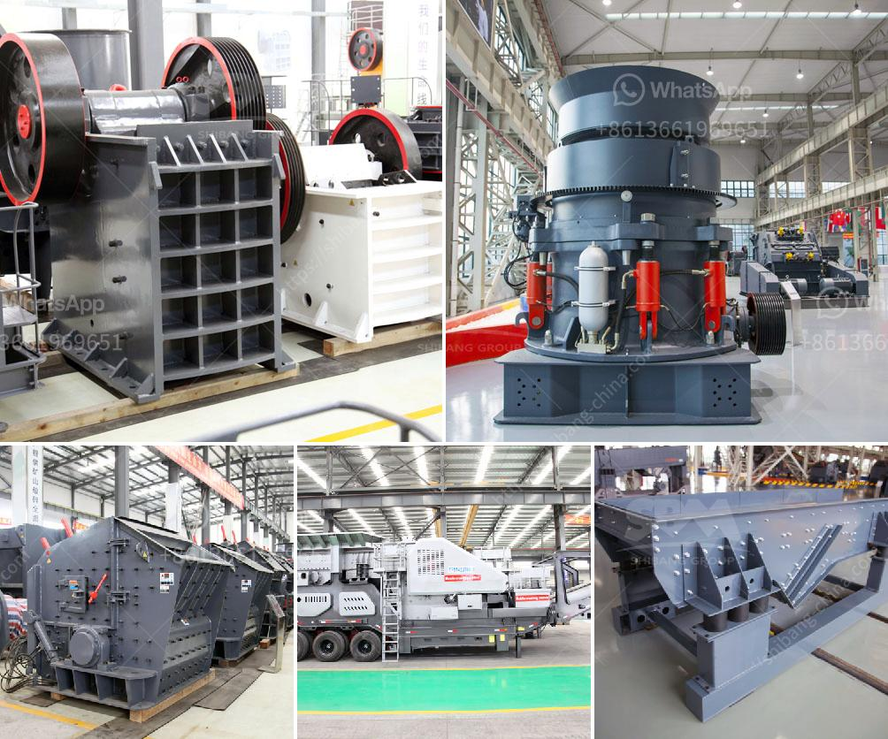

<h3>آخر خط إنتاج مسحوق الجبس</h3>
قد تمثل مساهمة صناعة البناء بشكل كبير في التنمية الاقتصادية والاجتماعية للعديد من الدول. ومن أهم المواد التي تستخدم في صناعة البناء هو مسحوق الجبس. يتم إنتاج مسحوق الجبس من مادة الجبس الطبيعية التي تحتوي على كبريتات الكالسيوم.

في الآونة الأخيرة، تم تطوير آخر خط إنتاج لمسحوق الجبس بتقنيات حديثة ومتقدمة. تستخدم هذه الآلات تقنيات التكسير والطحن لتحويل المادة الخام إلى مسحوق ناعم. يتم تخزين هذا المسحوق في صوامع خاصة لاحتياجات الإنتاج المستقبلية.

يعتبر آخر خط إنتاج مسحوق الجبس مخططًا متكاملًا يتألف من عدة مراحل. المرحلة الأولى هي مرحلة التكسير، حيث يتم استخدام آلات التكسير لتقسيم المادة الخام إلى قطع صغيرة. تليها مرحلة الطحن، حيث يتم استخدام المطاحن الدوارة لطحن المواد الخام المكسورة إلى مسحوق ناعم. يُضاف إلى المسحوق الماء للسيطرة على درجة الحرارة خلال عملية الطحن. وفي الأخير، يتم تجفيف المسحوق في أفران خاصة، حيث يتم تحويل المسحوق المبلل إلى مسحوق نهائي جاف.

يتميز آخر خط إنتاج مسحوق الجبس بعدة مزايا. فعلى سبيل المثال، يتم التحكم في عملية التكسير والطحن بدقة عالية، مما يضمن حصولنا على مسحوق جبس ذو جودة عالية. كما أن هذا الخط يتوفر على قدرة إنتاجية كبيرة، مما يعزز القدرة التنافسية للمنتجين.

وبالإضافة إلى ذلك، يمكننا أيضًا أن نبرز بعض الاستخدامات المتعددة لمسحوق الجبس. فهذا المنتج يستخدم بشكل شائع في إنتاج الجبس المعماري وألواح الجبس، وكذلك في صناعة الجص والدهانات والألوان. كما يستخدم في قطاعات مثل صناعة السيراميك والزجاج والمعادن، حيث يعتبر أحد المواد الأساسية.

باختصار، آخر خط إنتاج مسحوق الجبس يمثل تطورًا هامًا في صناعة البناء والتشييد في العالم. فقد أمكننا تحسين جودة المنتج وزيادة الإنتاجية من خلال استخدام التكنولوجيا الحديثة. كما أن اتساع استخدامات مسحوق الجبس يجعله مادة أساسية يتم الاعتماد عليها في عدة قطاعات صناعية.
<h3>Contact us</h3><ul><li><strong>Whatsapp:&nbsp;<a href="https://wa.me/8613661969651">+8613661969651</a></strong></li><li><a href="https://swt.shibang-china.com/?git&amp;zhl&amp;آخر خط إنتاج مسحوق الجبس"><strong>Online Service(chat now)</strong></a></li></ul><h3>Related</h3><ul><li><a href='تقرير المشروع على كسارة الخرسانة pdf.md'>تقرير المشروع على كسارة الخرسانة pdf</a></li><li><a href='عملية إنتاج لوحات الجبس.md'>عملية إنتاج لوحات الجبس</a></li><li><a href='كسارات الجرانيت والطاحونات.md'>كسارات الجرانيت والطاحونات</a></li><li><a href='مصنع سحق وطحن.md'>مصنع سحق وطحن</a></li><li><a href='موردين مطاحن الطحن في ججرانوالا.md'>موردين مطاحن الطحن في ججرانوالا</a></li></ul>