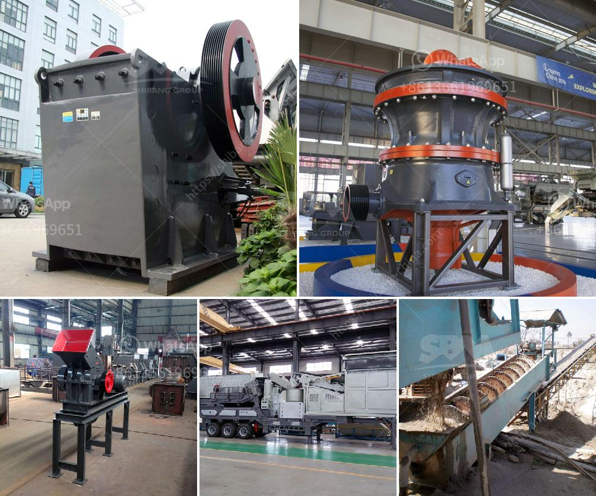

<h3>آخر مطحنة هامر</h3>
تعتبر آخر مطحنة هامر إحدى الابتكارات التقنية الحديثة التي تستخدم في مجال الطحن والتكسير. تم تصميم هذه المطاحن لتلبية احتياجات الصناعات المختلفة التي تحتاج إلى تفتيت المواد بطريقة سريعة وفعالة. 

تتميز آخر مطاحن هامر بعدة جوانب فريدة تميزها عن غيرها من المطاحن التقليدية. فمن أبرز مزاياها قوة الضرب العالية والسرعة العالية للغاية التي تتم بها عملية الطحن. وتتألف هذه المطاحن من مطرقة متحركة تسقط على المواد في الدوار، ما يؤدي إلى تفتيتها بسرعة كبيرة. ونظراً لقوة الضرب العالية، فإن المطاحن الهامر هي المثالية لتفتيت المواد القاسية والمعادن الصلبة مثل الحصى والخامات المعدنية.

وتتمتع آخر مطاحن هامر بأداء هائل في مجال الطحن والتكسير لعدة أسباب. أولاً، يتم ضبط سرعة الدوران ونوعية البكرة وحجم الفتحة في المطحنة وفقًا لنوع المواد المراد طحنها. ثانياً، يتم استخدام نظام كسر خاص لتسهيل عملية التصادم بين المواد والمطرقة. وباستخدام العديد من الأدوات الحديثة ، يمكن تحقيق طحن فعال ودقيق للمواد. 

بالإضافة إلى ذلك، فإن آخر مطاحن هامر قابلة للتعديل ومتعددة الاستخدامات، مما يجعلها مناسبة لمختلف الصناعات. بفضل الآليات المتقدمة والتقنيات المحسنة، يمكن تعديل هذه المطاحن بسهولة لتوفير طحن متنوع للمواد المختلفة. ويمكن استخدامها في مجالات عديدة مثل البناء والتعدين وإنتاج المواد الكيميائية.

لا يمكن أن ننكر أهمية آخر مطاحن هامر في تطوير صناعاتنا الحديثة. تعد تلك المطاحن حلاً مثاليًا لعمليات التكسير والطحن السريعة والفعالة. وتوفر هذه المطاحن مزايا عديدة من خلال تحسين كفاءة الإنتاج وتقليل الهدر وتحسين جودة المنتج النهائي.

في الختام، يمكن القول إن آخر مطاحن هامر تعتبر نقلة نوعية في مجال الطحن والتكسير. فتقنيتها الحديثة وقدرتها الهائلة على التعامل مع مجموعة متنوعة من المواد تجعلها الخيار الأمثل لعمليات الطحن الصناعية. ومن المتوقع أن تشهد هذه التكنولوجيا المبتكرة تطورًا مستمرًا في المستقبل وسيتم تحسينها بشكل أكبر لتلبية احتياجات الصناعات المتنوعة.
<h3>Contact us</h3><ul><li><strong>Whatsapp:&nbsp;<a href="https://wa.me/8613661969651">+8613661969651</a></strong></li><li><a href="https://swt.shibang-china.com/?git&amp;zhl&amp;آخر مطحنة هامر"><strong>Online Service(chat now)</strong></a></li></ul><h3>Related</h3><ul><li><a href='كسارات متنقلة مجنزرة.md'>كسارات متنقلة مجنزرة</a></li><li><a href='ريموند مطحنة في كولينز.md'>ريموند مطحنة في كولينز</a></li><li><a href='حجم كسارة الفك.md'>حجم كسارة الفك</a></li><li><a href='كسارات ستاملر الأمريكية لكسر المغذية.md'>كسارات ستاملر الأمريكية لكسر المغذية</a></li><li><a href='تكاليف مطاحن الكرة.md'>تكاليف مطاحن الكرة</a></li></ul>