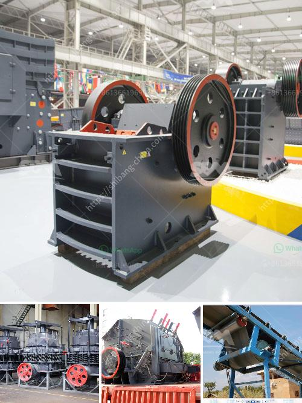

<h3>آفاق صناعة كسارة الجرانيت</h3>
تعتبر صناعة كسارة الجرانيت واحدة من الصناعات الحيوية في قطاع التعدين والبناء. يتم استخدام الجرانيت في العديد من التطبيقات المختلفة مثل البناء والتشييد وصناعة الطرق والجسور والرصف والتزيين الداخلي والخارجي. يعتبر الجرانيت مادة قوية ومتينة ومقاومة للصدأ وسهلة التنظيف والصيانة، مما يجعله خيارًا مثاليًا للمشاريع الكبيرة والصغيرة.

تعتبر آفاق صناعة كسارة الجرانيت واعدة ومشرقة. فإلى جانب الطلب المتزايد على الجرانيت في السوق المحلية، هناك طلب عالمي متزايد أيضًا. يعود ذلك إلى المظهر الجمالي للجرانيت وقوته الفائقة ومتانته، بالإضافة إلى مقاومته للعوامل الجوية والتآكل. يمكن استخدام الجرانيت في الأماكن العامة مثل المطارات والفنادق والمجمعات التجارية والمستشفيات، وكذلك في المنازل السكنية.

بالإضافة إلى ذلك، تتزايد الحاجة إلى كسارة الجرانيت نظرًا لزيادة الاستثمار في قطاع التعدين والبناء في العديد من الدول. وبالتالي، فإن المزيد من الشركات تدخل هذه الصناعة وتستثمر في تكنولوجيا متطورة لإنتاج وتشغيل كسارات الجرانيت بكفاءة وجودة عالية. تعمل هذه الشركات على تطوير وتحسين عمليات الكسر والطحن التي تستخدم لتحويل الجرانيت إلى منتجات عالية الجودة.

بالإضافة إلى ذلك، تواجه صناعة كسارة الجرانيت بعض التحديات. من بينها، زيادة التنافسية من البدائل الأخرى مثل الرخام والحجر الاصطناعي. ولكن مع مظهر الجرانيت الفريد وجودته العالية، فإنه من المرجح أن يظل الجرانيت أحد أولويات المستهلكين والمطورين.

بصفة عامة، يمكن القول بأن صناعة كسارة الجرانيت تشهد تطورًا ملحوظًا وسوقًا واعدًا. مع الطلب المستمر على الجرانيت في الأسواق المحلية والعالمية، ستستمر هذه الصناعة في النمو وخلق فرص عمل جديدة وتعزيز التنمية الاقتصادية في المجتمعات المعنية.
<h3>Contact us</h3><ul><li><strong>Whatsapp:&nbsp;<a href="https://wa.me/8613661969651">+8613661969651</a></strong></li><li><a href="https://swt.shibang-china.com/?git&amp;zhl&amp;آفاق صناعة كسارة الجرانيت"><strong>Online Service(chat now)</strong></a></li></ul><h3>Related</h3><ul><li><a href='مطحنة صغيرة.md'>مطحنة صغيرة</a></li><li><a href='كسارة الفك sp 60x100.md'>كسارة الفك sp 60x100</a></li><li><a href='سعر ناقل الحزام للتعدين.md'>سعر ناقل الحزام للتعدين</a></li><li><a href='آلة صنع مسحوق قشر الجوز في الهند.md'>آلة صنع مسحوق قشر الجوز في الهند</a></li><li><a href='مطحنة أسطوانية بسعة 15 طن.md'>مطحنة أسطوانية بسعة 15 طن</a></li></ul>