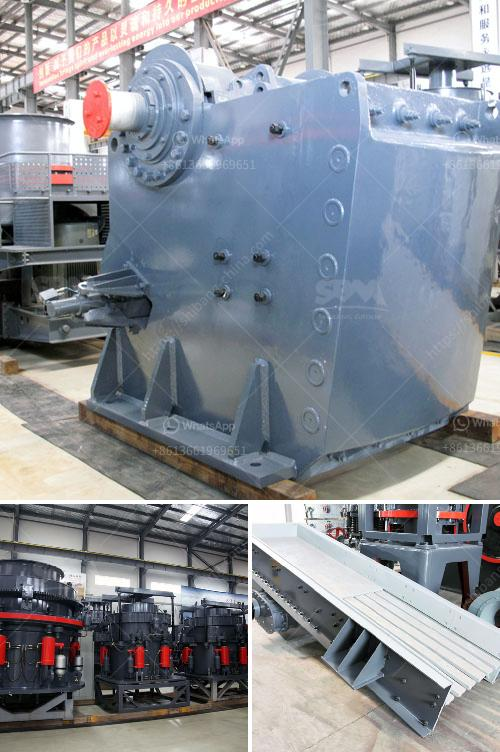

<h3>آلات إنتاج الجبس</h3>
تعتبر آلات إنتاج الجبس أدوات تستخدم في صناعة الجبس، وهي تستخدم لإنتاج الجبس بشكل سريع وفعال. تتكون هذه الآلات عادةً من عدة أجزاء ومكونات تعمل معًا لتحويل الجبس الخام إلى منتج نهائي.

أحد أهم أجزاء آلات إنتاج الجبس هو الكسارة. تستخدم الكسارة لسحق الجبس الخام إلى حجم صغير ومناسب للاستخدام المستقبلي. وهو يعمل عن طريق الضغط والاحتكاك، حيث تضرب الكسارة الجبس بشكل متكرر حتى يتم تفتيته إلى جزيئات صغيرة.

بعد ذلك، يتم نقل الجبس المكسر إلى الخلاطة. تعمل الخلاطة على خلط الجبس المكسر بالماء وغيره من المواد المساعدة مثل المواد اللاصقة والمواد المضافة الأخرى. يتم ضبط نسبة المكونات بعناية للحصول على خليط متجانس ومرن.

بعد الخلط، يتم نقل الخليط إلى الآلة الصب. تقوم الآلة بصب الجبس في قوالب معدنية أو خشبية وتسمح له بالتجفيف لفترة معينة. يتم تعديل سرعة الآلة وضغط الصب حسب حجم وشكل المنتج المرغوب.

بعد التجفيف، يتم إخراج المنتجات النهائية من القوالب ونقلها إلى خط الإنتاج النهائي. يتم تشكيل الجبس وتجميعه حسب الاحتياجات النهائية. ثم يتم التحكم في درجة حرارة ورطوبة الهواء للتوصل إلى القوام المطلوب والتجفيف النهائي.

تتميز آلات إنتاج الجبس بالسرعة والكفاءة في العمل، مما يعزز إنتاجية الصناعة. كما أن الآلات المستخدمة في صناعة الجبس تحتوي على تقنيات حديثة مثل الأتمتة والتحكم الذكي، مما يسهم في تحسين الجودة وتقليل الخطأ البشري.

في النهاية، تلعب آلات إنتاج الجبس دورًا حاسمًا في تصنيع الجبس بشكل سريع وفعال. تساهم في زيادة الإنتاجية وتحسين جودة المنتجات النهائية. بفضل تطور التكنولوجيا، يمكن توقع مشاركة الآلات في صناعة الجبس في المستقبل، وتحسين العمليات وتحقيق مستويات أعلى من الكفاءة والجودة.
<h3>Contact us</h3><ul><li><strong>Whatsapp:&nbsp;<a href="https://wa.me/8613661969651">+8613661969651</a></strong></li><li><a href="https://swt.shibang-china.com/?git&amp;zhl&amp;آلات إنتاج الجبس"><strong>Online Service(chat now)</strong></a></li></ul><h3>Related</h3><ul><li><a href='تكلفة سيور النقل.md'>تكلفة سيور النقل</a></li><li><a href='مصنع تكسير محمول للبيع في جنوب أفريقيا.md'>مصنع تكسير محمول للبيع في جنوب أفريقيا</a></li><li><a href='مصنع تكسير خام البوكسيت.md'>مصنع تكسير خام البوكسيت</a></li><li><a href='أسعار كسارات نيجيريا الجديدة.md'>أسعار كسارات نيجيريا الجديدة</a></li><li><a href='مطاحن للبيع في هراري.md'>مطاحن للبيع في هراري</a></li></ul>