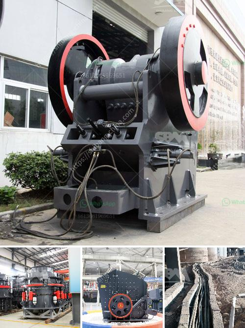

<h3>آلات إنتاج الرمل سحق الطحن والفرز</h3>
تعتبر آلات إنتاج الرمل سحق الطحن والفرز أدوات مهمة في صناعة البناء والمهندسين المدنيين، حيث يتم استخدامها لتحويل الصخور الكبيرة إلى رمل صغير وغرباله وتصنيفه. تتكون هذه الآلات من مجموعة من المعدات المتكاملة مثل الكسارة، والفرز، والمطحنة الرأسية وغيرها.

تتم عملية سحق الصخور بواسطة الكسارة، حيث يتم تغذية الصخور في الكسارة وسحقها لتصبح رمال صغيرة. وتتوفر العديد من أنواع الكسارات المختلفة، مثل الفكية والتصادمية والمخروطية، والتي تستخدم بناءً على حاجة المشروع ونوع الصخور المراد سحقها.

بعد عملية السحق، يتم فصل الرمال عن الصخور غير المرغوب فيها باستخدام آلة الفرز. تعتمد طريقة الفرز على حجم الرمال المطلوبة، حيث يتم تصنيفها وفقًا للحجم والشكل والمواصفات المطلوبة. يمكن أن تكون هناك عدة طبقات من المنخل لفصل الرمل وإزالة الشوائب الكبيرة الغير مرغوب فيها.

تعتبر المطاحن الرأسية أيضًا جزءًا هامًا في عملية إنتاج الرمل، حيث يتم استخدامها لطحن الرمل الناعم للحصول على حجم أصغر وشكل أكثر توحيدًا. تحتوي المطاحن الرأسية على نظام دوران قوي يعمل على طحن الرمال وتحطيمها بفعالية.

تحقق آلات إنتاج الرمل سحق الطحن والفرز من عملية إنتاج الرمال سريعة وفعالة، حيث يمكنها إنتاج كميات كبيرة من الرمل في وقت قصير. وبفضل التكنولوجيا المتقدمة، تتميز هذه الآلات بأداء عالي وكفاءة في استخدام الطاقة.

بصفة عامة، يمكن القول إن آلات إنتاج الرمل سحق الطحن والفرز هي ضرورة في صناعة البناء والمهندسين المدنيين. تلعب دورًا حاسمًا في تلبية الاحتياجات المتزايدة للرمل عالي الجودة في صناعة البناء. من خلال تحويل الصخور الكبيرة إلى رمل صغير، فإنها تسهم في تحسين جودة البناء وتوفير وقت وموارد تكلفة.
<h3>Contact us</h3><ul><li><strong>Whatsapp:&nbsp;<a href="https://wa.me/8613661969651">+8613661969651</a></strong></li><li><a href="https://swt.shibang-china.com/?git&amp;zhl&amp;آلات إنتاج الرمل سحق الطحن والفرز"><strong>Online Service(chat now)</strong></a></li></ul><h3>Related</h3><ul><li><a href='آلة سحق في الفلبين.md'>آلة سحق في الفلبين</a></li><li><a href='سعر كسارة الفك PE 400.md'>سعر كسارة الفك PE 400</a></li><li><a href='كسارة الجرانيت المحمولة.md'>كسارة الجرانيت المحمولة</a></li><li><a href='كسارة مخروطية غير مستخدمة في إثيوبيا للبيع.md'>كسارة مخروطية غير مستخدمة في إثيوبيا للبيع</a></li><li><a href='آلة كسارة محمولة.md'>آلة كسارة محمولة</a></li></ul>