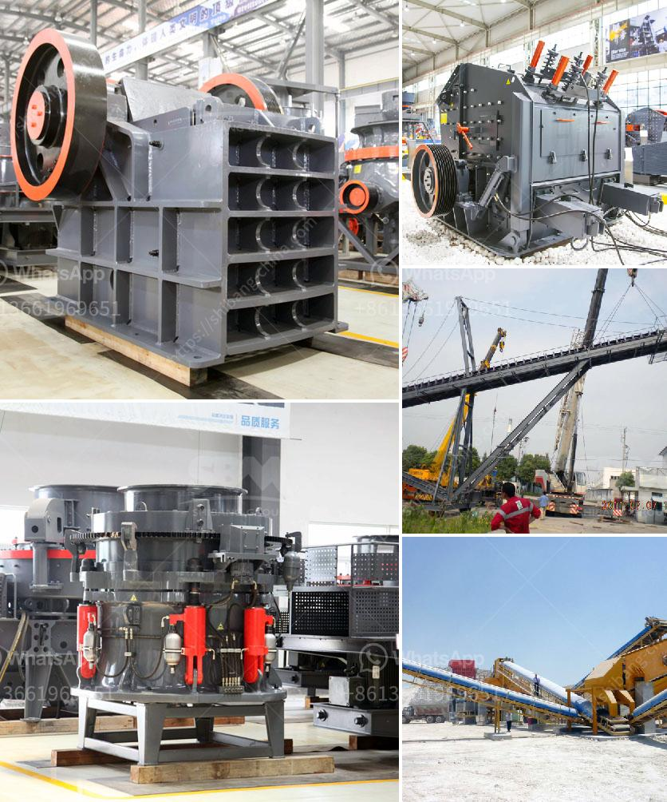

<h3>آلات إنتاج الكالسيوم</h3>
تعتبر آلات إنتاج الكالسيوم من أهم الآلات المستخدمة في صناعة الكالسيوم، وهو معدن من العناصر الكيميائية يستخدم في العديد من الصناعات. يتم إنتاج الكالسيوم عن طريق عدة طرق، ومن أهمها طريقة إنتاجه بواسطة فرن القوس الكهربائي.

يتكون فرن القوس الكهربائي من هيكل معدني يشبه القبة، وفي داخله يكون هناك فرن محمي بطبقة من الطوب الناري. الفرن يعمل بواسطة التيار الكهربائي الذي يتم إدخاله من القاعدة، ويتكون من مصدر كهربائي عالي الجهد. عندما يتم تشغيل الفرن، يتولد قوس كهربائي بين القطبين الكهربائيين الموجودين في الفرن، وهذا القوس يتولد من طاقة كهربائية عالية الجهد.

عندما يتم تشغيل الفرن وإدخال التيار الكهربائي، يتسبب القوس الكهربائي في تسخين المادة الموجودة داخل الفرن. تقوم الآلة بإدخال الخامات اللازمة لإنتاج الكالسيوم داخل الفرن، ويتم تطبيق درجات حرارة عالية جدًا تصل إلى حوالي 3300 درجة مئوية على المادة الموجودة داخل الفرن.

تمتاز هذه الآلات بقدرتها على إنتاج الكالسيوم بكميات كبيرة وبأعلى جودة ممكنة. وتستخدم آلات إنتاج الكالسيوم في الصناعات الكيميائية والبناء والزراعة وفي صناعة الأسمدة والأدوية. كما أنها تستخدم أيضًا في إنتاج حبيبات الكالسيوم التي تستخدم في صناعة الورق والدهانات والبلاستيك وغيرها من المنتجات الصناعية.

باختصار، آلات إنتاج الكالسيوم هي آلات حديثة وفعالة تعتمد على فرن القوس الكهربائي لإنتاج الكالسيوم بكميات كبيرة وبجودة عالية. تساهم هذه الآلات في تلبية الطلب المتزايد على الكالسيوم في الصناعات المختلفة وتلبية احتياجات السوق بشكل عام.
<h3>Contact us</h3><ul><li><strong>Whatsapp:&nbsp;<a href="https://wa.me/8613661969651">+8613661969651</a></strong></li><li><a href="https://swt.shibang-china.com/?git&amp;zhl&amp;آلات إنتاج الكالسيوم"><strong>Online Service(chat now)</strong></a></li></ul><h3>Related</h3><ul><li><a href='تحليل تكلفة سحق وفحص.md'>تحليل تكلفة سحق وفحص</a></li><li><a href='آلة طحن المطرقة بمعدل طن في الساعة.md'>آلة طحن المطرقة بمعدل طن في الساعة</a></li><li><a href='مواصفات مصنع سحق الحجر الجيري 450 طن في الساعة.md'>مواصفات مصنع سحق الحجر الجيري 450 طن في الساعة</a></li><li><a href='مطحنة للحجر الجيري في إيطاليا في بيرجامو.md'>مطحنة للحجر الجيري في إيطاليا في بيرجامو</a></li><li><a href='أفضل آلة سحق الكوارتز في الهند.md'>أفضل آلة سحق الكوارتز في الهند</a></li></ul>