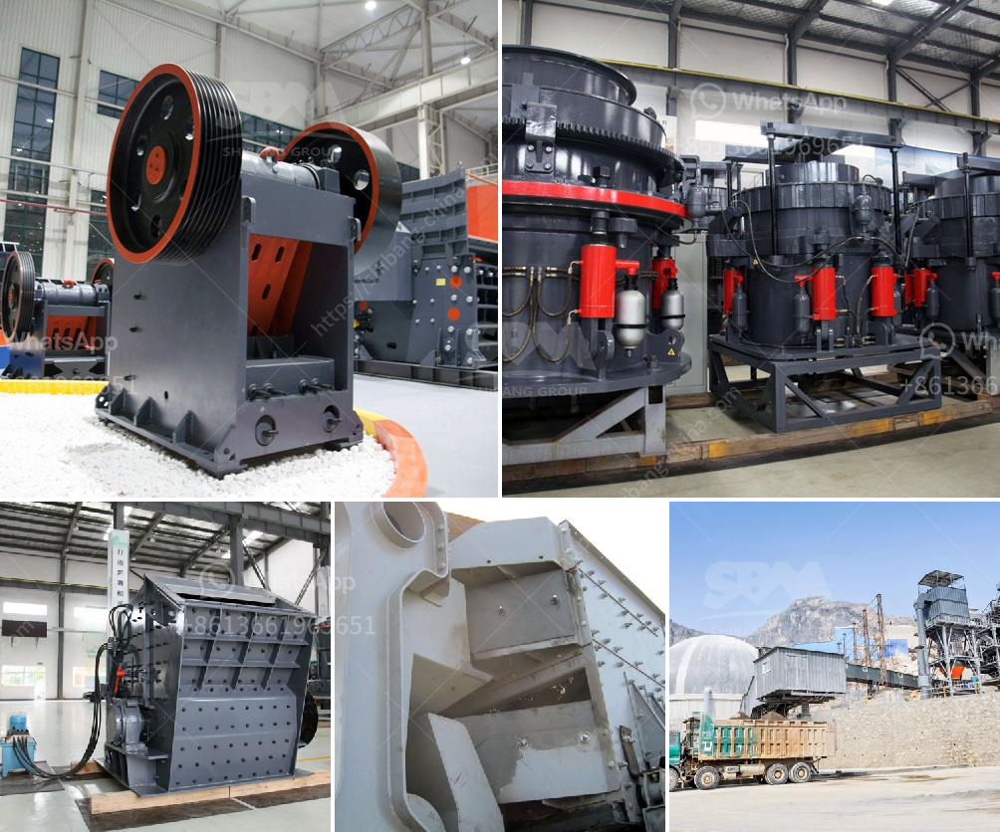

<h3>آلات إنتاج مسحوق كربونات الكالسيوم</h3>
تعد آلات إنتاج مسحوق كربونات الكالسيوم أدوات حديثة تستخدم لإنتاج الكالسيوم في صورة مسحوق. يتم استخدامه في العديد من الصناعات مثل صناعة الأدوية والبلاستيك والدهانات والطلاء.

ثمة عدة طرق لإنتاج مسحوق كربونات الكالسيوم، ولكن الطريقة الرئيسية تنطوي على استخدام عملية تسمى "عملية الطحن الجاف". يتم في هذه العملية استخدام آلات الفرز والطحن لتحويل الحجر الجيري المستخدم إلى مسحوق ناعم.

أولاً، يتم جمع الحجر الجيري الطبيعي ونقله إلى موقع الإنتاج. ثم يتم فحصه لإزالة الشوائب والرواسب الأخرى المتواجدة فيه. بعد ذلك، يتم تفتيته بواسطة مطرقة كبيرة لتجزئته إلى أجزاء صغيرة.

من ثم يتم نقل الحجر الجيري المكسور إلى آلات الطحن. تعمل هذه الآلات على طحن الحجر الجيري الناعم إلى مسحوق ناعم. يتم ضبط حجم الجسيمات النهائي المطلوب باستخدام فتحات الشبكة الموجودة في الجهاز. 

بعد طحن الحجر الجيري، يتم جمع المسحوق في أكياس أو حاويات لاستخدامه في الصناعات المختلفة. بعض الشركات تعمل على تصفية المسحوق وتحسين جودته عن طريق إجراء عمليات تجفيف وتنقية إضافية.

عملية إنتاج مسحوق كربونات الكالسيوم تتطلب آلات متخصصة وتقنيات متقدمة. يجب أيضاً الحرص على اتباع إجراءات السلامة المناسبة أثناء العمل، بما في ذلك استخدام معدات الوقاية الشخصية والتحكم في الغبار.

في النهاية، يمكن القول إن آلات إنتاج مسحوق كربونات الكالسيوم لديها دور هام في صناعات عديدة. تعمل هذه الآلات على تحويل الحجر الجيري إلى مسحوق ناعم يمكن استخدامه في العديد من التطبيقات المختلفة.
<h3>Contact us</h3><ul><li><strong>Whatsapp:&nbsp;<a href="https://wa.me/8613661969651">+8613661969651</a></strong></li><li><a href="https://swt.shibang-china.com/?git&amp;zhl&amp;آلات إنتاج مسحوق كربونات الكالسيوم"><strong>Online Service(chat now)</strong></a></li></ul><h3>Related</h3><ul><li><a href='تجهيز الذهب بالزئبق الفضي في جنوب أفريقيا.md'>تجهيز الذهب بالزئبق الفضي في جنوب أفريقيا</a></li><li><a href='شراء كسارة حجر في الإمارات.md'>شراء كسارة حجر في الإمارات</a></li><li><a href='مصنع فصل وتركيز المعادن في نيجيريا.md'>مصنع فصل وتركيز المعادن في نيجيريا</a></li><li><a href='مطحنة رطبة في الصين.md'>مطحنة رطبة في الصين</a></li><li><a href='تكسير الحجر المصنوع في ألمانيا.md'>تكسير الحجر المصنوع في ألمانيا</a></li></ul>