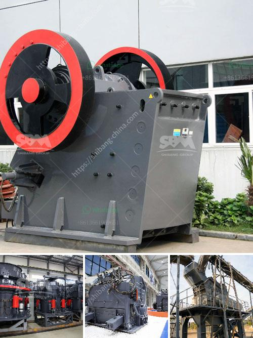

<h3>آلات الأسطوانة للطحن</h3>
تُعتبر آلات الأسطوانة للطحن من أهم الأدوات المستخدمة في صناعة الطحن الصناعي والزراعي. وتتميز هذه الآلات بقدرتها على طحن مواد مختلفة مثل القمح والشعير والأرز والذرة والحبوب الأخرى. تقوم الآلات بسحق هذه المواد وتحويلها إلى جسيمات صغيرة مناسبة للاستخدام في عدة صناعات مختلفة.

تعتمد هذه الآلات على مبدأ الطحن بواسطة الضغط والاحتكاك بين اسطوانتين معدنيتين. توضع المادة التي تحتاج إلى طحن في فجوة بين الاسطوانتين، وثم يتم تشغيل الآلة لتدور الاسطوانتين في اتجاهين معاكسين ومتوازيين للحصول على أفضل نتيجة. وتتمثل الغاية الأساسية من هذه العملية في تقليل حجم الحبوب وتحسين جودتها وتوزيعها بشكل متساوٍ.

إن أحد أهم استخدامات هذه الآلات هو في صناعة الأغذية وخاصة صناعة المطاحن. حيث يتم تحويل حبوب القمح والشعير إلى دقيق يستخدم في إنتاج الخبز والمعجنات والحلويات والمنتجات العديدة الأخرى. وتساهم آلات الأسطوانة في تحقيق جودة عالية للدقيق وسهولة الاستخدام وزيادة الإنتاجية.

وتستخدم هذه الآلات أيضًا في صناعة الأعلاف الحيوانية، حيث يتم سحق الحبوب والأعلاف الطبيعية لتحسين هضم الحيوانات وتعزيز نموها وإنتاجيتها. وبالإضافة إلى ذلك، يتم استخدامها في مجالات أخرى مثل صناعة المواد الكيميائية والدهانات والأصباغ.

تعتبر آلات الأسطوانة للطحن من الآلات المعقدة والتي تتطلب الصيانة المستمرة والاهتمام للحفاظ على أدائها الجيد. يجب أن تكون الاسطوانتان مصنوعتين من مواد عالية الجودة ومتينة لتحمل الاستخدام المستمر وتقليل التآكل. كما يجب تنظيف الآلة وتفقد أجزائها بشكل دوري لضمان عملية طحن فعالة وآمنة.

بشكل عام، آلات الأسطوانة للطحن تعد حلاً فعالًا واقتصاديًا في صناعة الطحن. فهي تعزز الإنتاجية وتعمل بكفاءة عالية، مما يسهم في توفير الوقت والجهد والموارد. كما تحسن الجودة والأداء للمواد المطحونة، وتساهم في تلبية احتياجات الأسواق المتنوعة.
<h3>Contact us</h3><ul><li><strong>Whatsapp:&nbsp;<a href="https://wa.me/8613661969651">+8613661969651</a></strong></li><li><a href="https://swt.shibang-china.com/?git&amp;zhl&amp;آلات الأسطوانة للطحن"><strong>Online Service(chat now)</strong></a></li></ul><h3>Related</h3><ul><li><a href='كسارة حصى ورمل في نيبال.md'>كسارة حصى ورمل في نيبال</a></li><li><a href='كسارة مخروطية للبيع.md'>كسارة مخروطية للبيع</a></li><li><a href='معالجة الذهب بنطاق صغير باستخدام طريقة CIP.md'>معالجة الذهب بنطاق صغير باستخدام طريقة CIP</a></li><li><a href='معدات تعدين الرمال والحصى للبيع.md'>معدات تعدين الرمال والحصى للبيع</a></li><li><a href='معدات تعدين الذهب الطبيعي في الصين.md'>معدات تعدين الذهب الطبيعي في الصين</a></li></ul>