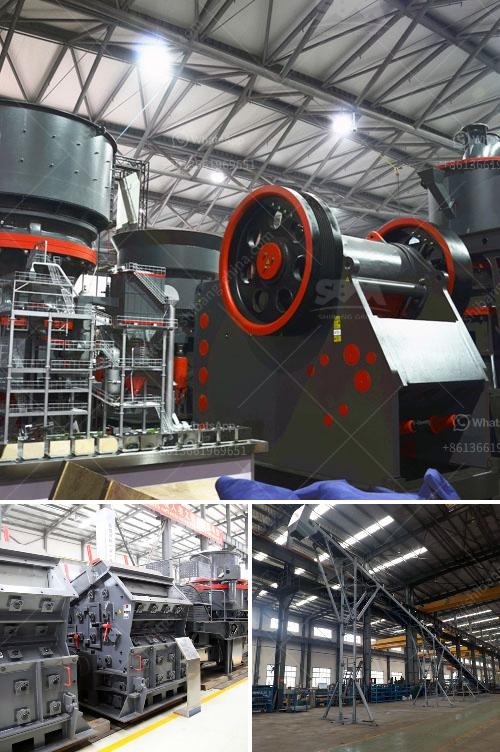

<h3>آلات التكسير والفحص</h3>
تشكل آلات التكسير والفحص أساسًا هامًا في عمليات التعدين وصناعة البناء والهدم. تستخدم هذه الآلات لتجهيز المواد الخام وتقطيعها وفحصها لتلبية الاحتياجات المحددة للمشروع. توفر آلات التكسير القدرة على تحويل المواد الخام الكبيرة إلى أحجام أصغر قابلة للتحمل والاستخدام في صناعات مختلفة.

تتوفر العديد من أنواع آلات التكسير والفحص لتناسب مختلف التطبيقات والمتطلبات. الكسارات الفكية هي واحدة من أكثر الآلات شيوعًا في صناعة التكسير. تستخدم لتكسير المواد الخام الكبيرة إلى أحجام أصغر بفضل فكين يتحركان لأعلى ولأسفل. تعتبر الكسارات المخروطية أيضًا أداة قوية للتحطيم حيث يتم سحق المواد بين سطحين مخروطيين ثابتين.

تستخدم آلات الفحص لفحص المواد المكسورة وفرزها وفقًا للحجم والشكل. تعمل الشبكات المعدنية على فصل المواد إلى فئات مختلفة بحسب حجم الفتحات في الشبكة. من المستخدمات الشائعة لآلات الفحص أيضًا هو فحص المواد المكسورة وإزالة المواد الغريبة أو الملوثة تلقائيًا.

تتميز آلات التكسير والفحص بعدة مزايا تعزز من كفاءتها وأدائها. تصميمها القوي والمتين يضمن استمرارية العملية دون انقطاع أو تلف. يتم تحسين الآلات لتوفير سهولة الصيانة وتبديل الأجزاء المتآكلة. كما توفر معظم الآلات خيارات قابلة للتعديل لتغيير الحجم والشكل النهائي للمواد. هذا يسمح للصناعات بضبط إخراج المواد وفقًا للمواصفات المطلوبة للمشروع.

بالإضافة إلى ذلك، تعتبر آلات التكسير والفحص أيضًا أكثر فعالية من حيث الطاقة والموارد. تم تحسين استخدام الطاقة وتصميم الآلات لتقليل الانبعاثات الضارة بالبيئة. بفضل الابتكارات التكنولوجية، تعمل الآلات الحديثة بكفاءة أعلى وباستخدام أقل من الوقود والموارد الطبيعية.

في النهاية، تعد آلات التكسير والفحص أدوات حاسمة في عمليات التعدين وصناعة البناء والهدم. تمثل تقدم التكنولوجيا والابتكار في هذا المجال اهتمامًا مستمرًا بتحسين الكفاءة والأمان والاستدامة في عمليات التكسير والفحص، مما يساهم في تطوير الصناعات وتلبية الاحتياجات المتنامية للمشروعات.
<h3>Contact us</h3><ul><li><strong>Whatsapp:&nbsp;<a href="https://wa.me/8613661969651">+8613661969651</a></strong></li><li><a href="https://swt.shibang-china.com/?git&amp;zhl&amp;آلات التكسير والفحص"><strong>Online Service(chat now)</strong></a></li></ul><h3>Related</h3><ul><li><a href='أفكار مشروع مصفاة النحاس صغيرة المقياس.md'>أفكار مشروع مصفاة النحاس صغيرة المقياس</a></li><li><a href='طاحونة كرات في كينيا.md'>طاحونة كرات في كينيا</a></li><li><a href='التكلفة المقدرة لإنشاء محجر.md'>التكلفة المقدرة لإنشاء محجر</a></li><li><a href='مصنعي مطاحن الرايموند في الهند.md'>مصنعي مطاحن الرايموند في الهند</a></li><li><a href='تعليم مطحنة الكرة.md'>تعليم مطحنة الكرة</a></li></ul>