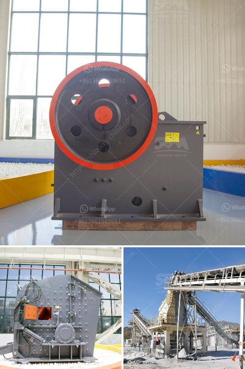

<h3>آلات الطحن بالكرات الكوارتز</h3>
تُستخدم آلات الطحن بالكرات الكوارتز في صناعات مختلفة مثل صناعة السيراميك والتلبيد الزجاجي والدهانات والأصباغ ومواد البناء وصناعة المعادن والصناعات الكيماوية، وهي تستخدم أيضًا في عمليات الطحن الرطب والجاف.

تعتبر آلات الطحن بالكرات الكوارتز من أهم الأدوات اللازمة في هذه الصناعات، حيث تستخدم هذه الآلات لطحن وسحق المواد الخام إلى حجم مطلوب تمهيدًا لتحويلها إلى منتج نهائي. تتكون الآلة من برميل دوار، وفوهات إدخال وإخراج المواد، وكرات كوارتز.

تتميز آلات الطحن بالكرات الكوارتز بعدة مزايا. فعلى سبيل المثال، يتم استخدام الكرات الكوارتز عالية الجودة، والتي تتميز بمقاومتها للتآكل والتآكل الكيميائي، وعدم امتصاصها للمواد الكيميائية، مما يعزز استقرارية العملية الكيميائية وجودة المنتج النهائي.

تعتبر آلات الطحن بالكرات الكوارتز أيضًا قوية وفعالة من حيث الأداء والطاقة. فهي تعمل بسرعة وتتميز بقدرتها على طحن الكميات الكبيرة من المواد، مما يحسن كفاءة الإنتاج ويوفر الوقت والجهد.

علاوة على ذلك، تتميز آلات الطحن بالكرات الكوارتز بأنها قابلة للتكيف والتعديل وفقًا لاحتياجات العملية. يمكن تعديل سرعة الطحن وحجم الكرات الكوارتز ومستوى الطحن النهائي لتلبية متطلبات الإنتاج المحددة.

بالإضافة إلى ذلك، تتميز آلات الطحن بالكرات الكوارتز بأنها آمنة في الاستخدام وسهلة التشغيل. فهي تعمل بفعالية ودقة عالية وتوفر نتائج دقيقة وموثوقة.

وفي الختام، تعد آلات الطحن بالكرات الكوارتز أداة أساسية في عملية تحويل المواد الخام إلى منتجات نهائية بجودة عالية. تتميز هذه الآلات بقوتها وفعاليتها ومتانتها واستقرارها، مما يجعلها اختيارًا مثاليًا للصناعات المختلفة التي تحتاج إلى الطحن والتلبيد والسحق للمواد الخام.
<h3>Contact us</h3><ul><li><strong>Whatsapp:&nbsp;<a href="https://wa.me/8613661969651">+8613661969651</a></strong></li><li><a href="https://swt.shibang-china.com/?git&amp;zhl&amp;آلات الطحن بالكرات الكوارتز"><strong>Online Service(chat now)</strong></a></li></ul><h3>Related</h3><ul><li><a href='كسارة صخرية صناعية.md'>كسارة صخرية صناعية</a></li><li><a href='تعدين رمال النهر والحجر في صباح.md'>تعدين رمال النهر والحجر في صباح</a></li><li><a href='مصنع تكسير الحصى بمقياس كبير.md'>مصنع تكسير الحصى بمقياس كبير</a></li><li><a href='حجم مدخلات ومخرجات مصنع تكسير الكوارتز.md'>حجم مدخلات ومخرجات مصنع تكسير الكوارتز</a></li><li><a href='سعر مصنع الرمل والحصى في الهند.md'>سعر مصنع الرمل والحصى في الهند</a></li></ul>