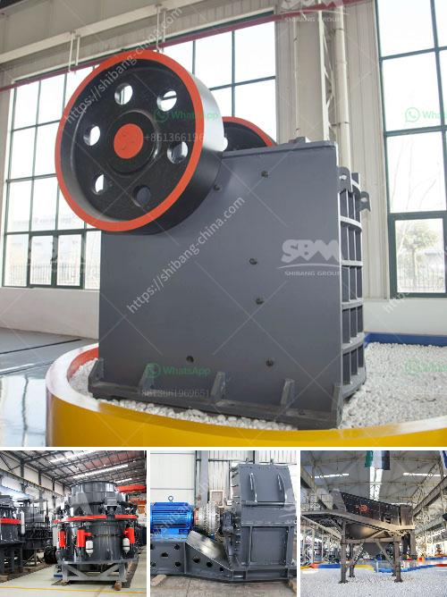

<h3>آلات الطحن لتكلفة مطحنة الدال</h3>
تعتبر آلات الطحن أدوات هامة في صناعة الأغذية، حيث تتيح لنا القدرة على تحويل الحبوب والحبيبات إلى مساحيق ناعمة يمكن استخدامها في إعداد مجموعة متنوعة من الوصفات والمنتجات الغذائية. ومن بين آلات الطحن المستخدمة على نطاق واسع، تأتي مطحنة الدال في مقدمة هذه الآلات.

مطحنة الدال هي نوع من الآلات التي تقوم بطحن الحبوب والقمح والذرة والشعير وغيرها من المحاصيل الزراعية إلى دقيق ناعم. يمكن استخدام مطحنة الدال في صناعة الطعام الصناعي، وصناعة الخبز، وصناعة الحلويات، وغيرها من الصناعات ذات العلاقة. يعود تاريخ استخدام مطحنة الدال إلى العديد من القرون، حيث كانت تُستخدم يدويًا في البداية، ولكن مع تقدم التكنولوجيا، أصبحت الطاقة الكهربائية هي المصدر الرئيسي للتشغيل، مما أدى إلى زيادة كفاءة العملية وتحسين جودة المنتج.

تتألف مطحنة الدال من مجموعة من الأجزاء المتحركة والثابتة، بما في ذلك الجهاز الكهربائي الذي يقوم بتشغيل الآلة ويوجه حركة الحبوب، والمخرج لإخراج الدقيق الناتج، والشفرات الحادة التي تقوم بطحن الحبوب إلى الحجم المطلوب. يتم تحويل الحبوب إلى الوعاء المخصص، ويمكن أيضًا إضافة وظائف إضافية مثل تحضير عصير الحبوب أو تحويل الحبوب إلى قطع أصغر لإعداد الفطائر.

كما تتوفر مطاحن الدال بتشكيلات متنوعة حسب الحجم والسعة المطلوبة. تتراوح تكلفة مطحنة الدال من 200 إلى 400 دولار، حسب حجم ومواصفات الجهاز. في السنوات الأخيرة، زاد الطلب على مطاحن الدال المحمولة والصغيرة، حيث تتيح للمستخدمين طحن بكميات أقل وفي الموقع الذي يلزمهم. بفضل تكنولوجيا اليوم، يمكننا العثور بسهولة على مطاحن الدال عبر الإنترنت وفي المتاجر المحلية.

باختصار، تعتبر مطاحن الدال أدوات مهمة في صناعة الأغذية، حيث تساعد في تحويل الحبوب والحبيبات إلى دقيق ناعم للاستخدام في إعداد الوصفات والمنتجات الغذائية المختلفة. يمكن العثور على مطاحن الدال بأسعار متنوعة تتراوح بين 200 و400 دولار. إذا كنت تعتزم استخدام مطحنة الدال للمنزل أو الأعمال التجارية الصغيرة، فإن هذه الآلة ستكون استثمارًا قيمًا لتلبية احتياجاتك في عملية طحن الحبوب.
<h3>Contact us</h3><ul><li><strong>Whatsapp:&nbsp;<a href="https://wa.me/8613661969651">+8613661969651</a></strong></li><li><a href="https://swt.shibang-china.com/?git&amp;zhl&amp;آلات الطحن لتكلفة مطحنة الدال"><strong>Online Service(chat now)</strong></a></li></ul><h3>Related</h3><ul><li><a href='مطحنة الكرة لتعدين الذهب على نطاق صغير.md'>مطحنة الكرة لتعدين الذهب على نطاق صغير</a></li><li><a href='فاصل عالي التدرج في زينغتشو.md'>فاصل عالي التدرج في زينغتشو</a></li><li><a href='اشتقاق السرعة الحرجة في مطحنة كرات PDF.md'>اشتقاق السرعة الحرجة في مطحنة كرات PDF</a></li><li><a href='أسعار مطحنة الكرة في زيمبابوي.md'>أسعار مطحنة الكرة في زيمبابوي</a></li><li><a href='مصنع الجبس في نيجيريا.md'>مصنع الجبس في نيجيريا</a></li></ul>