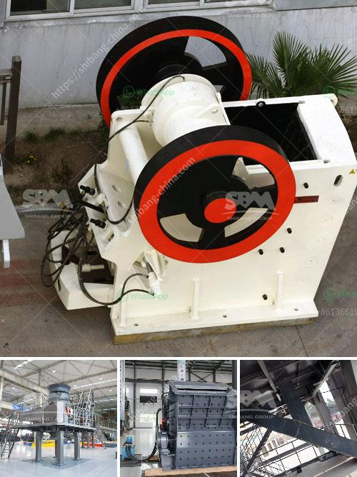

<h3>آلات الطحن والتعبئة في باكستان</h3>
تعتبر آلات الطحن والتعبئة في باكستان أحد القطاعات الحيوية في صناعة الزراعة والغذاء. تلعب هذه الآلات دورًا مهمًا في تحويل المحاصيل الزراعية إلى منتجات صالحة للاستهلاك، بحيث تزيد من كفاءة العمل وتعزز الجودة والتنافسية.

في الماضي، كانت تلك الصناعة أقل تطورًا وتعتمد بشكل كبير على العمل اليدوي، مما يستدعي الكثير من الجهد والوقت. ومع ذلك، تطورت تلك الصناعة تدريجيًا لتواكب التقدم التكنولوجي، وشهدت تحسينات عديدة في الأداء والكفاءة.

تعتبر آلات الطحن والتعبئة أساسية في إنتاج الأرز والقمح والدقيق والتوابل والأعلاف والمنتجات الحبوبية الأخرى. تتكون هذه الآلات من عدة أقسام، بدءًا من تنظيف المحصول وفرزه حسب حجمه ونوعه، ثم طحنه وفرزه مرة أخرى إلى مستويات معينة من النعومة. بعد ذلك، تتم عملية التعبئة والتغليف للمنتج النهائي، سواءً كان ذلك بالتعبئة اليدوية أو بواسطة آلات التعبئة الآلية.

توجد في باكستان العديد من الشركات المتخصصة في صناعة آلات الطحن والتعبئة، وتعمل على توفير تجهيزات عالية الجودة والأداء. وتشمل تلك الشركات إنتاج آلات الجرش والمطاحن وآلات فحص الحبوب وأجهزة التنظيف وآلات التغليف وغيرها. وتسعى الشركات المصنعة إلى تطوير تقنيات جديدة وتحسين العملية الإنتاجية لتلبية احتياجات السوق المتنامية.

من الجوانب الإيجابية لهذه الصناعة في باكستان، أنها توفر فرص عمل كبيرة للعديد من العمال، سواء في التشغيل أو الصيانة أو الإنتاج. كما تعزز هذه الصناعة الاقتصاد المحلي بزيادة الصادرات وتلبية احتياجات السوق المحلية. ومن الجانب البيئي، تعتبر آلات الطحن والتعبئة أكثر فعالية في استخدام الموارد وتقليل الفاقد، مما يحد من التلوث ويحسن الاستدامة.

يعد قطاع آلات الطحن والتعبئة في باكستان قطاعًا واعدًا يستحق الاهتمام والاستثمار. وتتطلب زيادة الدعم والتمويل لهذه الصناعة، وتعزيز التعاون بين القطاع الخاص والحكومة لتطوير وتحسين البنية التحتية وتعزيز القدرات التصنيعية والتسويقية. بتحقيق ذلك، سيتم تعزيز الاقتصاد الوطني وتوفير فرص عمل أكثر للمواطنين بإحداث تنمية مستدامة في صناعة الطحن والتعبئة في باكستان.
<h3>Contact us</h3><ul><li><strong>Whatsapp:&nbsp;<a href="https://wa.me/8613661969651">+8613661969651</a></strong></li><li><a href="https://swt.shibang-china.com/?git&amp;zhl&amp;آلات الطحن والتعبئة في باكستان"><strong>Online Service(chat now)</strong></a></li></ul><h3>Related</h3><ul><li><a href='مشترين وبائعين لآلات مطحنة ريموند.md'>مشترين وبائعين لآلات مطحنة ريموند</a></li><li><a href='مطاحن الهامر.md'>مطاحن الهامر</a></li><li><a href='عملية تصنيع كسارة الطين.md'>عملية تصنيع كسارة الطين</a></li><li><a href='كسارات حجر مستعملة للبيع في كينيا.md'>كسارات حجر مستعملة للبيع في كينيا</a></li><li><a href='تكلفة ناقل الحزام لصناعة التعدين.md'>تكلفة ناقل الحزام لصناعة التعدين</a></li></ul>