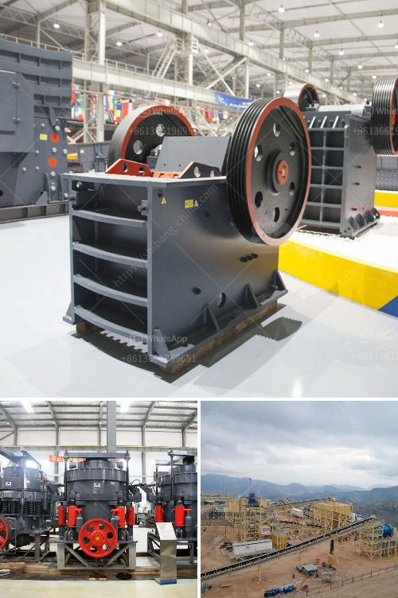

<h3>آلات تصنيع الجبس</h3>
تعتبر الآلات المستخدمة في تصنيع الجبص أدوات حاسمة في صناعة البناء والديكور. تتميز هذه الآلات بالقدرة على تحويل الجبص الخام إلى مواد جاهزة للاستخدام في البناء والديكور، وذلك بتقنيات وعمليات متقدمة.

الآلات المستخدمة في صناعة الجبص تتضمن مجموعة متنوعة من المعدات التي تساعد على تحسين كفاءة وجودة عملية التصنيع. تشمل هذه الآلات:

1- آلات سحق الجبص: تقوم بسحق الجبص الخام وتحويله إلى مسحوق ناعم، وهذا يسهل عملية معالجة الجبص بالآلات الأخرى.

2- خلاطات الجبص: تقوم بمزج الجبص المسحوق مع المواد الأخرى مثل الرمل والماء والمواد الكيماوية. وتحسن هذه الآلات عملية الخلط وتضمن توزيع متساوٍ للجبص في الخليط.

3- آلات تشكيل الجبص: تقوم بتشكيل الجبص وإعطائه الشكل المطلوب، سواء كان ذلك على شكل لوحات، ألواح جدران، أو قطع ثلاثية الأبعاد. تتم عملية التشكيل بواسطة قوالب معدنية أو أشكال قابلة للتعديل.

4- آلات التجفيف والتجهيز: بعد عملية التشكيل، يتم نقل الأجزاء المشكَّلة إلى آلات التجفيف والتجهيز. تعمل هذه الآلات على إزالة الرطوبة الموجودة في الجبص وإعطائه القوام والصلابة المطلوبة.

5- آلات التلميع والتشطيب: بعد التجفيف والتجهيز، يتم وضع الجبص في آلات التلميع والتشطيب لإزالة العيوب والشوائب السطحية وتحسين المظهر النهائي للمنتج.

تعتبر هذه الآلات مهمة لأنها تسهم في تحسين عملية تصنيع الجبص وتقليل العمالة اللازمة. فهي تعمل بكفاءة عالية وتنتج منتجات بجودة عالية ودقة، مما يضمن تلبية متطلبات العملاء وتحسين أداء الشركات المنتجة.

بالإضافة إلى ذلك، فإن استخدام الآلات في صناعة الجبص يساهم في زيادة الإنتاجية وتقليل التكاليف. حيث تقوم هذه الآلات بتنفيذ المهام بشكل سريع ودقيق، مما يؤدي إلى زيادة الكفاءة وتوفير الوقت والجهد.

تعد آلات تصنيع الجبص أدوات حاسمة في صناعة البناء والديكور، حيث تساهم في تحسين جودة وكفاءة عملية التصنيع. تستخدم هذه الآلات تقنيات وعمليات متقدمة لتحويل الجبص الخام إلى منتجات جاهزة للاستخدام في البناء والديكور، مما يساعد في تلبية احتياجات السوق وتحسين أداء الشركات المنتجة.
<h3>Contact us</h3><ul><li><strong>Whatsapp:&nbsp;<a href="https://wa.me/8613661969651">+8613661969651</a></strong></li><li><a href="https://swt.shibang-china.com/?git&amp;zhl&amp;آلات تصنيع الجبس"><strong>Online Service(chat now)</strong></a></li></ul><h3>Related</h3><ul><li><a href='كسارة أولية للدولوميت.md'>كسارة أولية للدولوميت</a></li><li><a href='مصنع لطحن الحجر الجيري والجبس للإسمنت.md'>مصنع لطحن الحجر الجيري والجبس للإسمنت</a></li><li><a href='حجم مدخلات ومخرجات مصنع تكسير الكوارتز.md'>حجم مدخلات ومخرجات مصنع تكسير الكوارتز</a></li><li><a href='آلة سحق جوز الهند.md'>آلة سحق جوز الهند</a></li><li><a href='تكلفة تعدين وتكرير النحاس.md'>تكلفة تعدين وتكرير النحاس</a></li></ul>