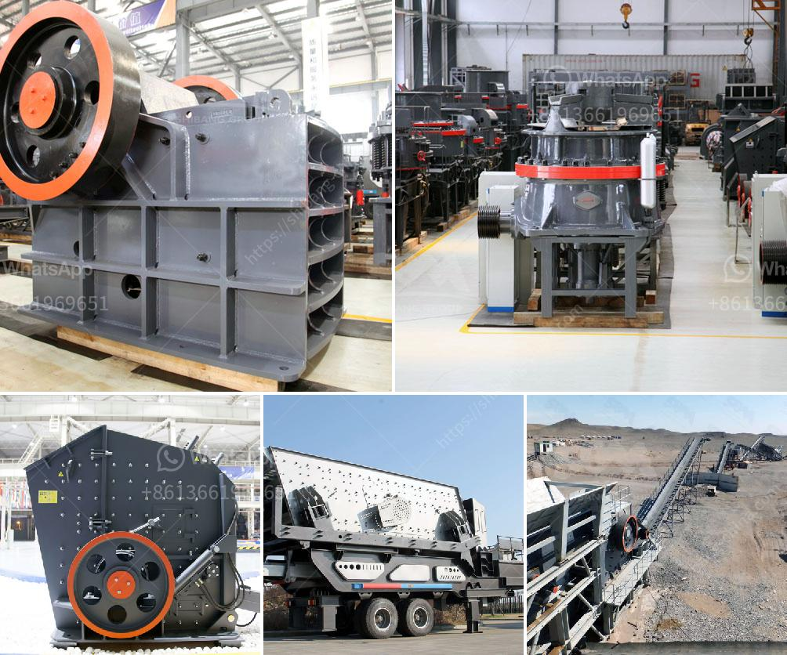

<h3>آلات تصنيع الرمل في الصين</h3>
تعد الصين واحدة من أكبر الدول المُصنعة لآلات تصنيع الرمل في العالم. وتأتي هذه الآلات بأحجام وأنواع متنوعة لتلبية احتياجات العملاء المختلفة. تركز الشركات المُصنعة الصينية على الجودة والأداء والتكلفة الفعالة لتصنيع الرمل. تلعب آلات تصنيع الرمل دورًا حاسمًا في صناعة البناء والبنية التحتية وصناعة الرمال الاصطناعية.

واحدة من أشهر الآلات الصينية لتصنيع الرمل هي الكسارة المطرقية. تتميز ببنائها الصلب المتين والصلابة العالية، وتساهم في تحطيم الصخور والأحجار الكبيرة إلى الأحجام المطلوبة لإنتاج الرمل. كما تتميز بتكلفتها المنخفضة وسهولة الصيانة، مما يجعلها خيارًا شائعًا للشركات والمقاولين.

بالإضافة إلى ذلك، تقدم الصين آلات تصنيع الرمل العمودية التي تعمل على تحويل الحجارة إلى رمل ناعم وفريد من نوعه. تعمل هذه الآلات بمبدأ طحن الأحجار على بعضها البعض، مما يتيح إنتاج رمل ذو جودة عالية وخالي من الغبار. تعتبر هذه الآلات مناسبة لتصنيع الرمال الاصطناعية للخرسانة والأسفلت، والتي تستخدم على نطاق واسع في مشاريع البناء الكبيرة.

تحرص الشركات المُصنعة الصينية على تحسين التكنولوجيا المستخدمة في آلات تصنيع الرمل، حيث تعمل على تطوير آلات متقدمة تعتمد على تقنيات الذكاء الاصطناعي والروبوتيات. يهدف ذلك إلى زيادة الكفاءة وتحسين جودة الرمال المنتجة، مع الحد من الاستهلاك الزائد للطاقة وتكاليف التشغيل.

بالنظر إلى زيادة الطلب على الرمال الاصطناعية في جميع أنحاء العالم، تلعب آلات تصنيع الرمل الصينية دورًا حيويًا في تلبية هذا الطلب المتزايد. وبفضل جودة منتجاتها وتقنياتها المبتكرة، تحافظ الصين على مكانتها الرائدة كواحدة من أكبر الشركات المُصنعة لآلات تصنيع الرمل في العالم.

وفي الختام، فإن التطور التكنولوجي والاستثمار المتواصل في صناعة آلات تصنيع الرمل في الصين يعزز قدرتها على تلبية الاحتياجات المتزايدة للرمال الاصطناعية. الابتكار التكنولوجي في هذا المجال سيستمر في دفع صناعة البناء وتطورها في السنوات المقبلة.
<h3>Contact us</h3><ul><li><strong>Whatsapp:&nbsp;<a href="https://wa.me/8613661969651">+8613661969651</a></strong></li><li><a href="https://swt.shibang-china.com/?git&amp;zhl&amp;آلات تصنيع الرمل في الصين"><strong>Online Service(chat now)</strong></a></li></ul><h3>Related</h3><ul><li><a href='مصنع الجير والدولوميت في ماليزيا.md'>مصنع الجير والدولوميت في ماليزيا</a></li><li><a href='مصنع كسارة الدولوميت في الكويت.md'>مصنع كسارة الدولوميت في الكويت</a></li><li><a href='خط إنتاج مطحنة عمودية LM.md'>خط إنتاج مطحنة عمودية LM</a></li><li><a href='كسارات محمولة للإيجار.md'>كسارات محمولة للإيجار</a></li><li><a href='تقرير المشروع حول وحدة تكسير الحجر.md'>تقرير المشروع حول وحدة تكسير الحجر</a></li></ul>