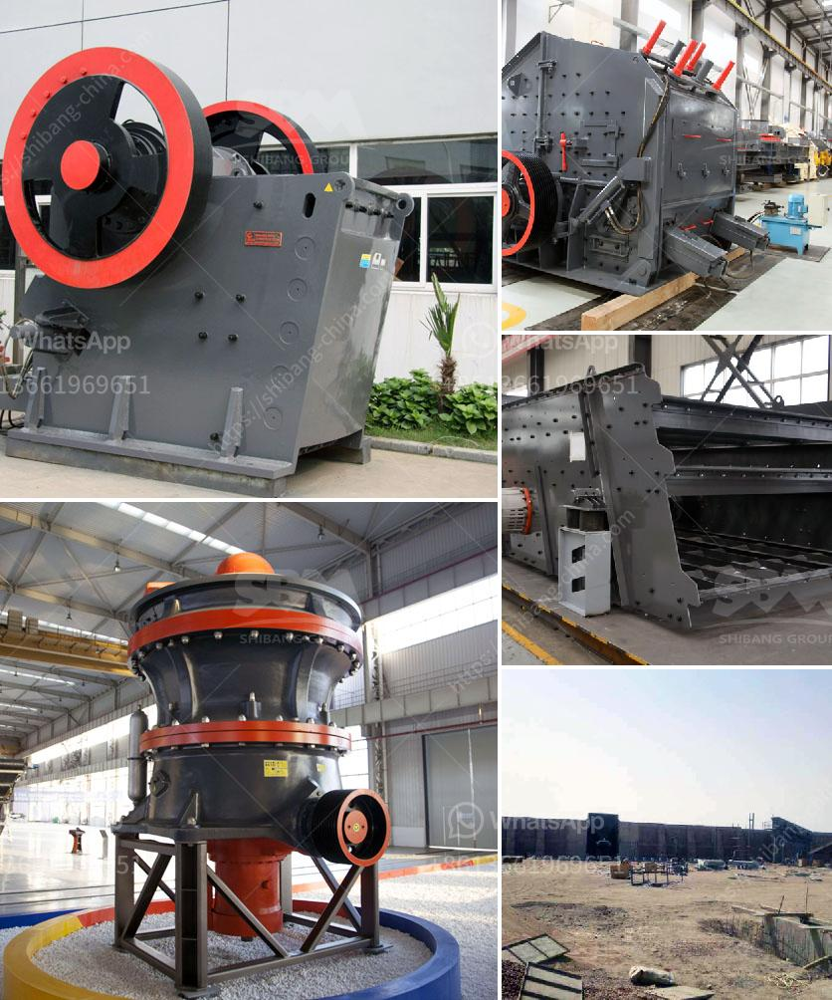

<h3>آلات تصنيع كتل الجبس في إيطاليا</h3>
إيطاليا هي واحدة من الدول الرائدة في تصنيع آلات تصنيع كتل الجبس، وتتمتع بسمعة عالية في هذا القطاع في جميع أنحاء العالم. يتم استخدام آلات تصنيع كتل الجبس في مجال البناء وتشييد الجدران الداخلية والخارجية وتجميعها بواسطة الجير المائي.

توفر إيطاليا العديد من الشركات المتخصصة في تصميم وتصنيع آلات تصنيع كتل الجبس بجودة عالية وتكنولوجيا حديثة. تعتمد هذه الآلات على نظام آلي متطور يتيح تصنيع كتل الجبس بطريقة أكثر كفاءة وأقل تكلفة.

تعتبر آلات التصنيع الإيطالية لكتل الجبس متعددة الاستخدامات وقادرة على تشكيل الجبس وفقاً للأبعاد والتصاميم المختلفة. تتضمن العمليات الأساسية التي تقوم بها هذه الآلات تقطيع الجبس إلى قطع معينة، وخلط المواد المكونة لتكوين الجبس، وصبها في قوالب، والتجفيف والتشكيل والتصميم النهائي. تستخدم هذه الآلات أيضًا تقنيات متقدمة للضغط العالي والتحكم الآلي لتكوين الكتل النهائية.

تتوفر في إيطاليا أيضًا آلات تصنيع كتل الجبس ذات القدرة الإنتاجية المختلفة، حيث يمكن تخصيص الآلات وتعديلها وفقًا لاحتياجات ومتطلبات المشاريع المختلفة. وتتميز هذه الآلات بالدقة والموثوقية وسرعة التصنيع والتشغيل السهل.

تشتهر إيطاليا بجمعة منتجي آلات تصنيع كتل الجبس المحترفين وذوي الخبرة، والذين يقدمون خدمات ما بعد البيع الممتازة، بما في ذلك التدريب والدعم الفني للعملاء. وبفضل هذه الفرق المتخصصة، تستطيع الشركات الإيطالية تزويد الزبائن في جميع أنحاء العالم بحلول فعالة وموثوقة لتصنيع كتل الجبس.

باختصار، يعتبر قطاع تصنيع آلات كتل الجبس في إيطاليا متقدمًا بشكل لافت ومتنوع، ويجذب الاهتمام والثقة من الزبائن ذوي الصناعات المختلفة حول العالم. تعتبر الجودة والتقنية العالية والدعم الفني المتميزة من أبرز مميزات هذا القطاع في إيطاليا.
<h3>Contact us</h3><ul><li><strong>Whatsapp:&nbsp;<a href="https://wa.me/8613661969651">+8613661969651</a></strong></li><li><a href="https://swt.shibang-china.com/?git&amp;zhl&amp;آلات تصنيع كتل الجبس في إيطاليا"><strong>Online Service(chat now)</strong></a></li></ul><h3>Related</h3><ul><li><a href='معدات إنتاج الركام.md'>معدات إنتاج الركام</a></li><li><a href='كسارة الصخور بوسطن.md'>كسارة الصخور بوسطن</a></li><li><a href='مصنع معالجة ملح الصخور.md'>مصنع معالجة ملح الصخور</a></li><li><a href='أنظمة ناقلات الحصى للمسافة.md'>أنظمة ناقلات الحصى للمسافة</a></li><li><a href='مورد آلة صنع الرمل.md'>مورد آلة صنع الرمل</a></li></ul>