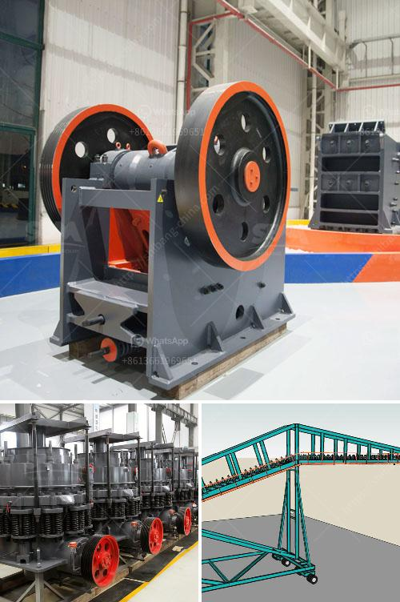

<h3>آلات تعدين الذهب الطمي</h3>
تعتبر آلات تعدين الذهب الطمي من الأدوات الحديثة والتكنولوجية التي تستخدم في استخراج الذهب من الطمي والرواسب الطينية. تتنوع هذه الآلات وتعتمد على العوامل المحلية ونوع المنطقة وكمية الذهب المراد استخراجها. وفي ما يلي سنتناول بعض الآلات الشائعة في عملية تعدين الذهب الطمي.

أحد الآلات الأساسية في تعدين الذهب الطمي هو القاطع الهيدروليكي. يعمل القاطع الهيدروليكي على تفتيت الصخور المشبعة بالذهب وتحويلها إلى طين يسهل تسرب الماء منها. يتم تحريك القاطع الهيدروليكي بواسطة ضغط المياه العالي، مما يؤدي إلى كسر الصخور وتحويلها إلى طين.

ثم يتم استخدام آلة الغسيل لاستخلاص الذهب من الطمي. تقوم الآلة بفصل الجزيئات الثقيلة مثل الذهب والركام الصخري. يتم ضخ قوة الماء بشكل كبير لفصل الذهب بفعالية، حيث يتم تركيز الذهب في الأسفل بينما يتم تجاهل الرواسب الأخرى.

لمعالجة الذهب الصغير الحجم، يتم استخدام جهاز السيانيد المنقولة. يتم إضافة محلول سيانيد إلى الطمي المحمل على الآلة، وباستخدام التدفق الهيدروليكي، يتم فصل الذهب من الركام. يمتص السيانيد الذهب ويتفاعل معه لتشكيل مركبات سيانيد الذهب. ثم يتم جمع هذه المركبات ومعالجتها لاستخلاص الذهب.

تعتبر آلات تعدين الذهب الطمي إحدى الوسائل الفعالة لاستخراج الذهب مع الحد الأدنى من الجهد والتكلفة. تسهم هذه الآلات في التقليل من العمل اليدوي المكثف وتسريع عملية تعدين الذهب. يجب أن يتم استخدام هذه الآلات بحذر وفقًا للأنظمة البيئية والصحية ذات الصلة لضمان الحفاظ على البيئة المحيطة وصحة العمال وسلامتهم.

في الختام، آلات تعدين الذهب الطمي تلعب دورًا هامًا في اقتصادات العديد من الدول وتعتبر وسيلة فعالة لاستخراج الذهب بشكل سريع وفعال. يجب أن يتم استخدام هذه الآلات بحذر وفقًا للمعايير البيئية والصحية لتحقيق أقصى قدر من الاستفادة مع الحفاظ على البيئة المحيطة.
<h3>Contact us</h3><ul><li><strong>Whatsapp:&nbsp;<a href="https://wa.me/8613661969651">+8613661969651</a></strong></li><li><a href="https://swt.shibang-china.com/?git&amp;zhl&amp;آلات تعدين الذهب الطمي"><strong>Online Service(chat now)</strong></a></li></ul><h3>Related</h3><ul><li><a href='مطحنة هامر ديزل في جنوب أفريقيا.md'>مطحنة هامر ديزل في جنوب أفريقيا</a></li><li><a href='عملية سحق الكسارة.md'>عملية سحق الكسارة</a></li><li><a href='مصنع سحق وطحن.md'>مصنع سحق وطحن</a></li><li><a href='كسارات فك متنقلة للبيع في المملكة المتحدة.md'>كسارات فك متنقلة للبيع في المملكة المتحدة</a></li><li><a href='كسارة محمولة مستعملة للبيع في جنوب أفريقيا.md'>كسارة محمولة مستعملة للبيع في جنوب أفريقيا</a></li></ul>