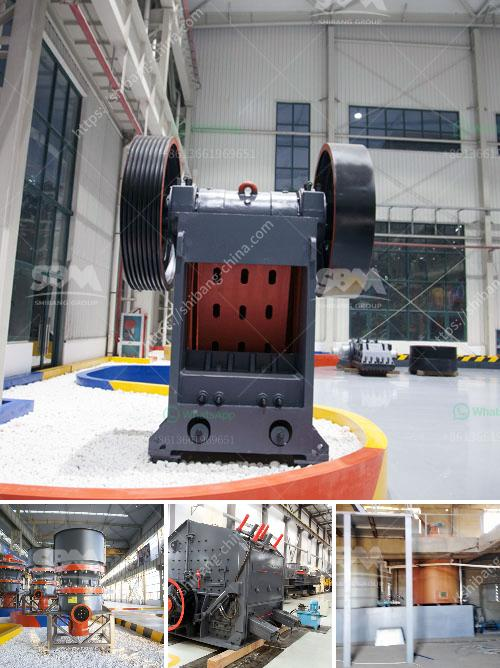

<h3>آلات تعدين الذهب مستعملة</h3>
آلات تعدين الذهب المستعملة هي أدوات تستخدم في عملية استخراج الذهب من الأرض. تعود تاريخ استخدام هذه الآلات إلى قرون عديدة ولعبت دورًا هامًا في تسهيل عملية التنقيب عن الذهب وزيادة الإنتاجية.

تتنوع آلات تعدين الذهب المستعملة في حجمها وطاقتها الإنتاجية. تشمل هذه الآلات المعدات الثقيلة مثل الحفارات والشاحنات التي تستخدم في إزالة الصخور والتربة الغير مرغوب فيها. كما تشمل أيضًا الكسارات والمطاحن التي تقوم بسحق الصخور الكبيرة إلى حجم صغير يمكن معالجته بسهولة.

تعتبر آلات غسل الذهب أحد أهم الأدوات المستخدمة في تعدين الذهب. تعمل هذه الآلات على فصل الذهب من الرمل والحصى باستخدام قوة الماء. تشمل هذه الآلات صوامع التخزين والشاكرات والغرابيل وأنابيب الضغط لنقل الماء. يتم تدوير المواد في هذه الآلات لفصل الذهب عن الأتربة والشوائب الأخرى.

تستخدم آلات طرق التعدين الآلي أيضًا في تعدين الذهب. تعمل هذه الآلات على انتزاع الذهب من الصخور المعدنية باستخدام القوة الميكانيكية. تشمل هذه الآلات المطارق الضخمة والكسارات والمناشير الكهربائية. تقوم هذه الآلات بكسر الصخور وتحويلها إلى أجزاء أصغر يمكن تنقيبها واستخراج الذهب منها.

من بين آلات تعدين الذهب المستعملة أيضًا آلات فصل الذهب المختلفة مثل الجداول الناعمة والمياه الفائقة الدقة. تعمل هذه الآلات على تجميع الذهب المنفصل عن المواد الأخرى مثل الرمل والحصى والحجارة الصغيرة.

بالإضافة إلى ذلك، تستخدم آلات الكشف عن الذهب الحديثة في تحديد المناطق التي تحتوي على ترسبات كثيفة من الذهب. تعمل هذه الآلات من خلال إرسال إشارات إلكترونية إلى الأرض وتحليل الاستجابة لتحديد وجود الذهب في التربة.

في النهاية، يمكن القول إن آلات تعدين الذهب المستعملة تعد عنصرًا أساسيًا في صناعة تعدين الذهب. تسهم هذه الآلات في زيادة الإنتاجية وتحسين كفاءة عملية استخراج الذهب، مما يساهم في تلبية الطلب المتزايد على هذا المعدن الثمين.
<h3>Contact us</h3><ul><li><strong>Whatsapp:&nbsp;<a href="https://wa.me/8613661969651">+8613661969651</a></strong></li><li><a href="https://swt.shibang-china.com/?git&amp;zhl&amp;آلات تعدين الذهب مستعملة"><strong>Online Service(chat now)</strong></a></li></ul><h3>Related</h3><ul><li><a href='مطحنة الكرة مع محول mercadolibre.md'>مطحنة الكرة مع محول mercadolibre</a></li><li><a href='خط سحق البازلت.md'>خط سحق البازلت</a></li><li><a href='مطحنة الكرة مطرقة مطحنة مطحنة أسطوانية آلة.md'>مطحنة الكرة مطرقة مطحنة مطحنة أسطوانية آلة</a></li><li><a href='صنع مسحوق الكالسيوم.md'>صنع مسحوق الكالسيوم</a></li><li><a href='أحجام كسارة الفك الحجر الجيري.md'>أحجام كسارة الفك الحجر الجيري</a></li></ul>