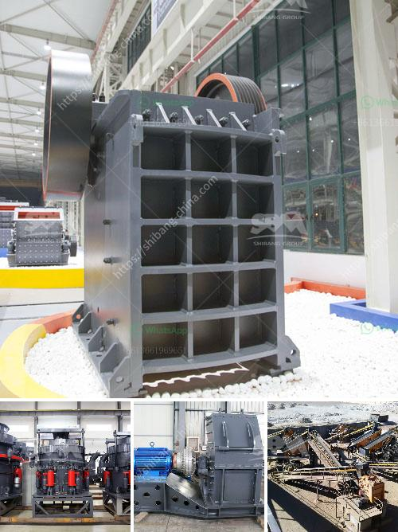

<h3>آلات تكسير الحصى</h3>
تكسير الحصى هو عملية مهمة في صناعة البناء والإنشاءات، حيث يتم استخدام الحصى المكسر في إنتاج الخرسانة والأسفلت والرصف وغيرها من التطبيقات الهندسية. ولتحقيق هذا الهدف، يتم استخدام آلات تكسير الحصى التي تقوم بتحويل الحصى الكبير إلى الحصى المكسر المطلوب.

تشمل آلات تكسير الحصى عدة أنواع، بما في ذلك الكسارات الفكية والكسارات الصدمية والكسارات المخروطية. تختلف هذه الآلات في تصميمها وطريقة عملها، ولكن جميعها تهدف إلى تحويل الحصى إلى ذرات صغيرة تتناسب مع احتياجات المشروع المحدد.

تعتبر الكسارة الفكية أحد أهم أنواع آلات تكسير الحصى، حيث تستخدم لكسر الحصى الكبير بالحجم وتحويله إلى ذرات صغيرة. تعمل الكسارة الفكية بواسطة ضغط الحصى بين لوحتين متحركتين، مما يؤدي إلى تكسير الحصى وتحويله إلى حجم أصغر. يتم ضبط فجوة بين اللوحتين المتحركتين وفقًا للحجم المطلوب للحصى المكسر.

أما الكسارة الصدمية فتعتمد على آلية الصدم لتكسير الحصى الكبير. تعمل الكسارة الصدمية بواسطة إلقاء الحصى بسرعة عالية على شريط معدني صلب. يتم امتصاص الصدمة بواسطة الشريط وتحويلها إلى طاقة كينتية، والتي تنتقل إلى الحصى وتكسرها. تختلف سرعة الإلقاء وزاوية الصدمة بين الآلات المختلفة وفقًا لنوع الحصى والاحتياجات المحددة للمشروع.

أما الكسارة المخروطية فتعتمد على آلية الضغط لتكسير الحصى. تعمل الكسارة المخروطية بواسطة ضغط الحصى بين جزء ثابت وآخر متحرك، مما يؤدي إلى تكسير الحصى وتحويله إلى حجم أصغر. يتم ضبط المسافة بين الجزء الثابت والمتحرك وفقًا للحجم المطلوب للحصى المكسر.

تحظى آلات تكسير الحصى بشعبية كبيرة في صناعة البناء والإنشاءات، حيث تساهم في توفير الحصى المكسر بالحجم المطلوب وتلبية احتياجات المشاريع المختلفة. تعزز هذه الآلات كفاءة العمل وتحقق وفرة في الوقت والجهد المبذولين. كما أنها تضمن جودة عالية للحصى المكسر، مما يحسن أداء المشروعات الهندسية ويعزز الاستدامة البيئية.

باختصار، آلات تكسير الحصى تعد جزءاً أساسياً في صناعة البناء والإنشاءات، وتساهم في تحويل الحصى الكبير إلى الحصى المكسر المطلوب. تتوفر هذه الآلات في عدة تصاميم وأحجام، وتستخدم تقنيات متعددة لتكسير الحصى بفعالية وكفاءة. تحسن هذه الآلات جودة وأداء المشروعات الهندسية وتلبي الاحتياجات المتنوعة للسوق
<h3>Contact us</h3><ul><li><strong>Whatsapp:&nbsp;<a href="https://wa.me/8613661969651">+8613661969651</a></strong></li><li><a href="https://swt.shibang-china.com/?git&amp;zhl&amp;آلات تكسير الحصى"><strong>Online Service(chat now)</strong></a></li></ul><h3>Related</h3><ul><li><a href='كسارة سلسلة السلسلة ومورديها.md'>كسارة سلسلة السلسلة ومورديها</a></li><li><a href='مصنع الأسمنت للبيع في دبي.md'>مصنع الأسمنت للبيع في دبي</a></li><li><a href='عملية تحويل الحجر الجيري إلى الإسمنت.md'>عملية تحويل الحجر الجيري إلى الإسمنت</a></li><li><a href='معدات تكسير الخرسانة.md'>معدات تكسير الخرسانة</a></li><li><a href='تصميم آلة تكسير الحجر.md'>تصميم آلة تكسير الحجر</a></li></ul>