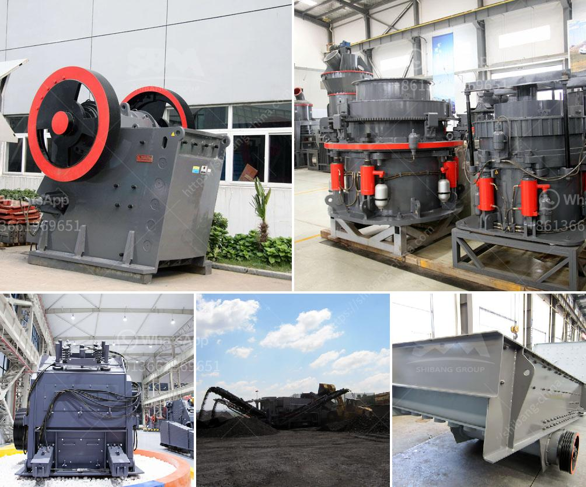

<h3>آلات تكسير وفرز</h3>
الآلات الخاصة بعملية تكسير وفرز تعد أدوات أساسية في صناعة التعدين والبناء والهندسة المدنية. تستخدم هذه الآلات لتحطيم المواد الخام إلى قطع صغيرة وفرزها وفقًا لحجمها. يتم استخدامها في مجموعة متنوعة من الصناعات لإنتاج مواد نهائية مستخدمة في الإنشاءات والطرق والأرصفة والأعمال الهيدروليكية وغيرها.

تعتبر آلة الكسارة الفكية واحدة من الأنواع الشائعة لآلات التكسير والتي تستخدم لتحطيم المواد بواسطة الضغط بين الفكين. تعتمد عملية كسر المواد على تطبيق قوة الضغط على المادة حتى تنكسر إلى أجزاء صغيرة. تتوفر الكسارات الفكية بأحجام مختلفة وقوى تحطيم مختلفة لتتناسب مع احتياجات الإنتاج المختلفة.

بالإضافة إلى الكسارة الفكية، تعتبر الكسارة المخروطية وآلة الصدم وآلة الأسطوانة الأخرى من الآلات الشائعة في عملية التكسير. تتميز الكسارة المخروطية بفتحة التغذية الصغيرة والشكل المخروطي للكسارة، مما يسمح بتكسير المواد بطريقة فعالة وفعالة. من ناحية أخرى، تستخدم آلات الصدم لتحطيم المواد عن طريق توجيه القوة الهيدروليكية أو الكهربائية على المواد لتحطيمها بشكل مستمر. هذه الآلات تعتمد على الصدم لتحطيم المواد بسرعة وفعالية.

بعد عملية التكسير، يتم استخدام آلات الفرز لفرز المواد وفقًا لحجمها. تتكون هذه الآلات عادةً من شبكات صغيرة تسمح فقط بمرور المواد ذات الأحجام المناسبة. الآلات الأكثر شيوعًا في عملية الفرز هي الشاشات الاهتزازية، حيث يتم تدويرها بسرعة لفصل المواد وفقًا لحجمها. تتوفر الشاشات الاهتزازية بأحجام وتصاميم مختلفة لتلبية متطلبات الفرز المختلفة.

تساهم آلات التكسير والفرز في تحسين كفاءة العمليات الصناعية وزيادة الإنتاجية. تساعد في تحويل المواد الخام إلى منتجات صالحة للاستخدام. كما تقلل من حاجة العمالة البشرية وتوفر وقتًا وجهدًا. وبالتالي، فإن هذه الآلات تعتبر ضرورية في العديد من الصناعات التي تعتمد على عملية التكسير والفرز.

باختصار، تعتبر آلات التكسير والفرز أدوات حيوية في العديد من الصناعات. تساعد في تحويل المواد الخام إلى منتجات قابلة للاستخدام وتزيد من كفاءة العمليات الصناعية. تلعب دورًا مهمًا في البناء والهندسة المدنية والتعدين وغيرها من الصناعات التي تعتمد على التكسير والفرز.
<h3>Contact us</h3><ul><li><strong>Whatsapp:&nbsp;<a href="https://wa.me/8613661969651">+8613661969651</a></strong></li><li><a href="https://swt.shibang-china.com/?git&amp;zhl&amp;آلات تكسير وفرز"><strong>Online Service(chat now)</strong></a></li></ul><h3>Related</h3><ul><li><a href='مصنع سحق وطحن.md'>مصنع سحق وطحن</a></li><li><a href='مطحنة رايموند للطحن الدقيق جدا.md'>مطحنة رايموند للطحن الدقيق جدا</a></li><li><a href='قائمة أسعار مصنع التكسير.md'>قائمة أسعار مصنع التكسير</a></li><li><a href='تجار في محطم الفحم وآلة طحن في الهند.md'>تجار في محطم الفحم وآلة طحن في الهند</a></li><li><a href='كسارات الحجر في المحجر.md'>كسارات الحجر في المحجر</a></li></ul>