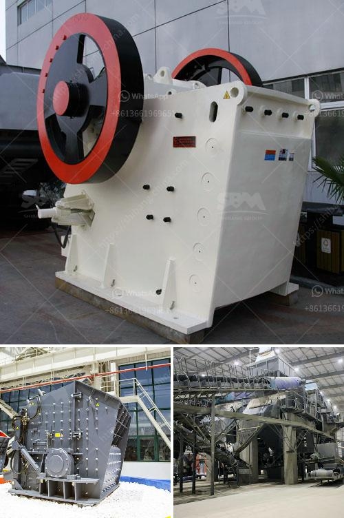

<h3>آلات سحق الحجر اليابانية</h3>
تعتبر آلات سحق الحجر اليابانية من أفضل الأدوات المستخدمة في صناعة البناء والتعدين، فهي تعمل على سحق الحجر بطريقة فعالة وبجودة عالية. تتميز هذه الآلات بتقنيات عالية الجودة وتصميمات متقدمة تجعل منها أداة فعالة وقوية في التعامل مع الحجارة.

تتكون هذه الآلات من مجموعة من الأجزاء المهمة مثل المحركات والأسطوانات والفكين والمطارق. تعمل المحركات على تحويل الطاقة الكهربائية إلى طاقة ميكانيكية، بينما تقوم الأسطوانات بتحريك الفكين لسحق الحجر. يتم تثبيت الحجر بين الفكين ويتم سحقه بواسطة حركة الفكين المستمرة والقوية. كما يمكن استخدام المطارق لتحطيم الحجر الكبير إلى قطع أصغر وأسهل للتعامل معها.

تستخدم هذه الآلات في مجموعة متنوعة من التطبيقات، بما في ذلك صناعة البناء والتعدين. ففي صناعة البناء، تستخدم لسحق الأحجار الكبيرة وتحويلها إلى حصمة يمكن استخدامها في الأعمال الإنشائية مثل بناء الطرق والجسور. كما تستخدم في صناعة البناء لتحطيم الحصى وتحويله إلى مواد قابلة للتدوير وإعادة الاستخدام.

أما في صناعة التعدين، فإن آلات سحق الحجر اليابانية تستخدم لاستخراج المعادن من الصخور والأرض. تقوم هذه الآلات بسحق الصخور الكبيرة المحتوية على المعادن واستخلاص المعادن منها. تعمل هذه الآلات بكفاءة عالية وتوفر وقتًا وجهدًا في عملية استخراج المعادن.

بالإضافة إلى ذلك، تتميز آلات سحق الحجر اليابانية بالمتانة والقوة، مما يجعلها قادرة على التعامل مع الحجارة الكبيرة بسهولة وفعالية. تم إجراء العديد من التحسينات على تصميم هذه الآلات لزيادة قدرتها على تحمل الضغط والعمل الشاق.

باختصار، آلات سحق الحجر اليابانية تعتبر أدوات مؤثرة وقوية في صناعة البناء والتعدين. تمتاز بتقنيات عالية الجودة وتصميمات متقدمة، مما يساهم في جعلها من أفضل الأدوات المتوفرة في السوق. تعمل هذه الآلات بكفاءة وقوة، مما يسهم في تحسين إنتاجية العمل وتوفير الوقت والجهد.
<h3>Contact us</h3><ul><li><strong>Whatsapp:&nbsp;<a href="https://wa.me/8613661969651">+8613661969651</a></strong></li><li><a href="https://swt.shibang-china.com/?git&amp;zhl&amp;آلات سحق الحجر اليابانية"><strong>Online Service(chat now)</strong></a></li></ul><h3>Related</h3><ul><li><a href='كسارة أولية مستخدمة في جنوب أفريقيا.md'>كسارة أولية مستخدمة في جنوب أفريقيا</a></li><li><a href='آلة طحن الرخام للبيع.md'>آلة طحن الرخام للبيع</a></li><li><a href='قطع غيار لكسارات الحجر.md'>قطع غيار لكسارات الحجر</a></li><li><a href='آلة كسارة الذهب للبيع في جنوب أفريقيا.md'>آلة كسارة الذهب للبيع في جنوب أفريقيا</a></li><li><a href='مصنع كامل لاستخراج النحاس للبيع.md'>مصنع كامل لاستخراج النحاس للبيع</a></li></ul>