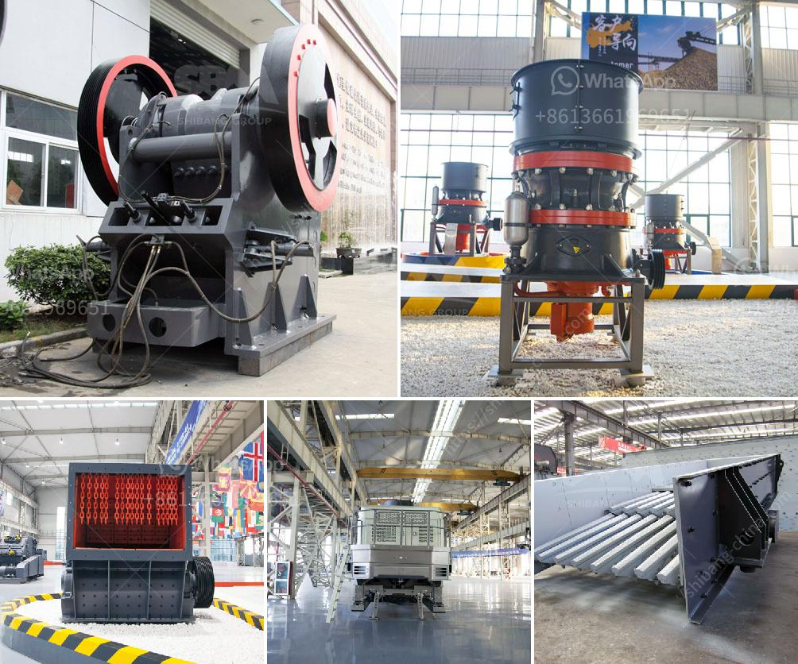

<h3>آلات سحق الركام</h3>
آلات سحق الركام هي آلات تستخدم لتحويل الركام إلى حجارة صغيرة الحجم تستخدم في العديد من الصناعات مثل صناعة البناء والطرق والسكك الحديدية. تعتبر آلات سحق الركام أداة أساسية في عملية تحويل الركام إلى مادة قابلة للتصنيع.

تتكون آلات سحق الركام من العديد من الأجزاء المختلفة مثل الفك المتحرك والفك الثابت ومحرك الديزل أو المحرك الكهربائي. يتم استخدام هذه الأجزاء معًا لسحق الركام بفعالية وتحويله إلى حجارة صغيرة.

تستخدم آلات سحق الركام في العديد من المشاريع الكبيرة مثل بناء الطرق والجسور والمباني. تعتبر هذه الآلات مهمة جدًا لأنها تساعد في تقليل حجم الركام وتسهيل عملية التخلص منها وإعادة تدويرها. إعادة تدوير الركام لها العديد من الفوائد البيئية والاقتصادية، حيث يتم توفير الموارد الطبيعية وتقليل تكلفة إنتاج المواد البنائية.

بالإضافة إلى ذلك، تساهم آلات سحق الركام في زيادة الكفاءة وتقليل الوقت والجهد المطلوب لإكمال المشروعات. فهي تتميز بالقدرة على سحق الركام بسرعة وفعالية، مما يجعل عملية البناء أسرع وأكثر اقتصادية.

علاوة على ذلك، يمكن استخدام آلات سحق الركام لتحسين جودة المنتج النهائي. حيث يمكن ضبط حجم الحصى المحطم وفقا لاحتياجات المشروع، مما يساعد في تحسين جودة البناء وتلبية المعايير الفنية.

بصفة عامة، تعتبر آلات سحق الركام أداة حاسمة في عملية البناء وإعادة التدوير. تلعب دورًا كبيرًا في تسهيل وتسريع عملية البناء وتحسين جودة المواد البنائية.
<h3>Contact us</h3><ul><li><strong>Whatsapp:&nbsp;<a href="https://wa.me/8613661969651">+8613661969651</a></strong></li><li><a href="https://swt.shibang-china.com/?git&amp;zhl&amp;آلات سحق الركام"><strong>Online Service(chat now)</strong></a></li></ul><h3>Related</h3><ul><li><a href='كسارة مخروطية جديدة تمامًا للبيع في الهند.md'>كسارة مخروطية جديدة تمامًا للبيع في الهند</a></li><li><a href='موردين طاحونة الفحم.md'>موردين طاحونة الفحم</a></li><li><a href='آلة كسارة محمولة.md'>آلة كسارة محمولة</a></li><li><a href='مطحنة كرات لتعدين الذهب للبيع.md'>مطحنة كرات لتعدين الذهب للبيع</a></li><li><a href='البحث عن شريك لكسارة الآلات.md'>البحث عن شريك لكسارة الآلات</a></li></ul>