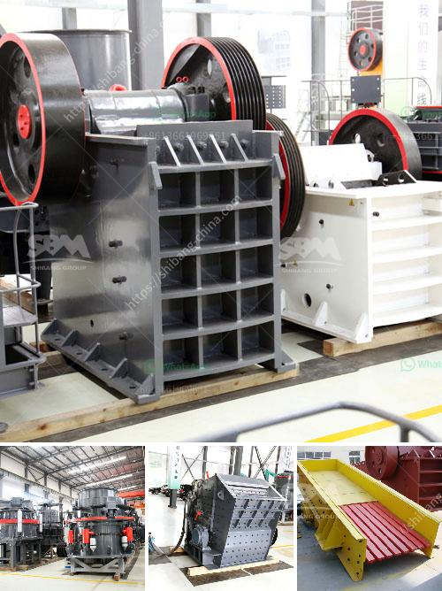

<h3>آلات سحق الفحم في جنوب أفريقيا</h3>
تعد جنوب أفريقيا اليوم واحدة من أكبر منتجي الفحم في العالم، حيث تمثل صناعة الفحم جزءًا هامًا من الاقتصاد الوطني وتوفر فرص عمل للآلاف من العمال. تعتمد عملية استخراج الفحم على الآلات المتطورة لسحق واستخلاص الفحم من مناجم الفحم. 

تتمثل الطريقة الأكثر شيوعًا لاستخراج الفحم في جنوب أفريقيا في استخلاص الفحم من تحت سطح الأرض في منجم فحم. عند بلوغ الفحم إلى السطح، يتم سحقه باستخدام معدات متخصصة. هناك عدة أنواع من آلات سحق الفحم المستخدمة في جنوب أفريقيا، بما في ذلك الكسارات والمطاحن.

تعد الكسارات من أهم الآلات التي تستخدم لسحق الفحم في جنوب أفريقيا. تتوافر العديد من الكسارات المتنقلة والكسارات الثابتة التي توفر أداءً فعالًا وموثوقًا في سحق الفحم. يعتمد استخدام نوع معين من الكسارة على حجم الفحم واحتياجات العملية التعدينية. تضم الكسارات الفكية والكسارات الصدمية والكسارات المخروطية بين الأنواع الشائعة من كسارات الفحم.

بالإضافة إلى الكسارات، تستخدم المطاحن أيضًا لسحق الفحم في جنوب أفريقيا. تعد مطاحن الفحم العمودية ومطاحن الكرة ومطاحن شبه الأوتوجيني من بين المطاحن الشائعة في صناعة تكسير الفحم. تقوم المطاحن بسحق الفحم إلى حجم صغير وتحويله إلى مسحوق، مما يجعل من السهل استخلاص الفحم واستخدامه في عمليات الإنتاج اللاحقة.

إجمالاً، تلعب آلات سحق الفحم دورًا حاسمًا في عملية استخراج وتوزيع الفحم في جنوب أفريقيا. حيث تساهم هذه الآلات في تسهيل وتحسين عملية تحويل الفحم من تحت الأرض إلى منتج نهائي قابل للاستخدام. كما أن استخدام تكنولوجيا متطورة وآلات متقدمة يعزز كفاءة إنتاج الفحم ويحسن السلامة والأمان في عمليات التعدين. وبالتالي، فإن آلات سحق الفحم تعد عنصرًا حاسمًا في صناعة الفحم في جنوب أفريقيا.
<h3>Contact us</h3><ul><li><strong>Whatsapp:&nbsp;<a href="https://wa.me/8613661969651">+8613661969651</a></strong></li><li><a href="https://swt.shibang-china.com/?git&amp;zhl&amp;آلات سحق الفحم في جنوب أفريقيا"><strong>Online Service(chat now)</strong></a></li></ul><h3>Related</h3><ul><li><a href='مطاحن الأسطوانات في الدول.md'>مطاحن الأسطوانات في الدول</a></li><li><a href='موزعون لمعدات المحاجر والتعدين في الصين.md'>موزعون لمعدات المحاجر والتعدين في الصين</a></li><li><a href='سعر مصنع الكسارة الهندسي الجديد 200 طن في الساعة.md'>سعر مصنع الكسارة الهندسي الجديد 200 طن في الساعة</a></li><li><a href='محطة كسارة نيجيريا.md'>محطة كسارة نيجيريا</a></li><li><a href='مصنع كسارة الحجر الأبيض في الفلبين.md'>مصنع كسارة الحجر الأبيض في الفلبين</a></li></ul>