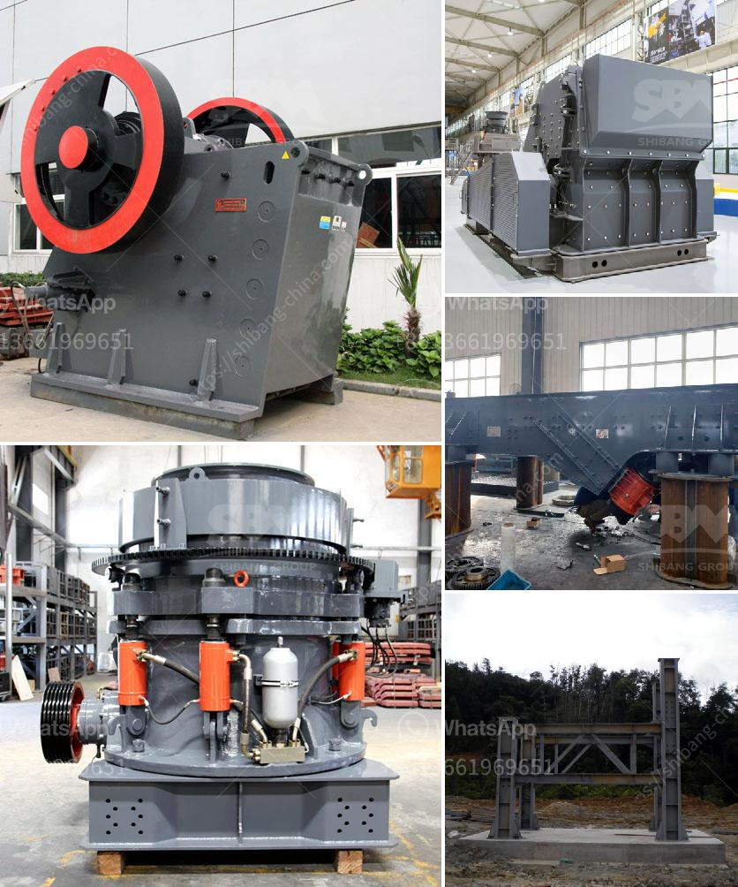

<h3>آلات سحق الكرةست</h3>
تعد آلات سحق الكرةست أحد أهم الأدوات في صناعة التعدين ومعالجة المواد الخام. تستخدم هذه الآلات لسحق المواد الصلبة إلى حجم صغير لاستخدامها في العديد من التطبيقات المختلفة. تكمن أهمية هذه الآلات في قدرتها على تحويل المواد الكبيرة وغير القابلة للاستخدام إلى مسحوق ناعم يمكن أن يكون مفيدًا في العديد من الصناعات.

تعمل آلات سحق الكرةست عن طريق تجويف داخلي يحتوي على كرة تدور بسرعة عالية. تتم غربلة المواد الخام وإدخالها في تجويف الآلة، حيث يتم سحقها بواسطة الكرة الدوارة. يتم نقل المواد المسحوقة خلال الكرة وتتمزق بفعل القوة العالية التي تتحملها المواد أثناء السحق. ينتج السائل النهائي بعد السحق في شكل مسحوق دقيق يمكن استخدامه في العديد من التطبيقات.

تعد آلات سحق الكرةست أحدث تقنية في هذا المجال، حيث تستخدم تكوينات ذكية وميزات متقدمة لضمان أفضل أداء ونتائج ممتازة. تتميز هذه الآلات بسرعة السحق والدقة والكفاءة العالية. بفضل تلك التقنيات المتطورة، تتمكن هذه الآلات من سحق مجموعة متنوعة من المواد بسهولة وفعالية.

تستخدم آلات سحق الكرةست في العديد من الصناعات مثل صناعة الأسمنت والكيماويات والمعادن والزجاج والسيراميك. تساهم هذه الآلات في إنتاج المساحيق الدقيقة المستخدمة في تصنيع العديد من المنتجات. علاوة على ذلك، تساهم في تقليل حجم المواد الخام وتوفير الطاقة وتحسين جودة المنتج النهائي.

بالاضافة إلى ذلك، فإن آلات سحق الكرةست تتمتع بالمرونة والقدرة على التكيف مع احتياجات العملاء المختلفة. يمكن تعديل إعدادات وسرعة الكرة لتلبية المتطلبات المحددة. بالإضافة إلى ذلك، تتوفر مجموعة متنوعة من الأحجام وتكوينات الآلات لتناسب مجموعة متنوعة من التطبيقات.

في الختام، تعد آلات سحق الكرةست أداة أساسية في صناعة التعدين ومعالجة المواد الخام. توفر هذه الآلات سحقًا دقيقًا وفعالًا للمواد الصلبة، مما يساهم في إنتاج المساحيق الدقيقة وتحسين جودة المنتج النهائي. بفضل تكويناتها الذكية والتكنولوجيا المتقدمة، تعد هذه الآلات خيارًا مثاليًا للعديد من الصناعات المختلفة.
<h3>Contact us</h3><ul><li><strong>Whatsapp:&nbsp;<a href="https://wa.me/8613661969651">+8613661969651</a></strong></li><li><a href="https://swt.shibang-china.com/?git&amp;zhl&amp;آلات سحق الكرةست"><strong>Online Service(chat now)</strong></a></li></ul><h3>Related</h3><ul><li><a href='مصنعو كسارات الجيري.md'>مصنعو كسارات الجيري</a></li><li><a href='رسم تخطيطي لعملية إنتاج الأسمنت.md'>رسم تخطيطي لعملية إنتاج الأسمنت</a></li><li><a href='آلات كسارة الحجر في هولندا.md'>آلات كسارة الحجر في هولندا</a></li><li><a href='آلات كسارة الحجر الكوارتز.md'>آلات كسارة الحجر الكوارتز</a></li><li><a href='مطاحن تحضير الدولوميت.md'>مطاحن تحضير الدولوميت</a></li></ul>