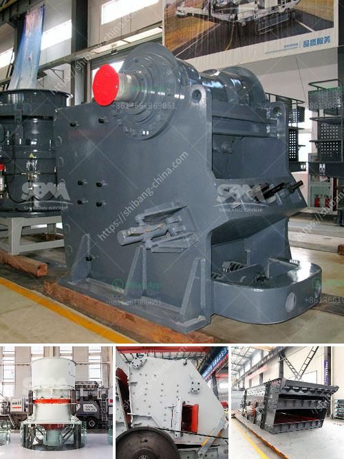

<h3>آلات سحق تعمل في بيرو</h3>
تعد آلات السحق من أهم الآلات المستخدمة في صناعة التعدين والبناء والهدم. وبدلاً من استخدام التقنيات التقليدية في سحق المواد الخام الكبيرة الحجم، أصبح تحويل هذه المواد إلى أحجام صغيرة أسهل وأكثر كفاءة باستخدام هذه الآلات.

في بيرو، تعد آلات السحق جزءًا أساسيًا من عمليات التعدين والتعدين. يعتبر قطاع التعدين في بيرو من أهم قطاعات الاقتصاد الوطني، حيث يتركز في مناطق مثل أريكيبا وكاخاماركا وأبانكاي وموروكوتشو وبيتزول وغيرها من المناطق.

تستخدم الآلات السحق في بيرو لسحق المواد الخام المستخرجة من التعدين، مثل النحاس والذهب والفضة والزنك والرصاص والقصدير والحديد والبوتاسيوم والموليبدينوم والفلسبار والصلصال والبارايت وغيرها من المعادن والصخور. تقوم هذه الآلات بسحق هذه المواد إلى أحجام أصغر، مما يتيح التعامل معها بسهولة أكبر في العمليات اللاحقة مثل المعالجة الكيميائية والفصل والتعبئة والتغليف.

تتكون الآلات السحق في بيرو من مكونات أساسية مثل الكسارة الفكية وكسارة الصدم وكسارة المخروط وكسارة الأسطوانة. تتميز هذه الآلات بقوتها العالية وكفاءتها في سحق المواد الخام الصلبة. وعلاوة على ذلك، تزود بعض الشركات المصنعة للآلات السحق في بيرو هذه الآلات بتقنيات حديثة مثل نظام التحكم الآلي والحماية من الحمل الزائد والتشغيل السلس.

تستخدم الآلات السحق في بيرو أيضًا في صناعة البناء والهدم. ففي هذه الصناعة، يتم سحق الخرسانة والأنقاض والصخور الطبيعية لإعادة تدويرها واستخدامها في بناء المباني والطرق الجديدة. تساهم هذه الآلات في تحقيق الاستدامة البيئية وتقليل تكاليف البناء والهدم.

باختصار، تعتبر آلات السحق في بيرو أدوات حيوية في صناعة التعدين والبناء والهدم. تمكن من تحويل المواد الخام الكبيرة الحجم إلى أحجام صغيرة وسهلة التعامل معها. وبفضل التقنيات المتقدمة والكفاءة العالية، تلعب هذه الآلات دورًا هامًا في تطوير قطاعات الاقتصاد الوطني والمساهمة في التنمية المستدامة.
<h3>Contact us</h3><ul><li><strong>Whatsapp:&nbsp;<a href="https://wa.me/8613661969651">+8613661969651</a></strong></li><li><a href="https://swt.shibang-china.com/?git&amp;zhl&amp;آلات سحق تعمل في بيرو"><strong>Online Service(chat now)</strong></a></li></ul><h3>Related</h3><ul><li><a href='مصنع غسيل الطين الجيري.md'>مصنع غسيل الطين الجيري</a></li><li><a href='خط سحق البازلت.md'>خط سحق البازلت</a></li><li><a href='آلة تكسير الفك.md'>آلة تكسير الفك</a></li><li><a href='موردين كسارات الفك والمخروط في موكوباني.md'>موردين كسارات الفك والمخروط في موكوباني</a></li><li><a href='أسعار وحدات طحن الكلنكر.md'>أسعار وحدات طحن الكلنكر</a></li></ul>