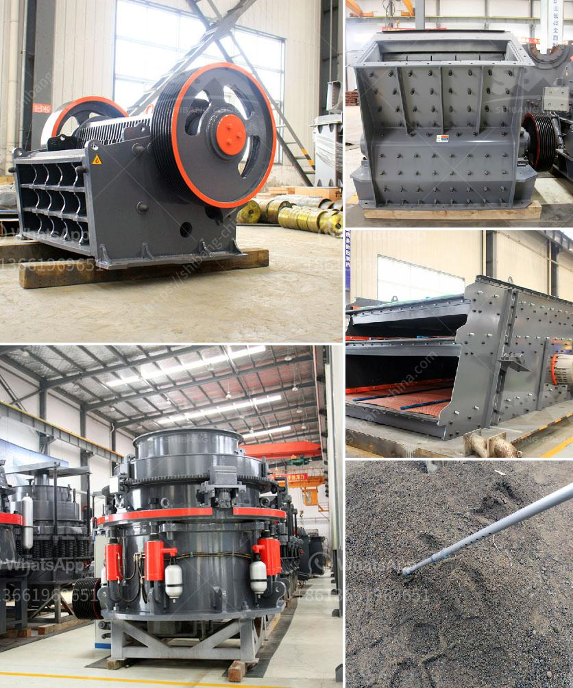

<h3>آلات صنع الأسمنت لمصنع الأسمنت كامل</h3>
تعتبر آلات صنع الأسمنت أحد العناصر الأساسية في مصنع الأسمنت، حيث تقوم بتحويل المواد الخام إلى خليط الأسمنت النهائي الذي يستخدم في البناء. يتكون مصنع الأسمنت عادةً من عدة أقسام أساسية، والتي تشمل وحدات التكسير والتجفيف والتسخين والطحن والتعبئة.

أولاً، تبدأ العملية بوحدة التكسير حيث يتم سحق المواد الخام، مثل الحجر الجيري والسيليكات والطين، إلى قطع صغيرة باستخدام كسارات. تتميز هذه الوحدة بالقوة والمتانة لتحمل عملية السحق المتكررة.

من ثم، يتم نقل المواد الخام إلى وحدة التجفيف حيث تعرض لدرجات حرارة عالية لتجفيفها من الرطوبة المتبقية. بعد ذلك، يتم نقل المواد إلى وحدة التسخين حيث تتعرض لدرجات حرارة شديدة لتحويلها إلى كلنكر الأسمنت.

ثم، تتم نقل الكلنكر إلى وحدة الطحن حيث يتم طحنه إلى مسحوق ناعم باستخدام آلات طحن مثل المطاحن الكروية والأسطوانية. يتم طحن المكونات الأخرى المستخدمة في الأسمنت، مثل مضافات الأداء والجبس، أيضًا في هذه الوحدة.

أخيرًا، تتم نقل الأسمنت المطحون إلى وحدة التعبئة حيث تعبأ في أكياس أوحاويات كبيرة بوزن محدد. تتم هذه العملية بواسطة آلات التعبئة والتغليف الأوتوماتيكية.

توفر آلات صنع الأسمنت القدرة على إنتاج كميات كبيرة من الأسمنت بكفاءة عالية وبتكلفة منخفضة. وبفضل التكنولوجيا المتقدمة، يمكن لهذه الآلات تحقيق معايير الجودة والسلامة المطلوبة للمنتج النهائي.

وفي الختام، يمكن القول إن آلات صنع الأسمنت تعد عنصرًا حيويًا لمصنع الأسمنت حيث تقوم بتحويل المواد الخام إلى منتج نهائي عالي الجودة يستخدم في صناعة البناء. تتطلب هذه العملية الدقة والمهارة والتحكم في العوامل المتغيرة لضمان إنتاج أفضل أنواع الأسمنت.
<h3>Contact us</h3><ul><li><strong>Whatsapp:&nbsp;<a href="https://wa.me/8613661969651">+8613661969651</a></strong></li><li><a href="https://swt.shibang-china.com/?git&amp;zhl&amp;آلات صنع الأسمنت لمصنع الأسمنت كامل"><strong>Online Service(chat now)</strong></a></li></ul><h3>Related</h3><ul><li><a href='كيفية عمل مصنع سحق الحجر.md'>كيفية عمل مصنع سحق الحجر</a></li><li><a href='مطحنة عمودية معلومات أيرلندا.md'>مطحنة عمودية معلومات أيرلندا</a></li><li><a href='مصنع معالجة الحجر الفلدسباري.md'>مصنع معالجة الحجر الفلدسباري</a></li><li><a href='مطحنة رطبة في الصين.md'>مطحنة رطبة في الصين</a></li><li><a href='الطحن بالكرات العمودية والأفقية.md'>الطحن بالكرات العمودية والأفقية</a></li></ul>