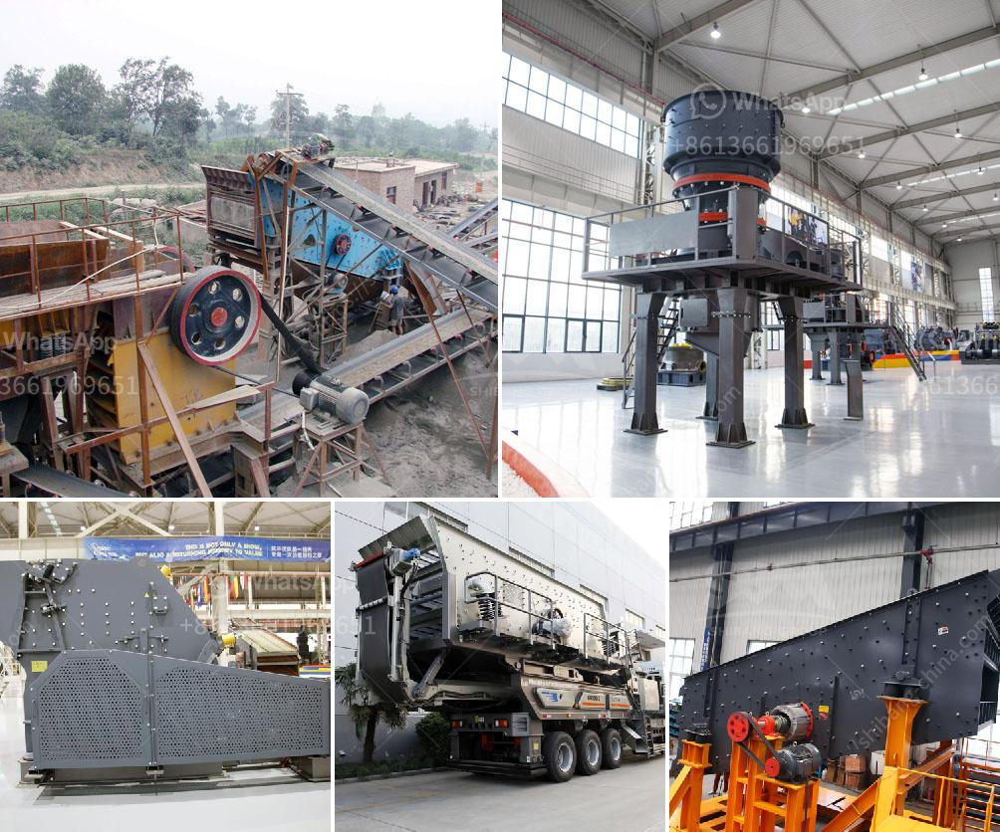

<h3>آلات صنع الألواح الجبسية من تركيا</h3>
الألواح الجبسية هي منتجات هامة في صناعة البناء والديكور، وتستخدم على نطاق واسع في إنشاء الجدران الداخلية والأسقف. ومن بين الدول المتخصصة في إنتاج الألواح الجبسية، تبرز تركيا بوجودها العديد من الشركات المتخصصة في هذا المجال.

تتميز آلات صنع الألواح الجبسية التي تنتجها الشركات التركية بالتكنولوجيا المتقدمة والجودة العالية. تعتمد هذه الآلات على عمليات الصب والضغط لتشكيل الجبس، مما ينتج عنه ألواح جبسية قوية ومتينة. بالإضافة إلى ذلك، تتميز تلك الآلات بسهولة التشغيل والصيانة، مما يجعلها محط اهتمام المصنعين.

تتمتع الألواح الجبسية التركية بعدة مزايا. فهي خفيفة الوزن وسهلة التركيب، مما يسهل عملية البناء ويقلل من الوقت والجهد المطلوبين. كما أنها مقاومة للحريق، مما يضيف طبقة إضافية من الأمان إلى المباني التي تستخدم فيها. بالإضافة إلى ذلك، توفر الألواح الجبسية عزلًا حراريًا وصوتيًا جيدًا، مما يحسن من كفاءة استهلاك الطاقة ويوفر راحة للسكان.

بفضل الجودة العالية والتكنولوجيا المتقدمة، تستخدم الألواح الجبسية المنتجة في تركيا في مشاريع بناء كبيرة على مستوى العالم. يتم تصديرها إلى العديد من الدول، وتحظى بسمعة جيدة في الأسواق العالمية.

وبغض النظر عن نوع المشروع الذي يتم تصميمه، يوفر استخدام الألواح الجبسية التركية مرونة في التصميم والأداء. فهي تتيح للمهندسين والمهندسات الإبداع والتجديد في الواجهة الداخلية والخارجية للمباني. بفضل العديد من الأشكال والتصاميم المتاحة، يمكن تنفيذ تصاميم فريدة وأنيقة تلبي رغبات العملاء.

باختصار، تعد آلات صنع الألواح الجبسية التركية جزءًا مهمًا من صناعة البناء على مستوى العالم. فهي توفر منتجات ذات جودة عالية وتشتهر بمزاياها العديدة، مما يجعلها خيارًا شائعًا بين المهندسين والمهندسات وأصحاب المشاريع.
<h3>Contact us</h3><ul><li><strong>Whatsapp:&nbsp;<a href="https://wa.me/8613661969651">+8613661969651</a></strong></li><li><a href="https://swt.shibang-china.com/?git&amp;zhl&amp;آلات صنع الألواح الجبسية من تركيا"><strong>Online Service(chat now)</strong></a></li></ul><h3>Related</h3><ul><li><a href='مكاتب CAD لمعدات التعدين.md'>مكاتب CAD لمعدات التعدين</a></li><li><a href='كسارة حجر في الهند.md'>كسارة حجر في الهند</a></li><li><a href='آلة صنع مسحوق الحجر الجيري في الهند.md'>آلة صنع مسحوق الحجر الجيري في الهند</a></li><li><a href='آلة طحن دقيقة في الصين.md'>آلة طحن دقيقة في الصين</a></li><li><a href='سعر كسارة الفك 24x12.md'>سعر كسارة الفك 24x12</a></li></ul>