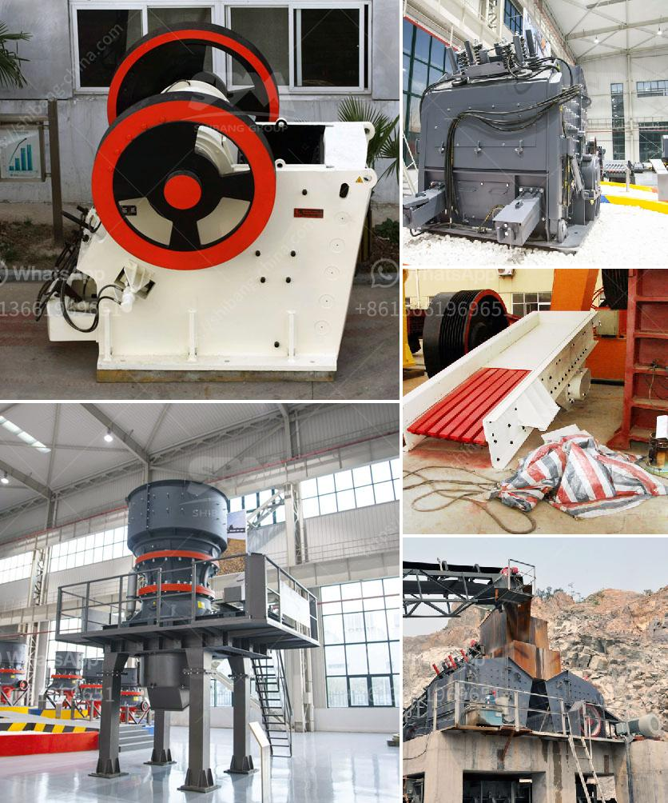

<h3>آلات صنع البودرة</h3>
آلات صنع البودرة هي آلات متخصصة تستخدم لتحويل المواد الخام إلى مسحوق رقيق وناعم. تعتبر صناعة البودرة أساسية في العديد من الصناعات مثل صناعة الأغذية، والصناعات الكيميائية، وصناعة الأدوية، حيث تلعب البودرة دوراً رئيسياً في تحسين الخواص والمواصفات للمنتج النهائي.

تتضمن آلات صنع البودرة عمليات مثل التكسير، والطحن، والتجفيف، والتصنيف، والخلط. في مرحلة التكسير، يتم تحطيم المواد الخام إلى قطع صغيرة باستخدام المطارق أو الكسارات. ثم يتم نقل المواد الخام المكسورة إلى عملية الطحن، حيث تتم طحنها باستخدام مطاحن خاصة لتحويلها إلى مسحوق ناعم.

بعد عملية الطحن، يتم نقل المسحوق إلى مرحلة التجفيف. يتم ذلك عن طريق تعريض المسحوق لدرجة حرارة مرتفعة أو تمرير تيار هوائي ساخن عليه لإزالة الرطوبة وتجفيف المسحوق. يعتبر التجفيف من أهم مراحل صنع البودرة، حيث يؤثر بشكل كبير على جودة وخواص المسحوق النهائي.

بعد مرحلة التجفيف، يتم نقل المسحوق إلى مرحلة التصنيف حيث يتم فصل المسحوق حسب حجم الجسيمات. يتم ذلك باستخدام آلات تصنيف معينة تقوم بتمرير المسحوق عبر فتحات صغيرة تسمح فقط بمرور الجزيئات ذات الحجم المطلوب بينما ترجع الأجزاء الأكبر مرة أخرى لعملية الطحن.

أخيرًا، يتم خلط المسحوق بنسب معينة للحصول على تركيبة نهائية هي البودرة. يتم ذلك باستخدام آلات الخلط التي تعمل على خلط المكونات بشكل متجانس وتوزيعها بالتساوي.

تتوفر آلات صنع البودرة بأحجام وقدرات مختلفة لتناسب احتياجات الصناعات المختلفة. تستخدم هذه الآلات في العديد من التطبيقات مثل صناعة الأغذية، حيث يمكن استخدامها لتصنيع مساحيق الحليب، والتوابل، والسكر، وغيرها. كما تستخدم أيضًا في صناعة الأدوية لتصنيع مساحيق تحتوي على مكونات طبية.

باختصار، يلعب صنع البودرة دوراً هاماً في العديد من الصناعات، وآلات صنع البودرة تساهم في إنتاج مساحيق ذات جودة عالية وخواص محسنة. تطورت تلك الآلات على مر السنين لتلبية متطلبات الصناعات المختلفة، وتصميمها وتقنياتها المتقدمة تساعد في زيادة فعالية الإنتاج وتقليل التكلفة.
<h3>Contact us</h3><ul><li><strong>Whatsapp:&nbsp;<a href="https://wa.me/8613661969651">+8613661969651</a></strong></li><li><a href="https://swt.shibang-china.com/?git&amp;zhl&amp;آلات صنع البودرة"><strong>Online Service(chat now)</strong></a></li></ul><h3>Related</h3><ul><li><a href='خطة عمل لتعدين الحجر واستغلاله.md'>خطة عمل لتعدين الحجر واستغلاله</a></li><li><a href='سعر مصنع الرمل والحصى في الهند.md'>سعر مصنع الرمل والحصى في الهند</a></li><li><a href='آلة طحن وخلط الكوارتز.md'>آلة طحن وخلط الكوارتز</a></li><li><a href='مورد آلة طحن التنتالوم على نطاق صغير.md'>مورد آلة طحن التنتالوم على نطاق صغير</a></li><li><a href='كسارات VSI بسعة 25 طن في الساعة.md'>كسارات VSI بسعة 25 طن في الساعة</a></li></ul>