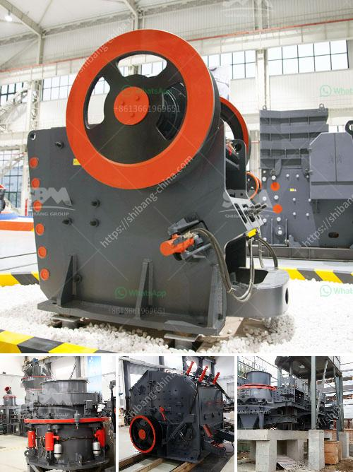

<h3>آلات صنع الحصى الكوارتز في الهند</h3>
تعتبر الهند واحدة من أهم الدول المنتجة للحصى الكوارتز في العالم. تستخدم الآلات المستخدمة في صناعة الحصى الكوارتز في الهند تقنيات حديثة وعالية الدقة لضمان جودة المنتج النهائي.

تتكون عملية صنع الحصى الكوارتز من عدة خطوات رئيسية. أولاً ، يتم استخراج الكوارتز من المحاجر الموجودة في مناطق مختلفة من الهند. يتم جمع الكوارتز من المحجر بواسطة آلات تقوم بتفتيت الصخور وفصل القطع الكبيرة عن القطع الصغيرة.

بعد ذلك، يتم نقل الكوارتز المستخرج إلى ورش العمل حيث يتم التعامل معه بأنواع مختلفة من الآلات. تتميز هذه الآلات بقدرتها على تحويل الكوارتز إلى حصى بحجم وشكل محدد. تتضمن بعض الآلات المستخدمة في هذه العملية أجهزة الطحن والفرز والتجميع.

بعد تشكيل الحصى الكوارتز، يتم فحصه بدقة للتأكد من جودته. يتم إجراء عدة اختبارات وفحوصات للتأكد من أن الحصى يفي بالمعايير العالمية وقابل للتصدير. يجب أن يكون الحصى متسقًا في الحجم واللون والنقاء.

بعد فحص الحصى والتأكد من جودته، يتم تعبئته وتغليفه بأشكال مختلفة وفقًا لمعايير العملاء. يتم استخدام العبوات المحكمة الغلق لضمان الحفاظ على جودة الحصى خلال عملية الشحن والتخزين.

يتم تصدير الحصى الكوارتز المنتج في الهند إلى العديد من الدول حول العالم. تعتبر الحجارة الكوارتزية التي تنتج في الهند شديدة التنافسية نظرًا لجودتها العالية وأسعارها التنافسية. تستخدم هذه الحجارة في العديد من التطبيقات مثل البناء والديكور والصناعات الكيماوية.

بالإضافة إلى ذلك، تعتبر صناعة الحصى الكوارتز في الهند مصدرا مهما للعمالة وفرص العمل. تساهم هذه الصناعة في توفير فرص عمل للعديد من العمال في المجالات المختلفة مثل الاستخراج والتصنيع والتعبئة والتغليف.

بشكل عام، تعتبر الهند واحدة من أهم منتجي الحصى الكوارتز في العالم، حيث تستخدم تقنيات حديثة وآلات عالية الجودة لضمان جودة المنتج النهائي. تستفيد الهند من تاريخ طويل في صناعة الحجارة الكوارتزية وتعمل على تطويرها وتحسينها بشكل مستمر.
<h3>Contact us</h3><ul><li><strong>Whatsapp:&nbsp;<a href="https://wa.me/8613661969651">+8613661969651</a></strong></li><li><a href="https://swt.shibang-china.com/?git&amp;zhl&amp;آلات صنع الحصى الكوارتز في الهند"><strong>Online Service(chat now)</strong></a></li></ul><h3>Related</h3><ul><li><a href='تكسير صخور صغيرة في لاس فيغاس.md'>تكسير صخور صغيرة في لاس فيغاس</a></li><li><a href='آلة سحق الدولوميت للبيع في دبي.md'>آلة سحق الدولوميت للبيع في دبي</a></li><li><a href='عملية إنتاج الطين.md'>عملية إنتاج الطين</a></li><li><a href='مواصفات مطحنة الكرة.md'>مواصفات مطحنة الكرة</a></li><li><a href='كسارة صخرية صناعية.md'>كسارة صخرية صناعية</a></li></ul>