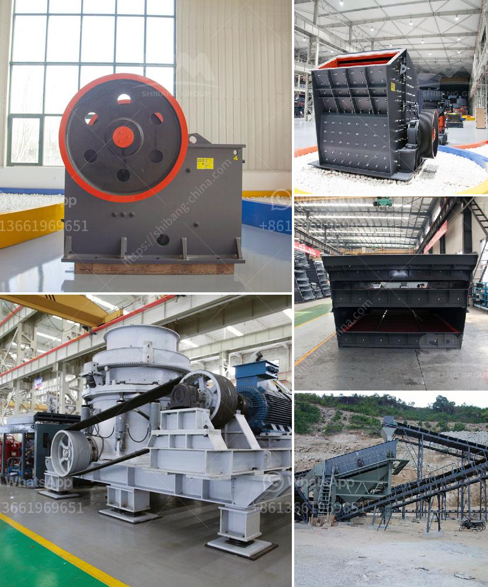

<h3>آلات طحن المطاحن للبيع</h3>
تعتبر آلات طحن المطاحن من الأدوات الأساسية في صناعة الغذاء والمطاحن التجارية حيث تستخدم لطحن مجموعة واسعة من المنتجات الغذائية بمن فيها الحبوب والقهوة والتوابل والبهارات والأعشاب.

تتميز آلات طحن المطاحن بقدرتها على تحويل المنتجات الخام إلى مسحوق ناعم بمختلف الدرجات حسب احتياجات المستخدم. تتكون المطاحن عادة من محرك كهربائي يعمل على تشغيل القرص أو الحجر الدوار الذي يقوم بطحن المنتجات الخام. كما تحتوي المطاحن على نظام لتحديد درجة الطحن المطلوبة وتعديل سرعة الطحن بناءً على التطبيق المرغوب فيه.

تأتي المطاحن بمجموعة متنوعة من الأحجام والقدرات لتناسب احتياجات المستخدم. يمكن العثور على مطاحن صغيرة الحجم والتي تعمل يدوياً للاستخدام المنزلي، وتستخدم عادةً لطحن القهوة والتوابل. بينما تتوفر مطاحن أكبر الحجم والتي تعمل بالكهرباء للاستخدام التجاري، حيث يمكنها معالجة ما يصل إلى عدة طن من المنتجات يومياً.

تعتبر التكنولوجيا المستخدمة في المطاحن حديثة وتتطور بشكل مستمر. تساعد التقنيات المتقدمة في الحفاظ على نوعية المنتج ومحتواها الغذائي. تعتمد بعض المطاحن على نظام الطحن الحجري التقليدي، بينما تستخدم المزيد من المطاحن الحديثة الأسطوانية أو القرصية لتعزيز كفاءة الطحن والحصول على نتائج أفضل.

يعتبر طحن المنتجات الغذائية من خلال المطاحن أمرًا ضروريًا للعديد من الصناعات مثل صناعة الخبز والمخابز وصناعة الحلويات والشوكولاتة. كما يمكن استخدام المطاحن لصناعة الأعلاف الحيوانية والأعلاف الدوائية وصناعة الأعشاب الطبية والأعشاب العطرية.

ورغم أن آلات طحن المطاحن قد تكون مكلفة إلى حد ما، إلا أنها تعتبر استثمارًا مستدامًا للشركات التجارية التي تعتمد على تجهيز المنتجات الخام. تعمل المطاحن بكفاءة عالية وتساهم في زيادة إنتاجية الشركات وتحقيق أقصى استفادة من المنتجات الخام.

في الختام، تعتبر آلات طحن المطاحن من الأدوات الأساسية في صناعة الغذاء والمطاحن التجارية. تقدم هذه المطاحن قدرة على طحن مجموعة واسعة من المنتجات الغذائية بالإضافة إلى القهوة والتوابل والزيوت العطرية. تتطور التكنولوجيا المستخدمة في المطاحن باستمرار لزيادة كفاءة الطحن وتحسين جودة المنتج. تعتبر المطاحن استثمارًا مستدامًا للشركات التجارية التي تعتمد على تجهيز المنتجات الخام. تساعد المطاحن في زيادة إنتاجية الشركات وتعزيز كفاءة العمل وتحقيق أقصى استفادة من المواد الخام المتاحة.
<h3>Contact us</h3><ul><li><strong>Whatsapp:&nbsp;<a href="https://wa.me/8613661969651">+8613661969651</a></strong></li><li><a href="https://swt.shibang-china.com/?git&amp;zhl&amp;آلات طحن المطاحن للبيع"><strong>Online Service(chat now)</strong></a></li></ul><h3>Related</h3><ul><li><a href='آلة سحق نقاء الشورا.md'>آلة سحق نقاء الشورا</a></li><li><a href='تحليل تكلفة سحق وفحص.md'>تحليل تكلفة سحق وفحص</a></li><li><a href='مصنع الحجر الجيري والآلات في تاميل نادو للبيع.md'>مصنع الحجر الجيري والآلات في تاميل نادو للبيع</a></li><li><a href='عملية التحول للأسمنت.md'>عملية التحول للأسمنت</a></li><li><a href='تكلفة آلة سحق الحجر كسارة الحجر.md'>تكلفة آلة سحق الحجر كسارة الحجر</a></li></ul>