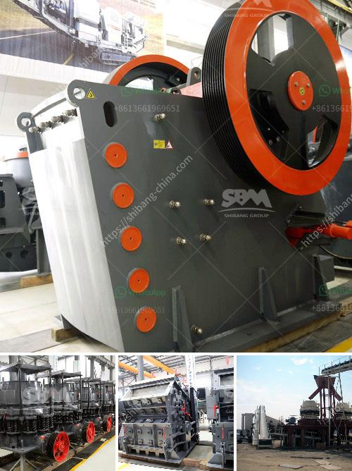

<h3>آلات طحن للمعادن في إندونيسيا</h3>
تعتبر آلات طحن المعادن أدوات أساسية في صناعة التعدين في إندونيسيا. تستخدم هذه الآلات لطحن المواد الخام وتحويلها إلى مساحيق ناعمة تستخدم في إنتاج السبائك المعدنية وغيرها من المنتجات الصناعية.

إندونيسيا تمتلك ثروات طبيعية هائلة من المعادن النفيسة والمعادن الأخرى مثل الذهب والنحاس والفضة والرصاص والزنك. يستخدم التعدين بشكل واسع في إندونيسيا لاستخلاص هذه المعادن وتحويلها إلى منتجات قيمة.

آلات طحن المعادن تلعب دورًا حاسمًا في عملية التحويل من الخامات إلى المنتجات النهائية. تتباين هذه الآلات في الحجم والقدرة والتقنيات المستخدمة، ولكن الهدف الأساسي هو طحن المواد الخام إلى حجم الجسيمات المطلوب وتحقيق النعومة المطلوبة.

تستخدم آلات طحن المعادن في المصانع والمناجم الكبيرة في إندونيسيا. وتشمل هذه الآلات مطاحن الكرة ومطاحن الأسطوانة ومطاحن ريموند وغيرها. تعتمد اختيار الآلة المناسبة على الخصائص المادية للمواد الخام ومتطلبات الإنتاج.

تتوفر هذه الآلات من الشركات المصنعة المتخصصة في مجال تصنيع آلات طحن المعادن. وقد حظيت هذه الشركات بتطور تكنولوجي مستمر لتلبية احتياجات صناعة التعدين في إندونيسيا. فمن خلال تطبيق التقنيات الحديثة في تصميم وتصنيع منتجاتهم، نجحت هذه الشركات في تعزيز كفاءة الآلات وتحسين أداءها.

بصفة عامة، تعتبر آلات طحن المعادن في إندونيسيا حجر الزاوية في صناعة التعدين. تلعب دورًا أساسيًا في تحويل المواد الخام إلى منتجات قيمة وتمكين الشركات من تحقيق أقصى استفادة من الموارد المعدنية. ومن المتوقع أن تستمر هذه الآلات في تطورها وتحسين أدائها مع مرور الوقت، مما يدعم نمو صناعة التعدين في البلاد.

بإجمالها، تقدم صناعة آلات طحن المعادن في إندونيسيا فرصًا كبيرة للتطور والنمو. تعتبر هذه الآلات أدوات حيوية لاستخلاص المعادن النفيسة وتحويلها إلى منتجات صناعية قيمة. وبفضل التقنيات المتقدمة والابتكارات المستمرة، ستظل هذه الآلات محورًا أساسيًا لصناعة التعدين في إندونيسيا في المستقبل.
<h3>Contact us</h3><ul><li><strong>Whatsapp:&nbsp;<a href="https://wa.me/8613661969651">+8613661969651</a></strong></li><li><a href="https://swt.shibang-china.com/?git&amp;zhl&amp;آلات طحن للمعادن في إندونيسيا"><strong>Online Service(chat now)</strong></a></li></ul><h3>Related</h3><ul><li><a href='مصنع آلات في جنوب أفريقيا لسحق الحجر.md'>مصنع آلات في جنوب أفريقيا لسحق الحجر</a></li><li><a href='كسارة ومصنع الفرز.md'>كسارة ومصنع الفرز</a></li><li><a href='عملية تصنيع الرمل الاصطناعي.md'>عملية تصنيع الرمل الاصطناعي</a></li><li><a href='سعر ماكينة مولين في ميدان.md'>سعر ماكينة مولين في ميدان</a></li><li><a href='وزن آلة كسارة الصخور.md'>وزن آلة كسارة الصخور</a></li></ul>