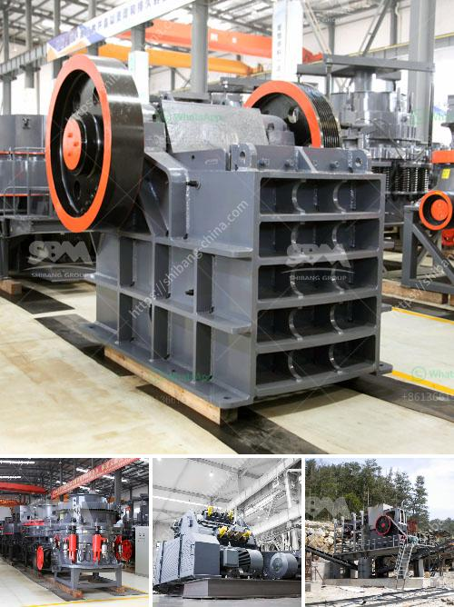

<h3>آلات غسيل الفحم</h3>
تعد آلات غسيل الفحم من الأدوات الهامة في صناعة التعدين واستخلاص الفحم. تهدف هذه الآلات إلى فصل الشوائب غير المرغوب فيها من الفحم من أجل تحسين جودته وتعزيز قيمته التجارية.

تتكون آلات غسيل الفحم من عدة مراحل تعتمد على تقنيات مختلفة لفصل الفحم عن الشوائب المرافقة.

تبدأ عملية الغسيل بطحن الفحم الخام إلى قطع صغيرة لزيادة سطح الاتصال مع المواد الكيماوية المستخدمة في العملية. يتم ثم غمر الفحم في ماء أو مذيبات مختلفة تحت درجة حرارة وضغط محددين.

في المرحلة التالية، تستخدم مواد كيماوية معينة مثل المعدنات الثقيلة والبوليمرات لفصل الفحم عن الشوائب. تساعد هذه المواد الكيماوية في تعزيز اختلاف الخصائص الفيزيائية بين الفحم والشوائب، مما يسهل فصلهما.

المرحلة التالية تعتمد على استخدام الهزازات والمصافي لفصل جزيئات الفحم بناءً على حجمها وكثافتها. يتم استخدام قوة التيار المتردد والاختلاف في الكثافة لفصل الفحم المرغوب فيه عن الشوائب.

أخيرًا، يتم تجفيف الفحم لإزالة الرطوبة الزائدة، وذلك بتعريضه لتيار هواء ساخن أو استخدام آلات تجفيف خاصة.

يعد غسيل الفحم عملية حيوية للحفاظ على بيئتنا الطبيعية، حيث يساعد في تقليل مستويات الشوائب البيئية الملوثة التي تتراوح بين المواد العضوية إلى المواد الثقيلة المسرطنة. كما أن تحسين جودة الفحم يسهم في زيادة كفاءة الاحتراق وتقليل انبعاثات غازات الدفيئة.

باختصار، آلات غسيل الفحم هي عبارة عن أدوات تقوم بفصل الفحم عن الشوائب المرافقة، مما يساهم في تحسين جودة الفحم والحفاظ على بيئتنا الطبيعية. تعتبر هذه الآلات حجر الزاوية في صناعة التنقيب عن الفحم وتعزيز استدامتها على المدى الطويل.
<h3>Contact us</h3><ul><li><strong>Whatsapp:&nbsp;<a href="https://wa.me/8613661969651">+8613661969651</a></strong></li><li><a href="https://swt.shibang-china.com/?git&amp;zhl&amp;آلات غسيل الفحم"><strong>Online Service(chat now)</strong></a></li></ul><h3>Related</h3><ul><li><a href='عمود المرفق لكسارة الفك.md'>عمود المرفق لكسارة الفك</a></li><li><a href='شركة تصنيع مطحنة الفحم في الصين.md'>شركة تصنيع مطحنة الفحم في الصين</a></li><li><a href='مصنع كرة الاسمنت المواد والطاقة.md'>مصنع كرة الاسمنت المواد والطاقة</a></li><li><a href='كسارات الحجر المحلية.md'>كسارات الحجر المحلية</a></li><li><a href='مصنع كامل لاستخراج النحاس للبيع.md'>مصنع كامل لاستخراج النحاس للبيع</a></li></ul>