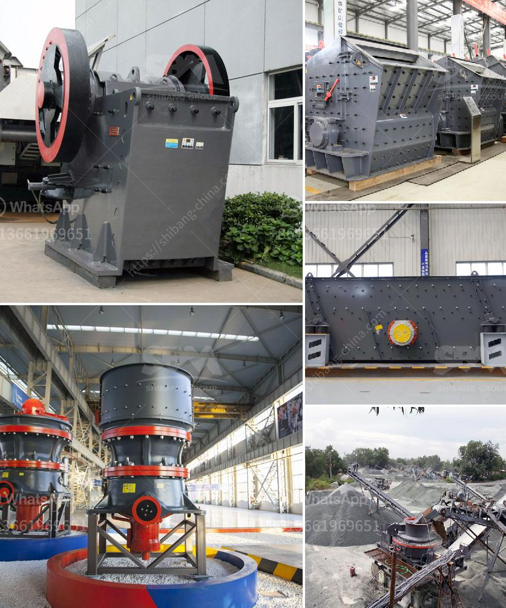

<h3>آلات كبيرة القدرة لمبيعاتها في الهند</h3>
تعتبر الهند واحدة من أكبر الأسواق الناشئة في العالم، حيث تشهد نموًا اقتصاديًا سريعًا وتغيرًا ملحوظًا في البنية التحتية وتنمية الصناعات المحلية. ومن بين الصناعات التي تحظى بشعبية كبيرة في الهند، نجد صناعة تصنيع الآلات الكبيرة من حيث القدرة والأداء.

تعدّ الآلات الكبيرة ذات القدرة العالية من المعدات المستخدمة في العديد من الصناعات، مثل التعدين والبناء والنقل والزراعة والطاقة والصناعات الثقيلة. وبالنظر إلى التوجه الحالي نحو التحضر الحضري في الهند وتنمية البنية التحتية في المدن وزيادة الإنتاج الزراعي، فإن الطلب على الآلات الكبيرة يزداد يومًا بعد يوم.

في التعدين، مثلاً، يعتبر الفحم والحديد من الموارد الرئيسية في الهند، ويتطلب استخراجهما استخدام آلات كبيرة للحفر والتقطيع والتحميل والنقل. بفضل وجود هذه الآلات، يتم تحسين كفاءة الإنتاج وتقليل التكاليف، مما يساهم في تحقيق الاقتصادية والاستدامة.

من جانبها، تستفيد صناعة البناء من الآلات الكبيرة لإنجاز المشاريع الضخمة في أوقات قصيرة. فبصفتها واحدة من أسرع الاقتصاديات نموًا في العالم، تشهد الهند اليوم طلبًا هائلاً على العقارات والمباني السكنية والتجارية والمنشآت التحتية. تجد الشركات والمقاولون أن استخدام الآلات الكبيرة يسهم في تنفيذ المشاريع بكفاءة عالية وفي وقتٍ قصير، ما يساعد في تلبية احتياجات العملاء وتحقيق الأرباح.

أيضًا، تستخدم الآلات الكبيرة في قطاع النقل لتسهيل حركة البضائع والمنتجات في جميع أنحاء الهند. وفي ظل النمو الاقتصادي المستمر، يزداد حجم السلع والمنتجات التي تحتاج إلى النقل والتوزيع، مما يشجع على استثمار في الآلات الكبيرة مثل الشاحنات والجرارات وآليات الحمولة.

ليس ذلك فقط، ففي الزراعة تستخدم الآلات الكبيرة لزيادة الإنتاجية وتحسين كفاءة العمل. مع تزايد السكان في الهند، يتزايد الطلب على المنتجات الزراعية، مما يدفع المزارعين إلى استخدام التقنيات المتقدمة والآلات الكبيرة لتحقيق زيادة في الإنتاج وتحديد كلف العمل. وبالتالي، تساعد هذه الآلات في تلبية احتياجات الغذاء المتزايدة في البلاد.

في النهاية، يمكن القول إن آلات كبيرة القدرة تحظى بشعبية كبيرة في الهند لقدرتها على تحسين الإنتاجية، وتقليل التكاليف، وتعزيز التنمية الاقتصادية. تلبي هذه الآلات احتياجات الصناعات المختلفة، وتدعم التحول الاقتصادي والاجتماعي في الهند، وتساهم في تحسين مستوى المعيشة وتوفير فرص العمل. وبذلك، فإن الآلات الكبيرة لديها مستقبل واعد في الهند.
<h3>Contact us</h3><ul><li><strong>Whatsapp:&nbsp;<a href="https://wa.me/8613661969651">+8613661969651</a></strong></li><li><a href="https://swt.shibang-china.com/?git&amp;zhl&amp;آلات كبيرة القدرة لمبيعاتها في الهند"><strong>Online Service(chat now)</strong></a></li></ul><h3>Related</h3><ul><li><a href='تقرير مشروع تصنيع الطوب الرملي.md'>تقرير مشروع تصنيع الطوب الرملي</a></li><li><a href='عملية تصنيع الإسمنت بالطريقة الرطبة.md'>عملية تصنيع الإسمنت بالطريقة الرطبة</a></li><li><a href='اشتقاق السرعة الحرجة في مطحنة كرات PDF.md'>اشتقاق السرعة الحرجة في مطحنة كرات PDF</a></li><li><a href='كسارة السيليكون الوافر.md'>كسارة السيليكون الوافر</a></li><li><a href='شركة معدات البناء.md'>شركة معدات البناء</a></li></ul>