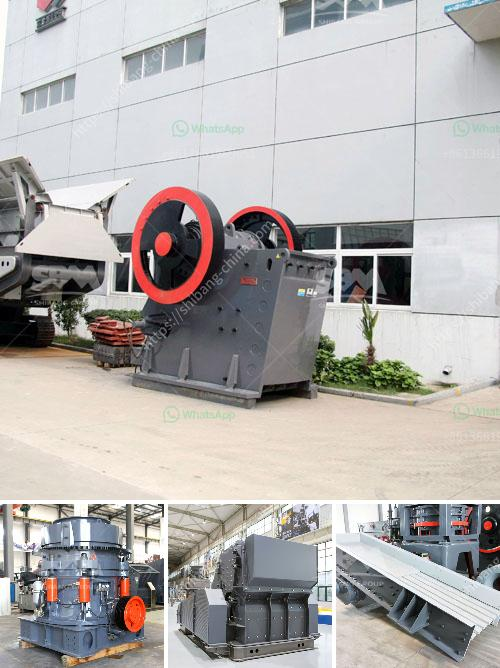

<h3>آلات كسارة الحجر الكوارتز</h3>
تعد آلات كسارة الحجر الكوارتز جزءًا هامًا في عمليات تكسير وتحطيم الصخور والحجارة الكبيرة إلى قطع صغيرة وقابلة للاستخدام في العديد من الصناعات. يتم استخدامها على نطاق واسع في مجالات مثل التعدين والبناء وصناعة المواد الكيميائية والطاقة وصناعة السيراميك.

تتكون آلات كسارة الحجر الكوارتز من أجزاء أساسية مثل المخروط المتحرك والجزء الثابت واللوحة الفاصلة والنظام الهيدروليكي والمحرك الكهربائي. تستخدم هذه الآلات قوة الضغط بين الجزء العلوي والجزء السفلي للكسر الصخور. بالإضافة إلى ذلك، تتميز آلات كسارة الحجر الكوارتز بسرعة التكسير والتحمل العالي لدرجات الحرارة العالية وأوزان الضغط. يتم تحسين الأداء الآلي لهذه الآلات من خلال تطبيق أحدث التقنيات والمعرفة في الهندسة الميكانيكية والهندسة الكهربائية.

تستخدم آلات كسارة الحجر الكوارتز لتكسير الحجارة الكبيرة إلى أحجام أصغر تتراوح بين عدة سنتيمترات إلى بضعة ميليمترات. يتم استخدامها في عدة تطبيقات مثل إنتاج الركام للبناء والأسفلت والخرسانة، وإعادة تدوير الركام، واستخراج الحصى والرمل. تتوافر آلات كسارة الحجر الكوارتز بعدة أحجام وقدرات لتلبية متطلبات العملاء المختلفة.

من المهم أن نتعرف على مميزات آلات كسارة الحجر الكوارتز. فإنها تتميز بالكفاءة العالية والاستهلاك المنخفض للطاقة وتشغيل مستقر وصيانة منخفضة. بالإضافة إلى ذلك، فإنها تساعد على تحقيق توفير الموارد وحماية البيئة بفضل إعادة التدوير الفعال للمواد الخام.

في الختام، تعد آلات كسارة الحجر الكوارتز حلاً فعالًا وموثوقًا لعملية تكسير الصخور والحجارة الكبيرة. تجمع بين الكفاءة والاستدامة وأداء التحكم. استخدامها في مختلف الصناعات ساهم في تطوير الاقتصاد وتحسين جودة الحياة. إنها تجسد التقدم في التكنولوجيا والهندسة وتوفر فرصًا للنمو والتطور المستدام.
<h3>Contact us</h3><ul><li><strong>Whatsapp:&nbsp;<a href="https://wa.me/8613661969651">+8613661969651</a></strong></li><li><a href="https://swt.shibang-china.com/?git&amp;zhl&amp;آلات كسارة الحجر الكوارتز"><strong>Online Service(chat now)</strong></a></li></ul><h3>Related</h3><ul><li><a href='سعر حزام النقل.md'>سعر حزام النقل</a></li><li><a href='محطة تكسير الصخور.md'>محطة تكسير الصخور</a></li><li><a href='سعر مطحنة الكرات بمقدار 25 طن في الساعة.md'>سعر مطحنة الكرات بمقدار 25 طن في الساعة</a></li><li><a href='كسارة للذهب.md'>كسارة للذهب</a></li><li><a href='بيع كسارة الحجر للبيع.md'>بيع كسارة الحجر للبيع</a></li></ul>