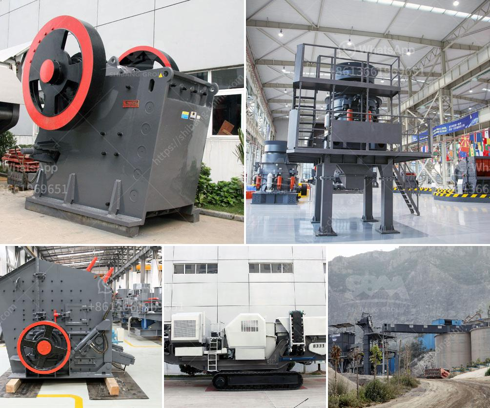

<h3>آلات كسارة الحجر في ماليزيا</h3>
ستتناول هذه المقالة آلات كسارة الحجر في ماليزيا. تعد آلات كسارة الحجر من أهم الأدوات في صناعة البناء والتعدين والمقاولات. وتستخدم هذه الآلات لتكسير الحجارة الكبيرة إلى حجارة صغيرة أو تكسير الصخور الكبيرة لتصبح أقل حجمًا وأكثر قابلية للتشغيل والاستخدام.  

تعتبر ماليزيا واحدة من الوجهات الرئيسية لصناعة آلات كسارة الحجر في العالم. تتمتع ماليزيا بموارد حجرية غنية ووفيرة ، مما جعلها مركزًا لإنتاج مختلف أنواع آلات الكسارة في المنطقة. تشهد الصناعة الماليزية لآلات كسارة الحجر تطورًا متسارعًا على مر السنين ، بفضل الابتكار التكنولوجي والتحسين المستمر للمعدات.

تتوفر في ماليزيا مجموعة واسعة من آلات كسارة الحجر لتناسب احتياجات العملاء المختلفة. يتم تصنيع هذه الآلات باستخدام أحدث التقنيات والمواد عالية الجودة لضمان الأداء العالي والمتانة. وتتضمن آلات الكسارة الشائعة في ماليزيا كسارة الفك ، وكسارة الصدم ، والكسارة المخروطية ، وكسارة الأسطوانة ، وغيرها الكثير.

تتميز آلات كسارة الحجر في ماليزيا بالعديد من المزايا. فهي تعمل بكفاءة عالية وتتميز بأداء قوي وقدرة كبيرة على التحمل. وتمتاز بتصميمها الدقيق الذي يجعلها قابلة للاستخدام في الظروف الصعبة والبيئات القاسية. وتساعد هذه الآلات على زيادة إنتاجية العمل وتقليل وقت التشغيل والتكلفة.

بالإضافة إلى ذلك ، تحظى آلات كسارة الحجر في ماليزيا بدعم فني ممتاز من قبل الشركات المصنعة وموردي الخدمات. يقدمون التدريب والدعم الفني للزبائن ، مما يضمن أن الآلات تعمل بكفاءة وفعالية في جميع الأوقات.

باختصار ، تعتبر آلات كسارة الحجر في ماليزيا مهمة للغاية في صناعات البناء والتعدين والمقاولات. تتميز بالأداء العالي والتصميم القوي والدعم الفني الممتاز. وتسهم هذه الآلات في زيادة الإنتاجية وتحسين كفاءة العمل. بالإضافة إلى ذلك ، فإن تطور الصناعة الماليزية لآلات كسارة الحجر يعكس روح الابتكار والتحسين المستمر في البلاد.
<h3>Contact us</h3><ul><li><strong>Whatsapp:&nbsp;<a href="https://wa.me/8613661969651">+8613661969651</a></strong></li><li><a href="https://swt.shibang-china.com/?git&amp;zhl&amp;آلات كسارة الحجر في ماليزيا"><strong>Online Service(chat now)</strong></a></li></ul><h3>Related</h3><ul><li><a href='مصنعي آلات سحق النحاس في الصين.md'>مصنعي آلات سحق النحاس في الصين</a></li><li><a href='مورد كسارة في الصين.md'>مورد كسارة في الصين</a></li><li><a href='مطاحن فائقة الدقة في الصين.md'>مطاحن فائقة الدقة في الصين</a></li><li><a href='آلة عملية مطحنة الأسطوانة.md'>آلة عملية مطحنة الأسطوانة</a></li><li><a href='معالجة كسارة الكوارتز.md'>معالجة كسارة الكوارتز</a></li></ul>