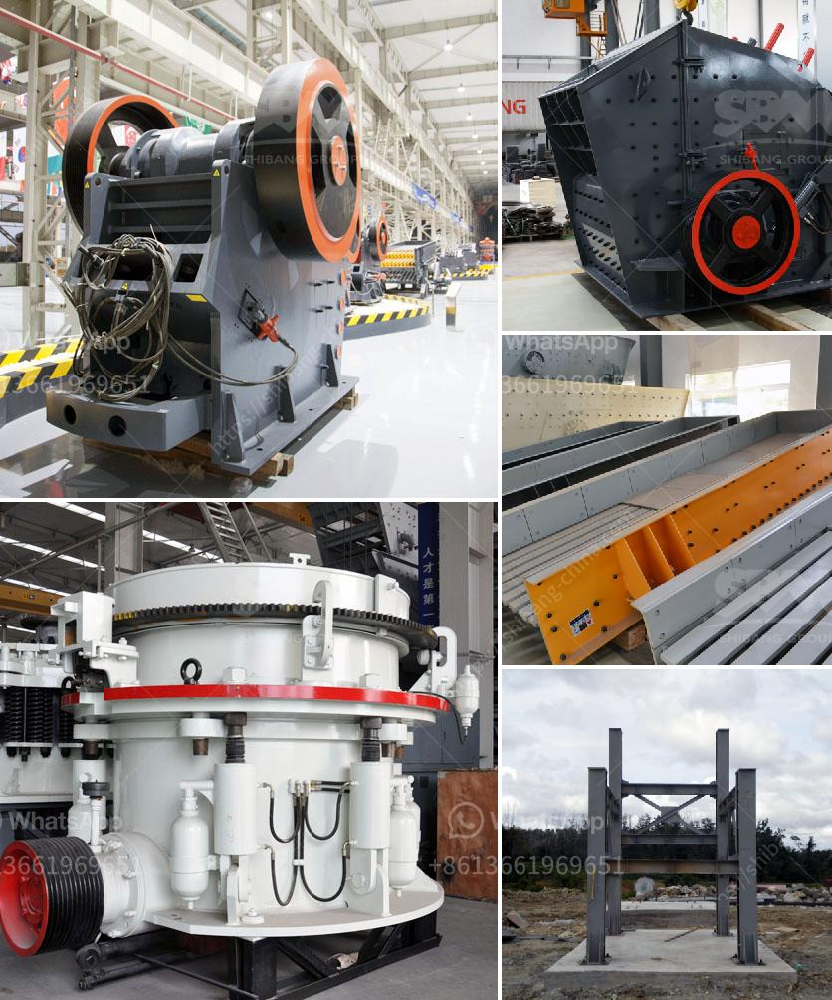

<h3>آلات كسارة الرقائق</h3>
تعتبر آلات كسارة الرقائق من الآلات الحديثة والمهمة في صناعة تدوير النفايات وإعادة تدويرها. تم تطوير هذه الآلات لتسهيل عملية تحويل الرقائق البلاستيكية والورقية إلى قطع صغيرة يسهل تخزينها واستخدامها في عمليات التصنيع الأخرى.

تعتمد آلات كسارة الرقائق على تقنية محطم الرقائق، حيث يتم وضع الرقائق في وحدة التغذية التي تقوم بتوجيهها إلى جزء الكسر لتقطيعها إلى جزيئات صغيرة. تتميز هذه الآلات بقدرتها على معالجة الرقائق بسرعة عالية وبدقة عالية، ويمكنها معالجة أنواع مختلفة من الرقائق مثل البلاستيك والورق والألومنيوم.

يوفر استخدام آلات كسارة الرقائق العديد من المزايا. فإلى جانب تقليل حجم الرقائق وجعلها أسهل في النقل والتخزين، يمكن إعادة استخدام القطع المحطمة في عمليات التصنيع الأخرى. على سبيل المثال، يمكن استخدام الرقائق المحطمة من البلاستيك في صناعة الأدوات والأجزاء البلاستيكية. بالإضافة إلى ذلك، تقلل هذه الآلات من التلوث البيئي الناجم عن التخلص غير السليم من الرقائق وتسهم في الحفاظ على البيئة.

تعتبر آلات كسارة الرقائق أيضًا من الآلات الاقتصادية والفعّالة من حيث التكلفة. فهي تقلل من تكاليف التخلص من النفايات البلاستيكية والورقية المنتجة في عمليات التصنيع، بالإضافة إلى تحقيق دخل إضافي من بيع القطع المحطمة. وبالتالي، يعتبر استخدام هذه الآلات استثمارًا ناجحًا لأي شركة تهتم بتدوير النفايات.

على الرغم من المزايا الكبيرة التي توفرها آلات كسارة الرقائق، يجب أن نأخذ في الاعتبار بعض التحديات والاعتبارات أثناء استخدامها. فمن الضروري ضبط هذه الآلات بشكل صحيح لتلافي أي مشاكل أثناء العملية، بالإضافة إلى ضرورة المحافظة على صيانتها بشكل دوري. كما يجب أن تكون هناك سياسات وقوانين صارمة للتخلص من النفايات بشكل سليم والامتثال للمعايير البيئية.

في النهاية، تعتبر آلات كسارة الرقائق حلاً مبتكرًا ومستدامًا لمشكلة تصريف النفايات وتلوث البيئة. بفضل قدراتها على تحويل الرقائق إلى قطع صغيرة قابلة للاستخدام، تساهم في تعزيز التدوير وتحقيق الاقتصاد الدائري. ومع مزاياها الاقتصادية والبيئية، فإن استخدام آلات كسارة الرقائق يمثل خطوة هامة في تعزيز الاستدامة والحفاظ على البيئة.
<h3>Contact us</h3><ul><li><strong>Whatsapp:&nbsp;<a href="https://wa.me/8613661969651">+8613661969651</a></strong></li><li><a href="https://swt.shibang-china.com/?git&amp;zhl&amp;آلات كسارة الرقائق"><strong>Online Service(chat now)</strong></a></li></ul><h3>Related</h3><ul><li><a href='آلة كسارة الصخور في ماليزيا.md'>آلة كسارة الصخور في ماليزيا</a></li><li><a href='شاشة جريزلي للبيع نيوزيلندا.md'>شاشة جريزلي للبيع نيوزيلندا</a></li><li><a href='عملية سحق التعدين لخام الحديد.md'>عملية سحق التعدين لخام الحديد</a></li><li><a href='كسارة الجرانيت المحمولة.md'>كسارة الجرانيت المحمولة</a></li><li><a href='مصنع تكسير الجرانيت 200 طن في الساعة للبيع.md'>مصنع تكسير الجرانيت 200 طن في الساعة للبيع</a></li></ul>