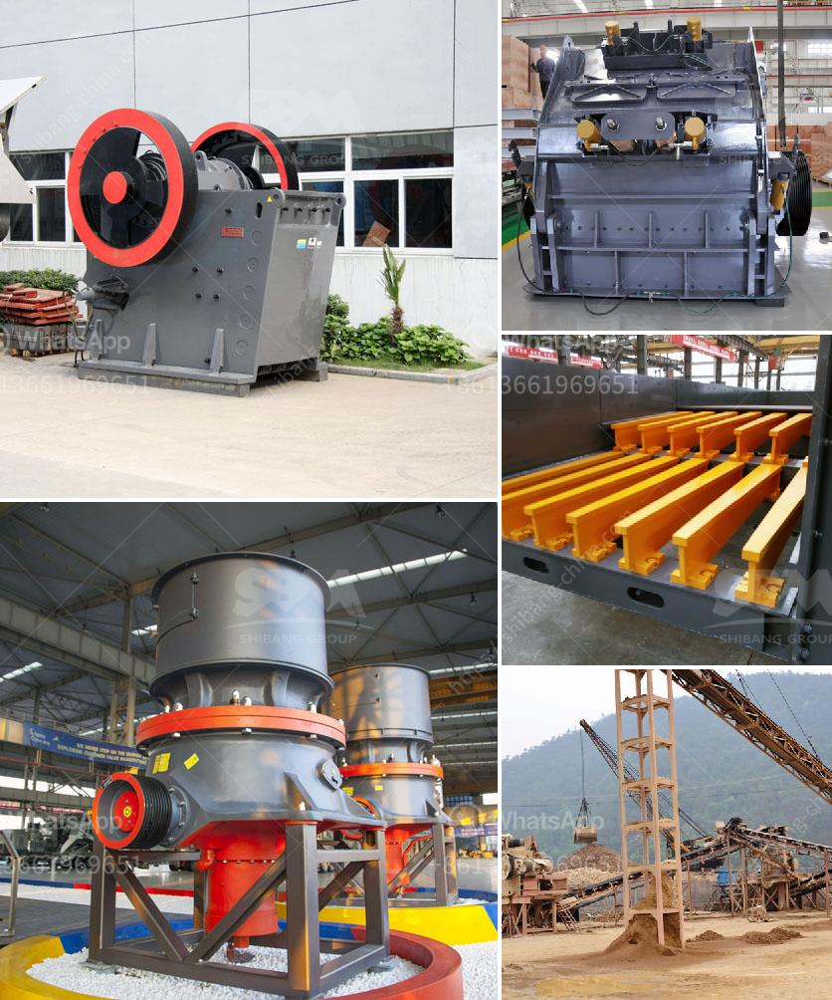

<h3>آلات كسارة الصخور</h3>
تعد آلات كسارة الصخور أدوات حيوية في صناعة التعدين والبناء والبناء ، حيث تستخدم لكسر وسحق الصخور والأحجار. تأتي هذه الآلات بأحجام وسعات مختلفة ويمكن استخدامها للعديد من الأغراض المختلفة. هنا سنلقي نظرة على أنواع آلات كسارة الصخور الشائعة ودورها في الصناعة.

تعتمد آلات كسارة الصخور على آلية قوية تستخدم لتحويل الصخور الكبيرة إلى حصى صغيرة. تحتوي هذه الآلات عادة على فكين يتحركان لأعلى ولأسفل باستخدام الضغط الهيدروليكي لتقليل حجم الصخور. كما تحوي على مطرقة تستخدم لتحطيم الصخور الصلبة. تعمل هذه الآلات بسرعات وقوة عالية ، مما يجعلها قادرة على كسر الصخور الأكثر صلابة.

تستخدم آلات كسارة الصخور على نطاق واسع في التعدين ، حيث يتم استخراج المواد الخام من باطن الأرض. بفضل قدرتها على كسر الصخور الضخمة ، يمكن للآلات الكسارة تفتيت الصخور إلى أحجام أصغر مناسبة للنقل والمعالجة اللاحقة. يتم استخدام الحجارة الصغيرة لإنتاج الإسمنت والخرسانة وغيرها من المواد الأساسية في البناء.

تستخدم أيضًا آلات كسارة الصخور في صناعة البناء ، حيث يتعين سحق الحصى والصخور الكبيرة لإنتاج مواد البناء. تشمل هذه المواد الحصى المستخدم في تعبئة الأساسات والطرق ، والحجارة المستخدمة في بناء الجدران والمباني ، والركام المستخدم في صناعة الخرسانة.

دور آلات كسارة الصخور في الصناعة حاسم وحاسم. تمكننا هذه الآلات من استخدام الموارد الطبيعية بكفاءة أكبر وتحقيق الاستدامة البيئية. كما تساهم في تسريع عمليات البناء وتحسين جودة المواد المستخدمة في الإنشاءات.

باختصار ، آلات كسارة الصخور هي أدوات هامة في صناعة التعدين والبناء. تعمل هذه الآلات على تحويل الصخور الكبيرة إلى حصى صغيرة قابلة للتنقل والاستخدام في العديد من التطبيقات. تحدث آلات كسارة الصخور ثورة في صناعة البناء ، حيث تمكننا من تحقيق الاستدامة وتسريع أعمال البناء.
<h3>Contact us</h3><ul><li><strong>Whatsapp:&nbsp;<a href="https://wa.me/8613661969651">+8613661969651</a></strong></li><li><a href="https://swt.shibang-china.com/?git&amp;zhl&amp;آلات كسارة الصخور"><strong>Online Service(chat now)</strong></a></li></ul><h3>Related</h3><ul><li><a href='جوال محطم الحجر الجيري.md'>جوال محطم الحجر الجيري</a></li><li><a href='المعدات المطلوبة لإنشاء محجر الجرانيت.md'>المعدات المطلوبة لإنشاء محجر الجرانيت</a></li><li><a href='كسارة صخور محمولة صغيرة للسحق.md'>كسارة صخور محمولة صغيرة للسحق</a></li><li><a href='شركة مصنعة مشهورة للكسارة والطاحونة في فرنسا.md'>شركة مصنعة مشهورة للكسارة والطاحونة في فرنسا</a></li><li><a href='تصنيع آلات التعدين.md'>تصنيع آلات التعدين</a></li></ul>