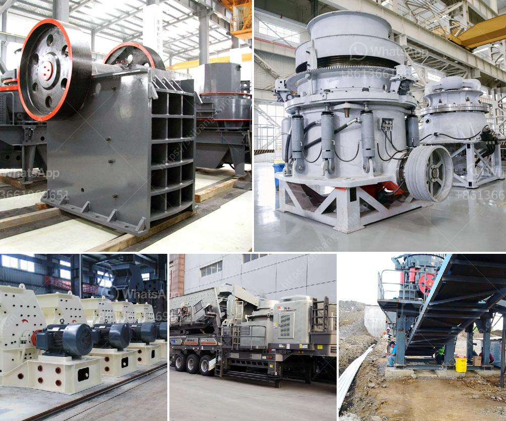

<h3>آلات كسارة المحجر في إيطاليا</h3>
تعتبر آلات كسارة المحجر في إيطاليا من أهم الأدوات المستخدمة في صناعة البناء والتعدين. تتميز هذه الآلات بقدرتها الكبيرة على تكسير الصخور والمواد الصلبة بطريقة فعالة وسريعة. وتستخدم في عمليات استخراج المواد الخام وتحضيرها للاستخدام في البناء أو الصناعة.

تتكون آلات كسارة المحجر من عدة أجزاء أساسية، بما في ذلك الفك المتحرك والفك الثابت والمطرقة الدوارة. وتعمل هذه الأجزاء بالتنسيق مع بعضها البعض لتكسير الصخور وتفتيتها إلى قطع صغيرة من الحجم المناسب.

تستخدم آلات كسارة المحجر في العديد من التطبيقات المختلفة. من بين هذه التطبيقات، استخراج الحصى والرمل والصخور المكسورة من المحاجر يعتبر الأكثر شيوعًا. يتم تحويل هذه المواد الخام إلى مواد نهائية تستخدم في البناء والبناء المدني والبناء الصناعي. كما تستخدم في إنتاج الركام لصنع الخرسانة.

إن إنتاج آلات كسارة المحجر في إيطاليا يتم بمستوى عالٍ من الجودة والتكنولوجيا المتقدمة. صممت هذه الآلات لتكون قوية ودقيقة، وتتمتع بموثوقية عالية وفترات خدمة طويلة. كما تتبع صناعة الآلات الإيطالية معايير عالية في الأداء والسلامة وحماية البيئة.

بفضل الابتكارات التكنولوجية والتحسينات المستمرة، أصبحت آلات كسارة المحجر في إيطاليا أكثر كفاءة وقوة من أي وقت مضى. تستخدم التقنيات المتقدمة مثل الهيدروليك والأتمتة لتحسين أداء هذه الآلات وجعلها أكثر سهولة في الاستخدام والصيانة.

لا شك في أن آلات كسارة المحجر في إيطاليا تلعب دورًا حاسمًا في صناعة البناء والتعدين. تساهم هذه الآلات في تحسين جودة المنتجات وزيادة الإنتاجية. كما يسهمون في تقليل تكاليف العمل وتحسين الكفاءة العامة لعمليات الإنتاج.

تتطلب العناية وصيانة دورية للحفاظ على أداء هذه الآلات على أعلى مستوى. وتحتاج الشركات المصنعة للآلات إلى الاستمرار في الابتكار وتطوير تصميماتها لتلبية احتياجات الصناعة المتغيرة.

باختصار، آلات كسارة المحجر في إيطاليا تعتبر أدوات حاسمة في صناعة البناء والتعدين. تتميز بتقنية متقدمة وجودة عالية. وتساهم في تحسين جودة المنتجات وزيادة الإنتاجية. ومن المتوقع أن تستمر في التطور والتحسين لتلبية احتياجات الصناعة المستقبلية.
<h3>Contact us</h3><ul><li><strong>Whatsapp:&nbsp;<a href="https://wa.me/8613661969651">+8613661969651</a></strong></li><li><a href="https://swt.shibang-china.com/?git&amp;zhl&amp;آلات كسارة المحجر في إيطاليا"><strong>Online Service(chat now)</strong></a></li></ul><h3>Related</h3><ul><li><a href='أريد شراء كسارة البوزولان.md'>أريد شراء كسارة البوزولان</a></li><li><a href='معدات طحن مستعملة في أوروبا.md'>معدات طحن مستعملة في أوروبا</a></li><li><a href='شركة تصنيع كسارة في جوجارات.md'>شركة تصنيع كسارة في جوجارات</a></li><li><a href='سلامة سير الناقلات ppt.md'>سلامة سير الناقلات ppt</a></li><li><a href='كسارة الخرسانة الصغيرة.md'>كسارة الخرسانة الصغيرة</a></li></ul>