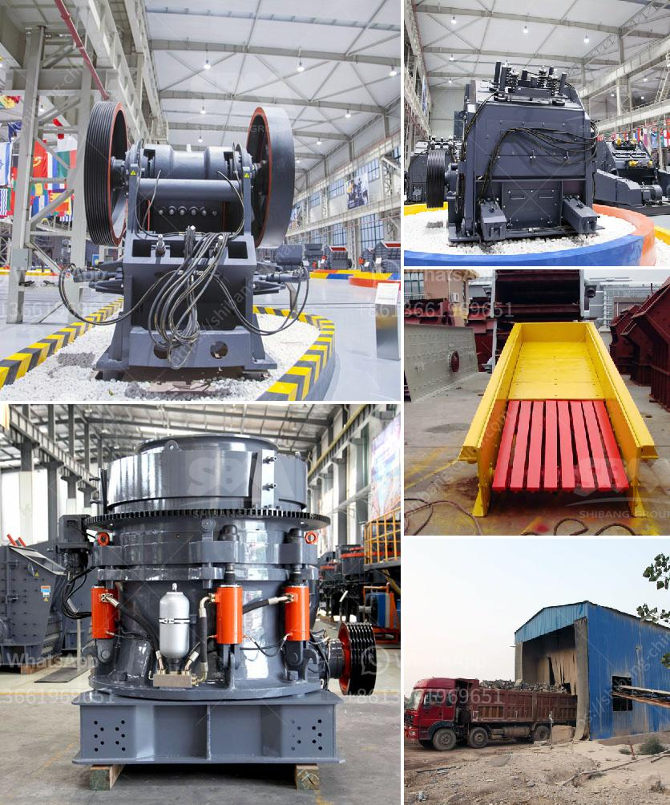

<h3>آلات كسارة المحجر</h3>
تعتبر آلات كسارة المحجر أدوات حاسمة في عملية استخراج الصخور والمعادن في العديد من الصناعات مثل صناعة الإنشاءات والطرق والسكك الحديدية، حيث تستخدم لتكسير الصخور الكبيرة إلى قطع صغيرة أكثر تكيفًا مع الاحتياجات المختلفة.

تعمل آلات كسارة المحجر عن طريق نظام يسمح بسحق الصخور بفعل القوة العالية المطبقة عليها. تتكون الآلة الأساسية من فكين تتحركان في اتجاهين متعاكستين، حيث تنفتح الفكوك لتستقبل الصخور الكبيرة ثم تنغلق لتكسرها. كما تحتوي على محرك لتزويد الطاقة اللازمة لحركة الفكين وقدرتها على تحمل الضغط العالي.

تتوفر آلات كسارة المحجر بعدة أحجام ومواصفات مختلفة، حسب نوع الصخور المطلوب تكسيرها وكمية الإنتاج المرغوبة. يتم اختيار النوع المناسب بناءً على الصخور، حيث تتطلب الصخور الصلبة آلات أكثر قوة وصلابة بينما تتميز الصخور الرخوة بالحساسية وتحتاج إلى آلات ضعيفة القوة.

تعتبر آلات كسارة المحجر فعالة لتوفير الوقت والجهد وتحسين إنتاجية العمل. فعملية التكسير تتم بسرعة عالية جداً مقارنة بعملية التكسير اليدوي التقليدية المتعبة والمكلفة. تقلل الآلة من حاجة العمالة البشرية بشكل كبير وتقلل من تكاليف الصيانة والإصلاح التي قد تنتج عن العمل الشاق.

بالإضافة إلى ذلك، تعتبر آلات كسارة المحجر آمنة وموثوقة. تأتي مع إجراءات وتقنيات أمان عالية لضمان سلامة العاملين والمعدات. كما تتميز بفعالية عالية في استخدام الطاقة حيث تقوم بتحويل الطاقة الكهربائية إلى قوة ميكانيكية بأكبر كفاءة ممكنة.

باختصار، تعتبر آلات كسارة المحجر أدوات حديثة وفعالة في صناعة الإنشاءات والتخطيط العمراني. فهي توفر الوقت والمجهود وتحسن من أداء العمل والإنتاجية. وعلى الرغم من الاستثمار الأولي اللازم لشراء هذه الآلات، فإن الفوائد الطويلة الأجل التي تقدمها تجعلها استثمارًا مثمرًا للعديد من الشركات في هذه الصناعة.
<h3>Contact us</h3><ul><li><strong>Whatsapp:&nbsp;<a href="https://wa.me/8613661969651">+8613661969651</a></strong></li><li><a href="https://swt.shibang-china.com/?git&amp;zhl&amp;آلات كسارة المحجر"><strong>Online Service(chat now)</strong></a></li></ul><h3>Related</h3><ul><li><a href='عملية تشكيل الأسمنت.md'>عملية تشكيل الأسمنت</a></li><li><a href='تكلفة طاحونة الكوارتز.md'>تكلفة طاحونة الكوارتز</a></li><li><a href='سعر كسارة الحجر المحمولة في.md'>سعر كسارة الحجر المحمولة في</a></li><li><a href='جر المحمول في.md'>جر المحمول في</a></li><li><a href='معدات تعدين كاملة في أكرا، غانا.md'>معدات تعدين كاملة في أكرا، غانا</a></li></ul>