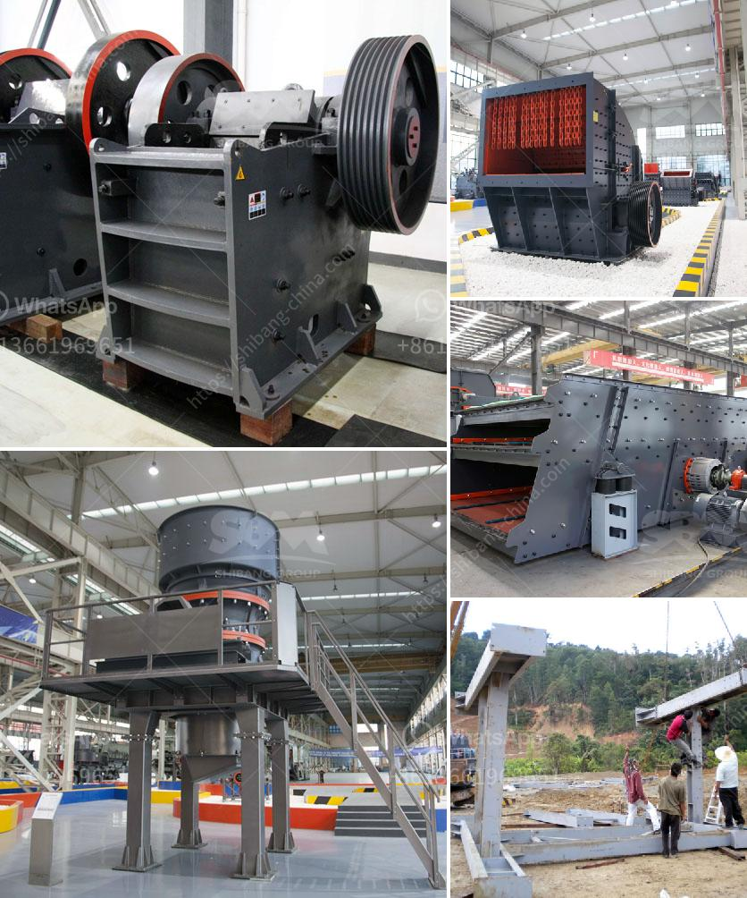

<h3>آلات كسارة للبيع</h3>
تُعدّ آلات الكسارة من بين الأدوات الأساسية في صناعة التعدين والبناء. وتتوفر هذه الآلات بأنواع وأحجام مختلفة، وتستخدم لكسر المواد الصلبة والأحجار الكبيرة إلى جزيئات صغيرة ومسحوق، مما يسهل عملية نقلها واستخدامها في إنتاج الخرسانة والركام والحصى وغيرها من المواد الأساسية.

تعتبر آلات الكسارة للبيع ضمن مجال الأعمال التجارية الناجحة، حيث يتزايد الطلب على هذه الآلات بسبب زيادة الاحتياجات العمرانية والبنائية في العديد من البلدان حول العالم. يُعزى ذلك أيضًا إلى النمو السكاني وتطور الاقتصادات، والتي تدفع بالحاجة إلى بنية تحتية قوية وفعّالة.

إذا كنت تفكر في شراء آلة كسارة جديدة أو مستعملة، فإليك بعض الأشياء التي يجب أن تنظر إليها قبل الشراء:

1. الحجم والسعة: يجب أن تحدد الأبعاد والقدرة التي تحتاجها في آلة الكسارة، وذلك بناءً على احتياجاتك الفعلية وحجم المشروع الذي تعمل عليه.

2. الكفاءة والتقنية: تحقق من كفاءة الآلة وتقنيات التشغيل، فالآلات الحديثة تتمتع بتقنيات أكثر تطورًا وتوفر في الطاقة وتحافظ على البيئة.

3. الصيانة: تحقق من احتياجات الصيانة والتشغيل الروتيني للآلة قبل الشراء. يجب أن تكون الآلة قابلة للتشغيل والتحكم بسهولة، وأن تكون القطع البديلة متوفرة وسهلة الاستبدال.

4. السعر: قم بمقارنة الأسعار والخدمات بين مختلف البائعين. قد تجد بعض العروض المتميزة لآلات الكسارة المستعملة، لكن يجب عليك الاحترام إلي الوقت المستهلك في قسم المستعمل.

5. التوصيل والضمان: تأكد من خدمات التوصيل والضمان التي يقدمها البائع. قد يكون من الأفضل الشراء من بائع محلي قريب، لكي تتمكن من الاطلاع على الآلة قبل الشراء.

في النهاية، فإن شراء آلة كسارة يُعدّ استثمارًا مهمًا يتطلب الكثير من البحث والدراسة. يجب عليك اختيار الطراز المناسب والموثوق به والذي يتماشى مع احتياجاتك وميزانيتك. كما ينبغي النظر في الخدمات الإضافية المقدمة مثل الصيانة والتدريب وخدمة ما بعد البيع.

بهذه الطريقة، يمكنك الحصول على آلة كسارة ذات جودة عالية تلبي احتياجاتك الصناعية وتساعدك في تحقيق النجاح والربحية في مجال البناء والتعدين.
<h3>Contact us</h3><ul><li><strong>Whatsapp:&nbsp;<a href="https://wa.me/8613661969651">+8613661969651</a></strong></li><li><a href="https://swt.shibang-china.com/?git&amp;zhl&amp;آلات كسارة للبيع"><strong>Online Service(chat now)</strong></a></li></ul><h3>Related</h3><ul><li><a href='أرض متاحة لمحجر الحجر.md'>أرض متاحة لمحجر الحجر</a></li><li><a href='الدوران الروتوري لكسارة الحجر الجيري.md'>الدوران الروتوري لكسارة الحجر الجيري</a></li><li><a href='عمل المطحنة الكرة بالهندية.md'>عمل المطحنة الكرة بالهندية</a></li><li><a href='كسارة حجر لصنع رمل البناء.md'>كسارة حجر لصنع رمل البناء</a></li><li><a href='مطحنة طحن عمودية مستعملة بسعة 100 طن في الساعة.md'>مطحنة طحن عمودية مستعملة بسعة 100 طن في الساعة</a></li></ul>