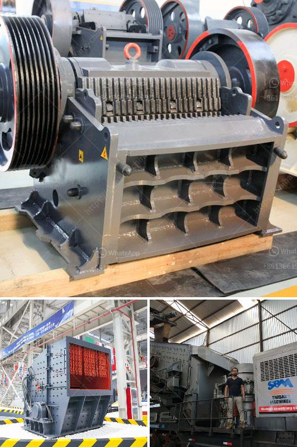

<h3>آلات محجر الجرانيت للبيع</h3>
إذا كنت تبحث عن آلات محجر الجرانيت للبيع، فإنك تقوم بخطوة ذكية في صناعة البناء والتشييد. فالجرانيت واحد من أكثر أنواع الحجر شيوعًا واستخدامًا في العديد من المشاريع الهندسية، سواء كانت تستهدف البناء السكني أو العام.

تُستخدم آلات محجر الجرانيت في عملية استخراج الجرانيت من المحجر وتصنيعه للاستخدام في المشاريع الهندسية. وتشمل هذه الآلات الحفارات والكسارات والكسارات المخروطية والغرابيل والحمولات وغيرها من الآلات، التي تساعد في تجهيز الحجر وتصنيعه بشكل متكامل.

تتميز آلات محجر الجرانيت بالعديد من المزايا والفوائد. فهي تساعد في تقليل الجهد والعمل اليدوي، مما يؤدي إلى زيادة الكفاءة في العمل وتوفير الوقت والمال. بالإضافة إلى ذلك، توفر آلات المحجر الجرانيت إمكانية الحصول على منتجات عالية الجودة وذات مواصفات دقيقة، مما يساعد في تحقيق نتائج مثالية في المشاريع الهندسية.

عند شراء آلات محجر الجرانيت، يجب أن تأخذ بعين الاعتبار بعض العوامل. أهم هذه العوامل هي جودة الآلات وكفاءتها وقوة تحملها والعناية المطلوبة بها. يجب اختيار آلات ذات جودة عالية وموثوقة من شركات موثوقة وذات سمعة جيدة في السوق.

بالإضافة إلى ذلك، يجب أن تدرس أيضًا احتياجاتك الخاصة وميزانيتك. يجب أن تتحقق من أن الآلات التي تنوي شراءها تتوافق مع حجم ونوع مشروعك. ومن الضروري أيضًا التحقق من أن السعر معقول ويناسب ميزانيتك المحددة.

في الختام، يعتبر شراء آلات محجر الجرانيت استثمارًا جيدًا في صناعة البناء والتشييد. إذا كنت تبحث عن الاستدامة والجودة والكفاءة في عملية التصنيع والتشييد، فإن شراء آلات محجر الجرانيت هو الخيار الأمثل. تأكد من اختيار الآلات الملائمة لاحتياجاتك وميزانيتك، واستعن بشركات موثوقة للحصول على جودة وموثوقية عالية.
<h3>Contact us</h3><ul><li><strong>Whatsapp:&nbsp;<a href="https://wa.me/8613661969651">+8613661969651</a></strong></li><li><a href="https://swt.shibang-china.com/?git&amp;zhl&amp;آلات محجر الجرانيت للبيع"><strong>Online Service(chat now)</strong></a></li></ul><h3>Related</h3><ul><li><a href='عملية تصنيع مسحوق البنتونيت.md'>عملية تصنيع مسحوق البنتونيت</a></li><li><a href='كسارة حجرية بسعة 100 طن في الساعة استهلاك الديزل.md'>كسارة حجرية بسعة 100 طن في الساعة استهلاك الديزل</a></li><li><a href='تكلفة آلة الكسارة.md'>تكلفة آلة الكسارة</a></li><li><a href='كسارة في الفلبين.md'>كسارة في الفلبين</a></li><li><a href='معدات تكسير خام الكروم المستخدمة.md'>معدات تكسير خام الكروم المستخدمة</a></li></ul>