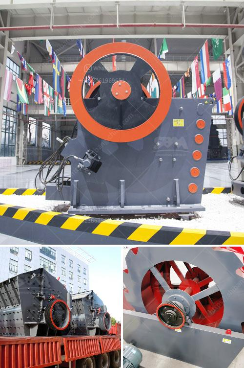

<h3>آلات محجر كاملة للبيع في الصين</h3>
يعتبر قطاع التعدين من أحد القطاعات الحيوية في الاقتصاد، ويشهد تطورًا مستمرًا في السنوات الأخيرة. ومن أجل تلبية الطلب المتزايد على الموارد المعدنية، فقد شهدت الصين تطورًا كبيرًا في صناعة آلات المحاجر.

تقدم الصين آلات محجر كاملة للبيع بمواصفات وميزات متنوعة تتناسب مع احتياجات العملاء في جميع أنحاء العالم. تتضمن هذه الآلات مجموعة واسعة من الأجهزة والمعدات التي تستخدم في عمليات التنقيب والتعدين، مثل الكسارات الفكية والكسارات المخروطية والمطاحن والشاشات الاهتزازية والحفارات وآلات النقل وغيرها.

تتميز آلات المحاجر الصينية بتصميمات عالية الجودة وتقنيات حديثة، مما يضمن الكفاءة والأداء العالي. بالإضافة إلى ذلك، فإن هذه الآلات تتميز بالمتانة والموثوقية، حيث تصمم وتصنع بمواد ذات جودة عالية وتخضع لاختبارات صارمة لضمان استخدامها لفترات طويلة دون أعطال.

بالإضافة إلى الجودة العالية والأداء الممتاز، يتمتع العملاء بالعديد من المزايا عند شراء آلات المحاجر الصينية. فقد تمتلك الصين شبكة توزيع وخدمة موسعة في العديد من البلدان، مما يسهل الحصول على الدعم الفني وقطع الغيار عند الحاجة. كما أن الأسعار التنافسية لآلات المحاجر الصينية تجعلها خيارًا مغريًا للعملاء.

تُعَدُّ آلات المحاجر الصينية فرصة مهمة للعملاء الذين يبحثون عن معدات تعدين عالية الجودة وفعالة. وتأخذ الصين بما لديها من شركات تصنيع محترفة دورًا رياديًا في هذا المجال، وتسعى جاهدة لتطوير آلات محاجر مبتكرة تلبي احتياجات العملاء. وعلاوةً على ذلك، تلتزم الصين بتطوير تكنولوجيا مستدامة تقلل من تأثير المحاجر على البيئة وتساهم في حماية الموارد الطبيعية.

باختصار، تُعَدُّ آلات المحاجر الصينية خيارًا ممتازًا للعملاء الذين يبحثون عن معدات تعدين ذات جودة عالية، وأداء ممتاز، وأسعار تنافسية. من خلال توفير تشكيلة واسعة من المنتجات والدعم الفني المستمر، تتطلع الشركات المصنعة الصينية إلى تلبية احتياجات العملاء وإقامة شراكات مربحة في صناعة التعدين.
<h3>Contact us</h3><ul><li><strong>Whatsapp:&nbsp;<a href="https://wa.me/8613661969651">+8613661969651</a></strong></li><li><a href="https://swt.shibang-china.com/?git&amp;zhl&amp;آلات محجر كاملة للبيع في الصين"><strong>Online Service(chat now)</strong></a></li></ul><h3>Related</h3><ul><li><a href='كسارة تعدين الحجر الجيري في فيتنام.md'>كسارة تعدين الحجر الجيري في فيتنام</a></li><li><a href='خط إنتاج مسحوق الجبس بمقياس صغير.md'>خط إنتاج مسحوق الجبس بمقياس صغير</a></li><li><a href='كسارة الكوارتز السيليكون.md'>كسارة الكوارتز السيليكون</a></li><li><a href='كيفية بناء مصنع استفادة من المنغنيز.md'>كيفية بناء مصنع استفادة من المنغنيز</a></li><li><a href='مورد آلة كسارة الأسطوانة.md'>مورد آلة كسارة الأسطوانة</a></li></ul>