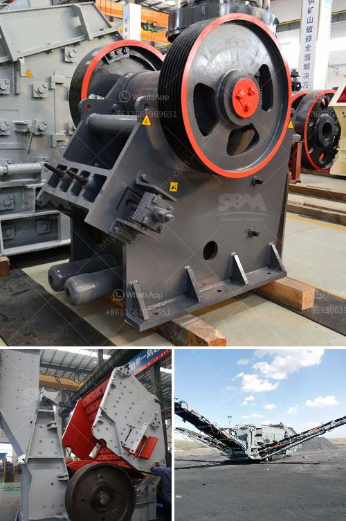

<h3>آلات مستخدمة في مصنع الفحم المسحوق</h3>
مصنع الفحم المسحوق هو مصنع يقوم بعملية تحويل الفحم الصلب إلى فحم ناعم، يُطلق عليه أيضًا اسم الفحم المطحون. تستخدم عدة آلات في هذا المصنع لتحقيق العملية بشكل فعال وفقًا للمتطلبات الصناعية. سنتحدث في هذه المقالة عن بعض الآلات الرئيسية المستخدمة في مصنع الفحم المسحوق.

أول آلة هي الكسارة، وهي عبارة عن آلة تُستخدم لتكسير الفحم الصلب إلى قطع أصغر من المواد الخام. تتكون الكسارة من حزام ناقل حيث يتم تحميل الفحم عليه، ثم يدخل في الكسارة عن طريق تأثير الدوارات. يتم تكسير الفحم في هذه العملية إلى قطع صغيرة جدًا.

من ثم، يتم استخدام الطباشة لفصل الفحم عن الشوائب الأخرى مثل الصخور والأحجار. الطباشة هي آلة تعمل على تعويم الفحم في الماء، حيث يتم فصل الفحم عن طبقة الماء العلوية التي تحتوي على الشوائب الأخرى. يتم سحب الفحم المعزول من قاع الطباشة.

ثم، يتم تجفيف الفحم في آلة تجفيف خاصة تُسمى الجافة. تعمل الجافة على تجفيف الفحم من الماء المتبقي فيه بعد عملية الطباشة. يتم إدخال الفحم الرطب في الجافة، وبفضل تدفق الهواء الساخن، يتم تبخير الماء المتبقي من الفحم.

ثم يتم تحويل الفحم المجفف إلى مسحوق في آلة طحن الفحم، والتي تعمل على فَتْحُ حبيبات الفحم الكبيرة إلى حبيبات أدق وشكلية أكثر اتساقًا. يتم تدوير الفحم في هذه العملية بين عجلات طحن عالقة وذات سرعة دوران عالية. تعتبر طحن الفحم عملية مهمة للغاية للحصول على فحم مسحوق عالي الجودة.

أخيرًا، يتم تغليف الفحم المسحوق في أكياس أو حاويات مناسبة للتخزين والنقل. يستخدم جهاز تعبئة الفحم لتعبئة الفحم المسحوق في الحقائب وإحكام إغلاقها بإحكام.

يمكن القول إن استخدام الآلات المذكورة أعلاه في مصنع الفحم المسحوق يسهم في تحسين جودة الفحم وجعله جاهزًا للاستخدام في العديد من الصناعات المختلفة. إن تحويل الفحم الصلب إلى فحم مسحوق يفتح الباب لاستخدامه في توليد الطاقة وصناعة المعادن والأسمدة وغيرها من التطبيقات.
<h3>Contact us</h3><ul><li><strong>Whatsapp:&nbsp;<a href="https://wa.me/8613661969651">+8613661969651</a></strong></li><li><a href="https://swt.shibang-china.com/?git&amp;zhl&amp;آلات مستخدمة في مصنع الفحم المسحوق"><strong>Online Service(chat now)</strong></a></li></ul><h3>Related</h3><ul><li><a href='كسارة حجر البلاد في الهند.md'>كسارة حجر البلاد في الهند</a></li><li><a href='مطحنة الأسطوانة بيرينج.md'>مطحنة الأسطوانة بيرينج</a></li><li><a href='كسارة متنقلة بنظام هيدروليكي.md'>كسارة متنقلة بنظام هيدروليكي</a></li><li><a href='نموذج عملي لكسارة الحجر.md'>نموذج عملي لكسارة الحجر</a></li><li><a href='مطحنة الكرة للذهب في إندونيسيا.md'>مطحنة الكرة للذهب في إندونيسيا</a></li></ul>