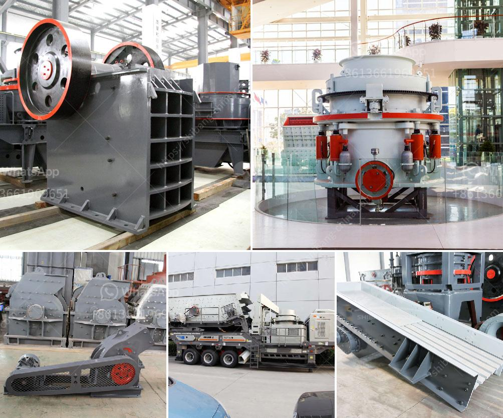

<h3>آلات مستخدمة للطحن في تاميل نادو، الهند</h3>
تاميل نادو هي ولاية تقع في جنوب الهند وتشتهر بتاريخها الغني وثقافتها الفريدة. تعد صناعة الطحن واحدة من الصناعات الحديثة والمتقدمة في الولاية، حيث تستخدم آلات متطورة في عملية الطحن.

تعد آلات الطحن من أهم الآلات المستخدمة في مجال تحويل الحبوب والبذور إلى مسحوق ناعم يستخدم في صناعة الطعام والعديد من الصناعات الأخرى. يعود استخدام الآلات في عملية الطحن في تاميل نادو إلى العصور القديمة، حيث كانت تستخدم المطاحن التقليدية المعروفة باسم "آتاذو‮ ‬" أو "آمي"، وتعتبر هذه الطريقة التقليدية للطحن لا تزال مستخدمة في بعض المناطق الريفية حتى يومنا هذا.

مع تطور التكنولوجيا، بدأت آلات الطحن الحديثة في الظهور في تاميل نادو. تستخدم الآلات الحديثة تقنيات متقدمة مثل الطحن بالضغط العالي والطحن بالاتساق والطحن الجاف لتحقيق أعلى جودة وكفاءة في عملية الطحن. تعمل هذه الآلات على تحويل الحبوب إلى مسحوق ناعم بواسطة الضغط والاحتكاك والاهتزاز، مع الحفاظ على القيمة الغذائية والنكهة الطبيعية للحبوب.

تتوفر آلات الطحن المستخدمة في تاميل نادو بمختلف الأحجام والأشكال والموديلات، ويتم اختيار الآلة المناسبة وفقًا لنوع الحبوب التي سيتم طحنها. تتراوح قدرة الآلات من المنازل والمطاعم الصغيرة التي تحتاج إلى طحن كميات صغيرة يوميًا، إلى المصانع الكبيرة التي تحتاج إلى طحن كميات كبيرة من الحبوب يوميًا.

تعتبر آلات الطحن في تاميل نادو مهمة جدًا في صناعة الطعام، حيث يتم استخدام مسحوق الحبوب في إعداد العديد من الأطباق مثل الدوسا والآيدلي والبيرياني والمقبلات. كما يتم استخدام مسحوق الحبوب في صناعة الخبز والكعك والمعجنات الأخرى.

بالاضافة الى صناعة الطعام، يتم استخدام آلات الطحن أيضًا في صناعات أخرى مثل صناعة الأعلاف والأسمدة والأعشاب الطبية. تلعب آلات الطحن دورًا حيويًا في زيادة كفاءة هذه الصناعات وتحسين جودة منتجاتها.

باختصار، تعد آلات الطحن في تاميل نادو مهمة جدًا ومتقدمة ومستخدمة على نطاق واسع في عملية تحويل الحبوب والبذور إلى مسحوق ناعم. تعكس استخدامات هذه الآلات ثقافة الطعام الغنية والتنوع الذي يعرف به تاميل نادو. مع ازدهار صناعة الطحن في الولاية، يتوقع أن تستمر الابتكارات والتحسينات في آلات الطحن مستقبلًا لتحقيق أفضل أداء ونتائج عالية الجودة.
<h3>Contact us</h3><ul><li><strong>Whatsapp:&nbsp;<a href="https://wa.me/8613661969651">+8613661969651</a></strong></li><li><a href="https://swt.shibang-china.com/?git&amp;zhl&amp;آلات مستخدمة للطحن في تاميل نادو، الهند"><strong>Online Service(chat now)</strong></a></li></ul><h3>Related</h3><ul><li><a href='آلة صنع البليت الصغيرة للبيع في كينيا.md'>آلة صنع البليت الصغيرة للبيع في كينيا</a></li><li><a href='ورقة تدفق معالجة الحجر الجيري.md'>ورقة تدفق معالجة الحجر الجيري</a></li><li><a href='سعر مصنع الكسارة في باكستان.md'>سعر مصنع الكسارة في باكستان</a></li><li><a href='كسارة الحجر في هيماتشال براديش.md'>كسارة الحجر في هيماتشال براديش</a></li><li><a href='كسارة للبيع بسعر دبي.md'>كسارة للبيع بسعر دبي</a></li></ul>