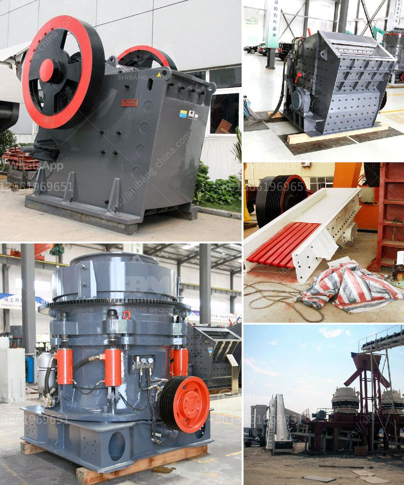

<h3>آلات مصنع الحصى الكوارتز</h3>
يعتبر الحصى الكوارتز أحد المواد الضرورية في صناعة البناء، حيث يستخدم في إعداد الخرسانة والأسفلت وغيرها من المواد المقاومة للماء والرطوبة. ولتلبية الطلب المتزايد على هذه المادة، يتم استخدام آلات مصنع الحصى الكوارتز.

يتكون مصنع الحصى الكوارتز من عدة مراحل مهمة تضمن تحقيق نوعية عالية للمنتج النهائي. أولاً وقبل كل شيء، يتم جمع الحصى الكوارتز من المناجم، حيث يتم فصله عن باقي المواد الخام الأخرى. بعد ذلك، يتم نقل الحصى إلى سير متحرك حيث يتم تنظيفه بشكل جيد قبل أن يتم إدخاله إلى آلة سحق.

تعتبر آلة سحق الحصى الكوارتز هي العملية الأساسية في مصنع الحصى. تستخدم هذه الآلة لسحق الحصى الكوارتز إلى حجم صغير ومتجانس يمكن من خلاله استخراج الشوائب والأجسام الغريبة الأخرى. هناك عدة أنواع من آلات السحق المستخدمة في هذه العملية، مثل الكسارات المطرقية والكسارات الفكية.

بعد عملية السحق، يتم نقل الحصى الكوارتز إلى مرحلة غسله وفصل الشوائب. يتم غسل الحصى بالماء بطريقة متكررة للتخلص من الأتربة والأوساخ العالقة به. ثم يتم تصفية الحصى باستخدام آلات الفرز لإزالة الشوائب الأخرى مثل الحصى الصغيرة والرمال الناعمة.

بعد ذلك، يتم تجفيف وتخزين الحصى النهائي في مخازن المصنع. ومن هنا، يتم توزيع الحصى الكوارتز الجاهز للاستخدام في صناعة البناء والتشييد. يتم تصنيعه بأحجام وأشكال مختلفة تناسب احتياجات العملاء.

يعتبر مصنع الحصى الكوارتز مثالًا على تكنولوجيا المعالجة الميكانيكية الحديثة التي تلبي الطلب المتزايد على هذه المادة. يساهم في توفير مواد البناء عالية الجودة وفقًا للمعايير الدولية. علاوة على ذلك، فإن استخدام مصنع الحصى الكوارتز يسهم في المحافظة على موارد البيئة نظرًا لعملية تصنيعه الآمنة والفعالة.

في النهاية، يعد مصنع الحصى الكوارتز أحد العناصر الرئيسية في صناعة البناء والتشييد. يتطلب عملية تصنيعه استخدام آلات حديثة وعمليات مُحكمة لتحقيق أفضل نتائج. ويعد استخدام هذه المادة المتطورة وذات الجودة العالية ضروريًا لبناء المنشآت المتينة التي تستدام لسنوات عديدة.
<h3>Contact us</h3><ul><li><strong>Whatsapp:&nbsp;<a href="https://wa.me/8613661969651">+8613661969651</a></strong></li><li><a href="https://swt.shibang-china.com/?git&amp;zhl&amp;آلات مصنع الحصى الكوارتز"><strong>Online Service(chat now)</strong></a></li></ul><h3>Related</h3><ul><li><a href='آلة طحن مسحوق الحجر الصغيرة.md'>آلة طحن مسحوق الحجر الصغيرة</a></li><li><a href='سعر كسارة الفك المحمولة.md'>سعر كسارة الفك المحمولة</a></li><li><a href='محطات الكسارات للبيع في باكستان.md'>محطات الكسارات للبيع في باكستان</a></li><li><a href='كسارات الفك مسحوق كربيد التنجستن.md'>كسارات الفك مسحوق كربيد التنجستن</a></li><li><a href='معالجة الحجر الجيري في نيجيريا.md'>معالجة الحجر الجيري في نيجيريا</a></li></ul>