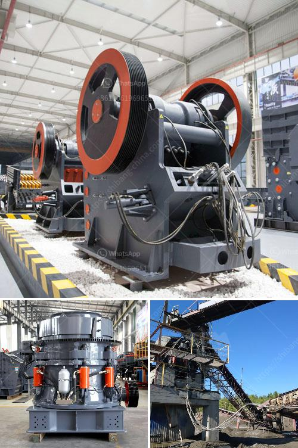

<h3>آلات مصنع تكسير وفرز الحجر المحمولة</h3>
تعد آلات تكسير وفرز الحجر المحمولة أداة حديثة في صناعة التعدين والبناء، حيث تساعد على تحويل الصخور الكبيرة إلى قطع أصغر يمكن استخدامها في تصنيع المواد الإنشائية والمنتجات الأخرى. تتميز هذه الآلات بقدرتها على تكسير الصخور بكفاءة وبسرعة دون الحاجة إلى استخدام آليات ثقيلة ومعدات متطورة.

تعمل آلات تكسير وفرز الحجر المحمولة بنظام ميكانيكي يتكون من الفك المتحرك والفك الثابت، حيث يتم تحريك الفك المتحرك باتجاه الفك الثابت لتكسير الصخور بينهما. بعد عملية التكسير، يتم نقل الحجارة المكسورة إلى الآلة الفرز حيث يتم فصل القطع الكبيرة والصغيرة وفقًا للحجم والشكل. يمكن أن يكون الحجم النهائي للصخور متنوعًا ويمكن ضبطها حسب المتطلبات المحددة.

تتميز آلات التكسير والفرز المحمولة بعدة مزايا رئيسية. أولاً، فهي قابلة للتنقل ويمكن نقلها بسهولة من مكان إلى آخر. هذا يعطي المزيد من المرونة والكفاءة لعمليات التكسير والفرز، حيث يمكن استخدامها في مواقع متعددة دون الحاجة إلى بنية ثابتة وترتيبات معقدة. ثانيًا، فإن هذه الآلات صغيرة الحجم وتحتاج إلى مساحة صغيرة للعمل، مما يجعلها مناسبة للعمل في المواقع ذات الحجم المحدود. ثالثًا، فإنها تتميز بإنتاجية عالية وأداء قوي، مما يساعد على زيادة كفاءة العمل وتقليل تكلفة الإنتاج.

يستخدم تكسير الصخور المحمولة في مجموعة واسعة من التطبيقات في صناعة البناء والتعدين. يمكن استخدامها لسحق الحجارة والخرسانة والركام والمواد الأخرى المستخدمة في البناء وعمليات الطرق. كما يمكن استخدامها في استخراج المعادن من المواقع التعدينية. بفضل هذه الآلات المحمولة، يمكن تحقيق توفير في تكلفة الإنتاج وزيادة الكفاءة في عمليات التكسير والفرز.

باختصار، آلات تكسير وفرز الحجر المحمولة تعتبر أداة حديثة ومهمة في صناعة التعدين والبناء. تتميز بالقدرة على تحويل الصخور الكبيرة إلى قطع أصغر بكفاءة وسرعة، بفضل نظام تكسير وفرز ميكانيكي مبتكر. وبفضل التنقل السهل والحجم الصغير والإنتاجية العالية، توفر هذه الآلات تحسينًا كبيرًا في كفاءة عمليات التكسير والفرز وتقليل التكاليف للشركات والمنظمات التي تعتمد على هذه التقنية.
<h3>Contact us</h3><ul><li><strong>Whatsapp:&nbsp;<a href="https://wa.me/8613661969651">+8613661969651</a></strong></li><li><a href="https://swt.shibang-china.com/?git&amp;zhl&amp;آلات مصنع تكسير وفرز الحجر المحمولة"><strong>Online Service(chat now)</strong></a></li></ul><h3>Related</h3><ul><li><a href='آلة معالجة الكاولين في المصنع.md'>آلة معالجة الكاولين في المصنع</a></li><li><a href='طاحونة مسحوق ناعمة جدا.md'>طاحونة مسحوق ناعمة جدا</a></li><li><a href='آلات إنتاج الكالسيوم.md'>آلات إنتاج الكالسيوم</a></li><li><a href='مصنع تكسير في مالي.md'>مصنع تكسير في مالي</a></li><li><a href='آلة سحق الحجر المحمولة في أمريكا.md'>آلة سحق الحجر المحمولة في أمريكا</a></li></ul>