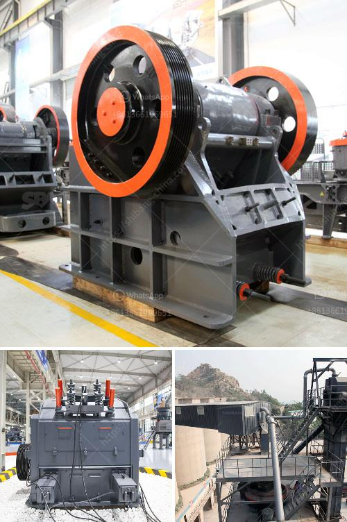

<h3>آلات مطاحن المطرقة في إندونيسيا</h3>
تشتهر إندونيسيا بصناعة المطاحن المطرقة التي تُستخدم في طحن مجموعة متنوعة من المواد مثل الذرة والقمح والأعلاف. تُعد هذه المطاحن أداة أساسية لمنتجي الأعلاف والمزارعين، وقد تطورت بشكل كبير على مر السنين.

تعتبر مطاحن المطرقة آلات تعمل بشكل بسيط وفعال. تتألف المطاحن من طاحونة دوارة بها مطرقة تستخدم لضرب المادة الخام الموجودة في الآلة. يتم تطبيق قوة الصدمة من المطرقة على المادة الخام لتكسيرها وطحنها إلى حجم الجسيمات المطلوب.

تستخدم المطاحن المطرقة في عدة صناعات مختلفة في إندونيسيا، منها صناعة الأعلاف والأغذية والحبوب. يعتبر إنتاج الأعلاف من الاستخدامات الرئيسية للمطاحن المطرقة في البلاد، حيث يتم طحن الحبوب وخلطها مع العناصر الأخرى لإنتاج أعلاف ذات جودة عالية لتغذية الحيوانات. كما يستخدم المزارعون المطاحن المطرقة لطحن الحبوب والقمح لاستخدامها في إنتاج الطعام.

تعتبر مطاحن المطرقة في إندونيسيا هامة لعدة أسباب. أولًا، فهي توفر طريقة فعالة وكفاءة لطحن المواد الخام، مما يساهم في زيادة إنتاجية الأعلاف والأغذية. ثانيًا، تعد هذه الآلات أقل تكلفة مقارنة ببعض الطرق التقليدية الأخرى للطحن. وأخيرًا، فإنها تساعد في تقليل العمل البشري وزيادة الإنتاجية، مما يجعلها اختيارًا شائعًا بين المزارعين والمنتجين.

على الرغم من الفوائد المذكورة، تواجه صناعة مطاحن المطرقة في إندونيسيا بعض التحديات. تشمل هذه التحديات المنافسة من الأسواق الخارجية والتكاليف المرتفعة للمواد الخام والطاقة. ومع ذلك، فإن صناعة مطاحن المطرقة ما زالت تلعب دورًا حيويًا في الاقتصاد المحلي وتساهم في تلبية الطلب المحلي على الأعلاف والأغذية.

في الختام، تعتبر مطاحن المطرقة في إندونيسيا جزءًا هامًا من الصناعات التحويلية في البلاد. توفر هذه الآلات طريقة فعالة لطحن المواد الخام وتلبية الطلب المحلي على الأعلاف والأغذية. ومع التحديات التي تواجهها هذه الصناعة، يتعين على المصنعين العمل على تطوير تكنولوجيا المطاحن المطرقة وتحسين كفاءتها لدينامية إندونيسيا الاقتصادية ومستقبلها التجاري.
<h3>Contact us</h3><ul><li><strong>Whatsapp:&nbsp;<a href="https://wa.me/8613661969651">+8613661969651</a></strong></li><li><a href="https://swt.shibang-china.com/?git&amp;zhl&amp;آلات مطاحن المطرقة في إندونيسيا"><strong>Online Service(chat now)</strong></a></li></ul><h3>Related</h3><ul><li><a href='آلة مطحنة الدورين.md'>آلة مطحنة الدورين</a></li><li><a href='كسارة حجر للبناء.md'>كسارة حجر للبناء</a></li><li><a href='مطحنة الدولوميت بحجم 13x18 للبيع.md'>مطحنة الدولوميت بحجم 13x18 للبيع</a></li><li><a href='سعر معدات التعدين المستخدمة.md'>سعر معدات التعدين المستخدمة</a></li><li><a href='شراء كسارة حجرية صغيرة في الفلبين.md'>شراء كسارة حجرية صغيرة في الفلبين</a></li></ul>