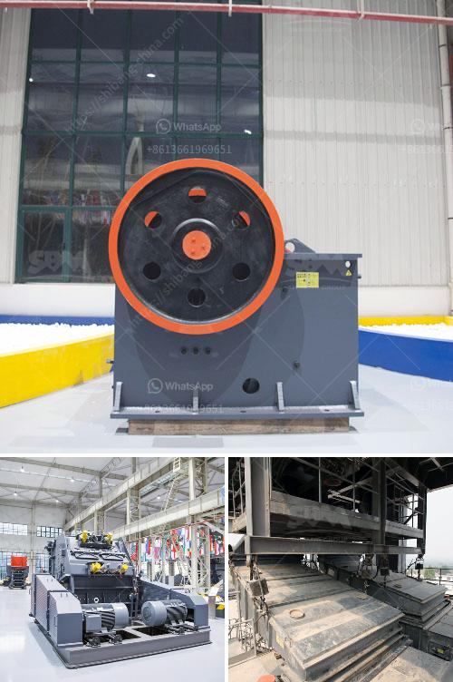

<h3>آلات مطحنة في جنوب أفريقيا</h3>
يُعتبر قطاع الصناعة في جنوب أفريقيا من أهم القطاعات الاقتصادية في البلاد، حيث يساهم بشكل كبير في تحقيق النمو الاقتصادي وتوفير فرص العمل للسكان المحليين. ومن بين الصناعات الرائجة في جنوب أفريقيا، نجد صناعة المطاحن.

تَعتبر المطاحن من الآلات الحيوية في عملية تحويل حبوب الحبوب إلى دقيق ومستحضرات قمحية أخرى. تعتبر جنوب أفريقيا ، بناءً على البحوث والتطوير والتقنية المتقدمة ، واحدة من كبار مُصنعي ومُصدري الآلات الصناعية في القارة الأفريقية. تلعب مطاحن جنوب أفريقيا دورًا مهمًا في دعم صناعة الحبوب وتعزيز الانتاجية في المجال الزراعي.

تعد مطاحن جنوب أفريقيا مشهورة بجودة منتجاتها وأدائها الموثوق به في عملية طحن الحبوب. تأخذ المطاحن في الاعتبار جميع عوامل الإنتاج بدءًا من استلام الحبوب وتنقيتها وتنظيفها وطحنها حتى تصنيع المخلفات الزراعية وإنتاج منتجات ذات جودة عالية. تستخدم المطاحن في جنوب أفريقيا أحدث التقنيات والمعدات الحديثة لضمان تحقيق الكفاءة العالية وتوفير المواد الخام. تستخدم هذه الآلات أجهزة الاستشعار الإلكترونية والروبوتات والبرامج المتقدمة لزيادة الإنتاجية والدقة.

بالإضافة إلى ذلك ، تلتزم معظم مطاحن جنوب أفريقيا بالمعايير العالمية فيما يتعلق بالجودة والسلامة والصحة العامة. فهي تستخدم مواد وأجزاء قابلة للتطهير وتطبق ممارسات السلامة المتقدمة لضمان عدم تلوث المنتجات بالكائنات الحية الدقيقة أو المواد الضارة الأخرى.

من الجوانب الإيجابية للمطاحن في جنوب أفريقيا هو دعمها للمجتمع والاقتصاد المحلي. فعادةً ما توفر المطاحن فرص عمل مستدامة للموظفين المحليين وتعزز العمليات القائمة على المحليات والمؤسسات المحلية الأخرى ، مما يُعزز النمو الاقتصادي في تلك المناطق.

للاستنتاج، تعتبر آلات المطاحن في جنوب أفريقيا أحدث التقنيات والمعدات المتاحة في صناعة المطاحن. تلتزم بإنتاج منتجات عالية الجودة وتلبية الطلب المتزايد على المنتجات الزراعية والمعدات في السوق المحلية والدولية. بفضل جودة المنتجات وتوفير العمل والدعم للمجتمع المحلي ، تساهم مطاحن جنوب أفريقيا في تعزيز الاقتصاد المحلي وتحقيق النمو الاقتصادي في البلاد.
<h3>Contact us</h3><ul><li><strong>Whatsapp:&nbsp;<a href="https://wa.me/8613661969651">+8613661969651</a></strong></li><li><a href="https://swt.shibang-china.com/?git&amp;zhl&amp;آلات مطحنة في جنوب أفريقيا"><strong>Online Service(chat now)</strong></a></li></ul><h3>Related</h3><ul><li><a href='مصنع كسارة الفك للبيع في أفريقيا.md'>مصنع كسارة الفك للبيع في أفريقيا</a></li><li><a href='كيفية بدء مشروع كسارة الحجر.md'>كيفية بدء مشروع كسارة الحجر</a></li><li><a href='كسارات محمولة جنوب أفريقيا.md'>كسارات محمولة جنوب أفريقيا</a></li><li><a href='معدات كسارة الحجر.md'>معدات كسارة الحجر</a></li><li><a href='صناعة تكسير الحجر.md'>صناعة تكسير الحجر</a></li></ul>