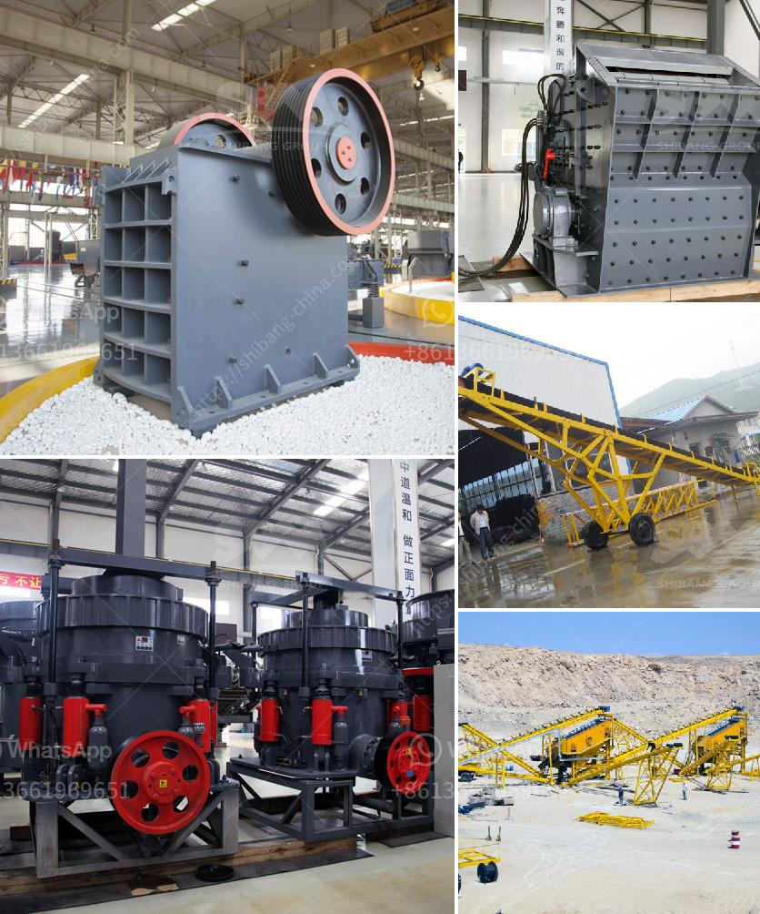

<h3>آلات معالجة الأحجار الكريمة لإثيوبيا</h3>
تعتبر إثيوبيا واحدة من أهم البلدان التي تُعرف بوفرة الأحجار الكريمة، وتتميز بعروضها الضخمة من الأحجار الثمينة مثل الياقوت والزمرد والأوبال. ومن أجل استخلاص هذه الأحجار الثمينة بشكل فعال واحترافي، تستخدم آلات معالجة الأحجار الكريمة التكنولوجيا المتطورة والمعدات المتخصصة.

تعد آلات معالجة الأحجار الكريمة في إثيوبيا من الأدوات الحديثة التي تساعد على تحسين جودة وقيمة الأحجار الكريمة المستخرجة، وتكون عملية تنقية ومعالجة الأحجار بواسطة هذه الآلات مهمة جدًا لاستعادة لمعانها وجمالها الطبيعي.

تعمل آلات معالجة الأحجار الكريمة على تجهيز الأحجار لتحقيق متطلبات ومعايير الجودة، وتشمل عمليات التنظيف والتلميع والتصقيع والتعقيم. تستخدم هذه الآلات تقنيات مختلفة لتنقية الأحجار وتعزيز جمالها وبريقها الطبيعي. أحد الأساليب الشائعة المستخدمة هي تسخين الأحجار لإطلاق لونها الطبيعي وحسن بريقها.

أحد المعروفات الشهيرة من آلات معالجة الأحجار الكريمة هو الكيانين، وهي آلة تعمل على تحسين لون الأحجار الكريمة الزمرد ومعالجة النقاط السوداء والعيوب الأخرى. كما تستخدم آلات الليزر المتطورة في تقطيع ونحت الأحجار الكريمة، مما يعطيها تصميمات فريدة وجميلة.

تقوم إثيوبيا بتصدير العديد من الأحجار الكريمة المعالجة إلى دول أخرى حول العالم. وتلعب هذه الصناعة دورًا هامًا في تعزيز الاقتصاد المحلي وتوفير فرص عمل للسكان المحليين. كما أن اكتشاف مناجم جديدة وتطور تكنولوجيا معالجة الأحجار الكريمة في إثيوبيا يتيح فرصًا جديدة للاستثمار وتعزيز القطاع التجاري.

باختصار، يشهد قطاع معالجة الأحجار الكريمة في إثيوبيا نموًا مستدامًا وتقدمًا تكنولوجيًا مستمرًا. وتعتبر الآلات المستخدمة في عمليات التنقية والمعالجة الحديثة عنصرًا أساسيًا في تعزيز جودة وقيمة الأحجار الكريمة المستخرجة من أراضي هذا البلد الجميل.
<h3>Contact us</h3><ul><li><strong>Whatsapp:&nbsp;<a href="https://wa.me/8613661969651">+8613661969651</a></strong></li><li><a href="https://swt.shibang-china.com/?git&amp;zhl&amp;آلات معالجة الأحجار الكريمة لإثيوبيا"><strong>Online Service(chat now)</strong></a></li></ul><h3>Related</h3><ul><li><a href='تصميم آلة سحق الجبس بتنسيق PDF.md'>تصميم آلة سحق الجبس بتنسيق PDF</a></li><li><a href='كسارة مخروطية سلسلة CS.md'>كسارة مخروطية سلسلة CS</a></li><li><a href='موزعون للأحزمة والناقلات في إندونيسيا.md'>موزعون للأحزمة والناقلات في إندونيسيا</a></li><li><a href='طاحونة كرات لطحن الحجر الجيري.md'>طاحونة كرات لطحن الحجر الجيري</a></li><li><a href='دراسة جدوى لمصنع سحق الكروم الفير.md'>دراسة جدوى لمصنع سحق الكروم الفير</a></li></ul>