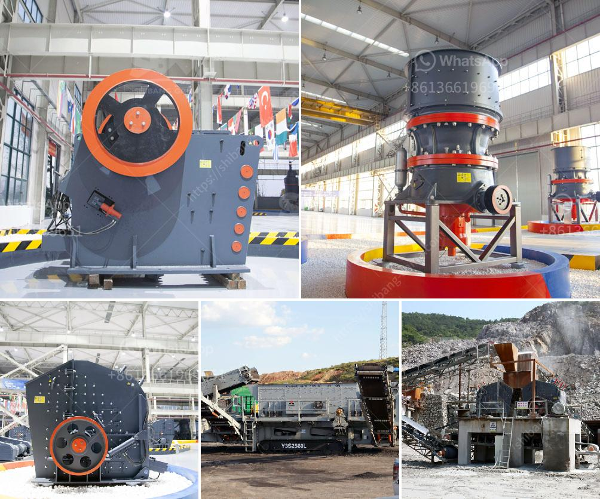

<h3>آلات معالجة الجير</h3>
تعتبر آلات معالجة الجير أدوات حديثة وفعالة تستخدم في مجموعة واسعة من الصناعات. تهدف هذه الآلات إلى معالجة وتحويل الجير إلى منتج نهائي مفيد يمكن استخدامه في مختلف التطبيقات.

إحدى استخدامات آلات معالجة الجير هو إزالة الشوائب والمواد العضوية من الجير الخام. يتم ذلك بواسطة عملية تعرف باسم تحلية الجير، حيث يتم تنقية الجير من الشوائب الغريبة مثل الغبار والطمي والشوائب العضوية باستخدام معدات خاصة. تسمح عملية تحلية الجير بالحصول على منتج نهائي نقي وجاهز للاستخدام في العديد من التطبيقات.

بعد تحلية الجير، يتم نقله إلى آلات المعالجة الأخرى التي تعمل على تحويله إلى منتجات نهائية مفيدة. على سبيل المثال، يمكن استخدام الجير المعالج في صناعة الأسمنت. يتم خلطه مع المواد الأخرى مثل الطين والغضار لتشكيل مزيج يسمى "الكلنكر". يعتبر الكلنكر مادة أساسية في عملية صناعة الأسمنت، حيث يتم طهيه وطحنه لإنتاج أنواع مختلفة من الأسمنت.

آلات معالجة الجير تستخدم أيضًا في صناعة الزجاج. فالجير المعالج يعتبر مكونًا أساسيًا في عملية صناعة الزجاج، حيث يتم خلطه مع مواد أخرى مثل الرمل والصودا الكاوية لتشكيل خليط يتم طهيه لإنتاج الزجاج. يعزز استخدام الجير في صناعة الزجاج قوة وقابلية الزجاج للاستخدام في التطبيقات المختلفة.

بالإضافة إلى ذلك، يستخدم الجير المعالج أيضًا في صناعة السيراميك وصناعة الأسمدة وصناعة الورق. يعتبر الجير مادة قيمة ومفيدة في هذه الصناعات، حيث يؤدي دورًا حيويًا في تحسين خواص المنتجات النهائية وارتفاع كفاءتها.

اختيار آلة معالجة الجير المناسبة يعتبر أمرًا حاسمًا لتحقيق النتائج المرجوة. هناك العديد من العوامل التي يجب مراعاتها عند الاختيار مثل التكلفة والكفاءة والأداء. بالإضافة إلى ذلك، يجب أيضًا الاهتمام بصيانة وتشغيل هذه الآلات بشكل صحيح لضمان استمرارية العملية واستخدامها الأمثل.

في النهاية، يعتبر استخدام آلات معالجة الجير ضروريًا لتحقيق منتجات ذات جودة عالية في مجموعة من الصناعات. تثبت هذه الآلات فعاليتها في معالجة الجير وتحويله إلى منتجات نهائية قابلة للاستخدام في التطبيقات المختلفة. تطور التكنولوجيا المستمر في هذا المجال يؤدي إلى تحسين أداء هذه الآلات وتوفير مزيد من الفوائد للصناعات المختلفة.
<h3>Contact us</h3><ul><li><strong>Whatsapp:&nbsp;<a href="https://wa.me/8613661969651">+8613661969651</a></strong></li><li><a href="https://swt.shibang-china.com/?git&amp;zhl&amp;آلات معالجة الجير"><strong>Online Service(chat now)</strong></a></li></ul><h3>Related</h3><ul><li><a href='آلات صنع الأسمنت لمصنع الأسمنت كامل.md'>آلات صنع الأسمنت لمصنع الأسمنت كامل</a></li><li><a href='مطاحن زيمبابوي.md'>مطاحن زيمبابوي</a></li><li><a href='تقرير مشروع مصنع الأسمنت الصغير.md'>تقرير مشروع مصنع الأسمنت الصغير</a></li><li><a href='مصنع غسيل الفحم للبيع في جنوب أفريقيا.md'>مصنع غسيل الفحم للبيع في جنوب أفريقيا</a></li><li><a href='طاحونة الكرة الرطبة في الصين.md'>طاحونة الكرة الرطبة في الصين</a></li></ul>