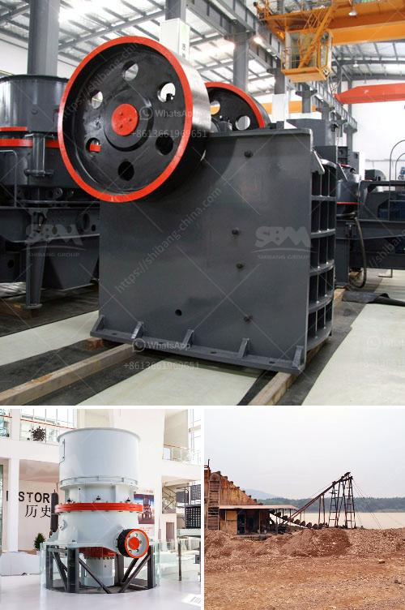

<h3>آلات معالجة الكاولين للبيع</h3>
تعد معالجة الكاولين من العمليات الرئيسية في صناعة التعدين والمعادن. الكاولين هو معدن صناعي أبيض يتكون أساسًا من ألومينا وسيليكا ، ويتم استخدامه في عدة صناعات مثل الطلاء والورق والأدوات الصحية والسيراميك. يجب أن تمر الخامات الخام بعملية الغسيل والتخفيف والتنقية لإزالة الشوائب وتحسين نسبة النجاة ، وتركز بعد ذلك باستخدام العديد من الآلات المختلفة للحصول على منتج نهائي ذو جودة عالية.

تتكون عملية معالجة الكاولين من عدة مراحل. في مرحلة الغسيل ، يتم غسل الخام بالماء لإزالة الجسيمات الغريبة والشوائب الأخرى التي يمكن أن تؤثر على جودة المنتج النهائي. هناك آلات مختلفة مثل الفاصل الجاذب والفاصل الهوائي يمكن استخدامها في هذه المرحلة لفصل الجسيمات الرملية والشوائب الأخرى عن جسيمات الكاولين.

بعد مرحلة الغسيل ، يتم تخفيف الكاولين بواسطة آلة الغربلة أو المطحنة لتجزئة الجسيمات الكبيرة إلى جسيمات أصغر وأكثر متجانسة. يتم استخدام الجاذبية أو المطحنة الدوارة لتحقيق هذا الهدف.

من ثم ، يتم إجراء عملية التنقية للحصول على منتج نهائي نقي وجاهز للاستخدام. تعتمد عملية التنقية على استخدام العديد من التقنيات مثل الفصل الجاذب لفصل الجسيمات غير المرغوب فيها والجسيمات الأخرى المتواجدة في الكاولين. تستخدم أيضًا آلات أخرى مثل فاصل الهواء والفاصل المغناطيسي لإزالة الشوائب الأخرى من الكاولين.

هناك العديد من الآلات المتخصصة المتاحة في السوق لتنفيذ هذه العمليات بفاعلية وفعالية. بعض الشركات المتخصصة في تصنيع آلات معالجة الكاولين تقدم مجموعة واسعة من المعدات ، مثل الغسالات ، والغرابيل ، والفواصل ، والطواحين. تحظى هذه الآلات بشعبية في صناعة التعدين والمعادن بسبب قدرتها على زيادة كفاءة العمليات وتحسين جودة المنتجات النهائية.

بالنظر إلى متطلبات السوق المختلفة ، تتوفر آلات معالجة الكاولين بأحجام وسعات مختلفة. يتعين على المشترين اختيار الآلة المناسبة وفقًا لاحتياجاتهم الخاصة والمواصفات المطلوبة للمنتج النهائي.

في النهاية ، يمكن القول أن آلات معالجة الكاولين تلعب دورًا حاسمًا في تحويل الكاولين الخام إلى منتج نهائي ذو جودة عالية. من خلال استخدام التكنولوجيا المناسبة والآلات المتخصصة ، يمكن للشركات تحقيق أداء ممتاز وزيادة إنتاجيتها.
<h3>Contact us</h3><ul><li><strong>Whatsapp:&nbsp;<a href="https://wa.me/8613661969651">+8613661969651</a></strong></li><li><a href="https://swt.shibang-china.com/?git&amp;zhl&amp;آلات معالجة الكاولين للبيع"><strong>Online Service(chat now)</strong></a></li></ul><h3>Related</h3><ul><li><a href='كسارة الحجر في المملكة المتحدة.md'>كسارة الحجر في المملكة المتحدة</a></li><li><a href='كسارة الصخور.md'>كسارة الصخور</a></li><li><a href='مصنع كسارة الصخور بسعة 150 طن.md'>مصنع كسارة الصخور بسعة 150 طن</a></li><li><a href='كسارات الجرانيت والطاحونات.md'>كسارات الجرانيت والطاحونات</a></li><li><a href='أسعار كسارات الجيرة.md'>أسعار كسارات الجيرة</a></li></ul>